# Lab 2 – Messaging Extensions

## Before you start

1.  Browse to <https://www.microsoftazurepass.com>

2.  Click on **Sign In** on the top right and sign in using your
    [admin@M365xXXXXXX.onmicrosoft.com](mailto:admin@M365xXXXXXX.onmicrosoft.com)
    user ID.

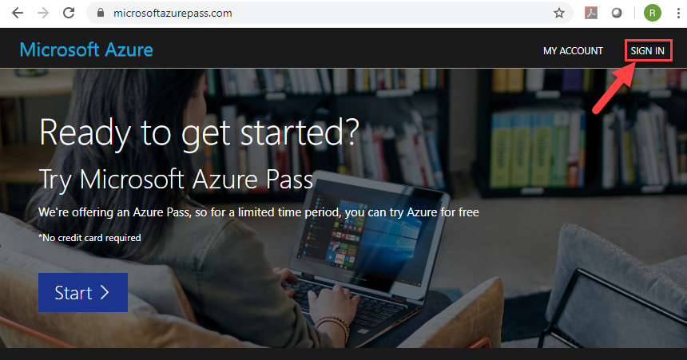

1.  Once signed in, click on **Start** and follow the on-screen steps to enter
    the provided **Azure Pass Promo code** and claim your Azure subscription.

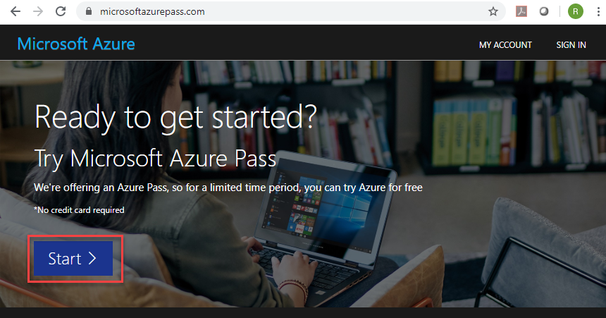

## Exercise 0 – Update Tenant Setup

1.  Open a new browser tab and navigate to the following URL:

    <https://admin.teams.microsoft.com>

2.  Sign in with your lab admin credentials.

3.  In the left navigation pane, click on **Teams apps** and then **Setup
    policies**.

4.  Turn ON the **Upload Custom Apps** option.

5.  Open another browse tab and navigate to the following URL:

    <https://admin.microsoft.com>

6.  Sign in with your lab admin credentials, if prompted to sign in.

7.  In the left navigation pane, expand **Users** and then select **Active
    Users**.

8.  Click **Add a user**.

9.  In **Add a user** panel,

    **First Name** – Test

    **Last Name** – User

    **Display Name** – Test User

    **Username –** testuser

    **Password Settings –** Select **Let me create password**

    **Password** – Pa55w.rd12345

10. **Uncheck** the checkbox for **Require this user to change their password
    when they first sign in**.

11. Click **Next**.

12. Click **Next**.

13. Click **Next**.

14. Click **Finish adding**.

15. Click **Close**.

## Exercise 1- Create action command messaging extensions

In this exercise, you'll create an action command messaging extension for a
custom Microsoft Teams app. Action commands allow you present your users with a
modal popup to collect or display information, then process their interaction
and send information back to Teams.

### Task 1 - Register a new bot

1.  Open a new browser tab and navigate to the following URL:

    <https://portal.azure.com>

2.  Click **Sign in** and then sign in with your lab admin credentials.

3.  Select **Create a resource** in the left-hand navigation.

    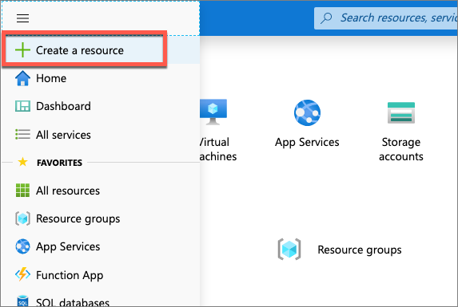

4.  Enter **resource group** in the **Search the marketplace** input box, and
    select **Resource group**.

    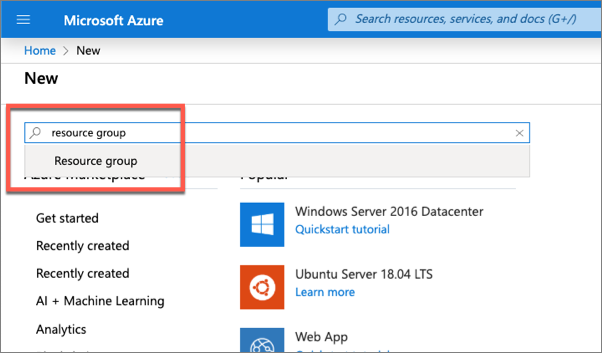

5.  On the **Resource Group** page, select the **Create** button to create a new
    resource group.

6.  Select a valid subscription, enter a name for the resource group, and select
    the wanted region.

    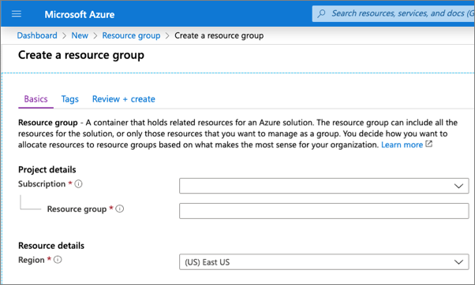

7.  Complete the wizard to create the resource group. Once Azure has completed
    the resource group creation process, navigate to the resource group.

8.  From the resource group, select the **Add** or **Create resources** button.

    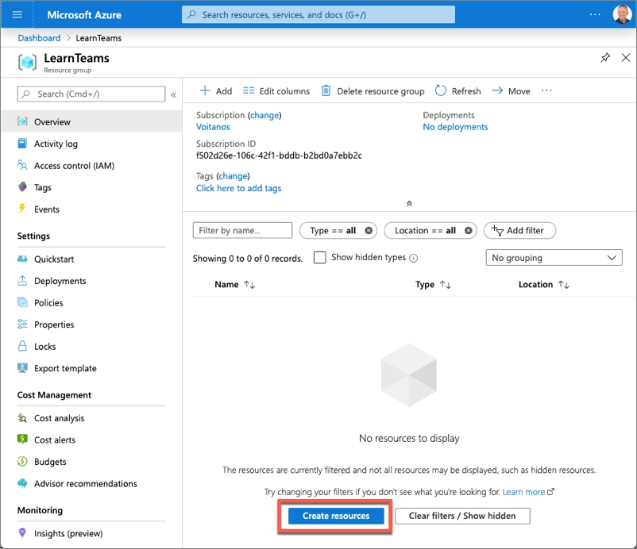

9.  Enter **bot** in the **Search the marketplace** input box and select **Bot
    Channels Registration** from the list of resources returned. Then select
    **Create** on the next page to start the process of registering a new bot
    resource:

    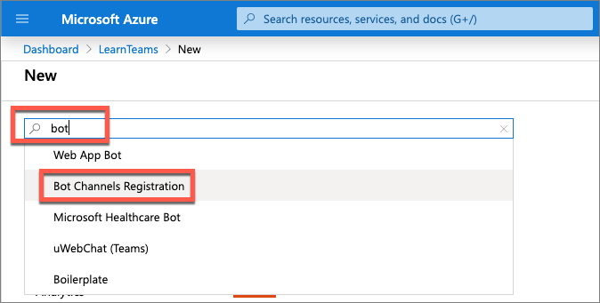

10. In the **Bot Channels Registration** blade, enter the following values and
    then select **Create**:

-   **Bot handle**: *Enter a globally unique name for the bot*

-   **Subscription**: *Leave the default subscription*

-   **Resource group**: *Select the resource group you created previously*

-   **Location**: *Select your preferred Azure region*

-   **Pricing tier**: *Select a preferred pricing tier; the F0 tier is free*

-   **Messaging endpoint**:
    [https://REPLACE_THIS.ngrok.io/api/messages](https://replace_this.ngrok.io/api/messages)

    The bot registration needs to know the endpoint of the web service where the
    bot is implemented. This will change each time you start the ngrok utility
    used in previous exercises.

-   **Application Insights**: Off

-   **Microsoft App ID and password**: Auto create App ID and password

1.  Azure will start to provision the new resource. This will take a moment or
    two. Once it's finished, navigate to the bot resource in the resource group.

    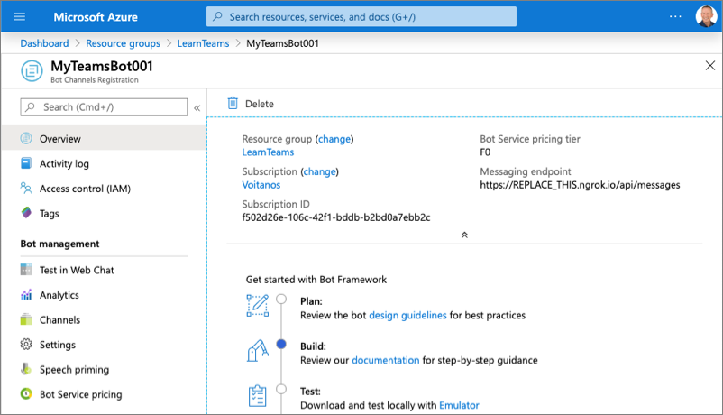

2.  In order for the bot to interact with Microsoft Teams, you must enable the
    Teams channel. From the bot resource in Azure, select **Channels** in the
    left-hand navigation.

3.  On the **Connect to channels** pane, select the **Microsoft Teams** channel,
    then select **Save** to confirm the action.

    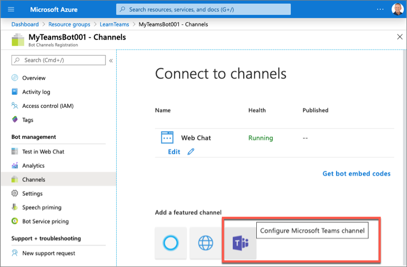

4.  Once this process is complete, you should see both the Web Chat and
    Microsoft Teams listed in your enabled channels:

    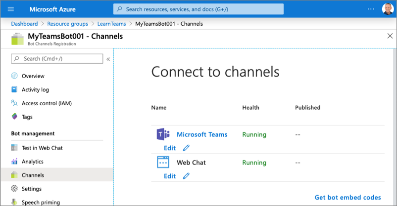

5.  Select **Settings** from the left-hand navigation. Scroll down to the
    **Microsoft App ID** section. Copy the ID of the bot to a notepad, as you'll
    need it later.

    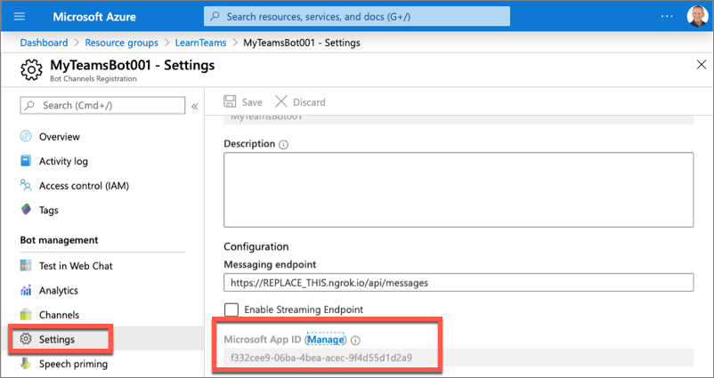

6.  Select **Manage** to navigate to the Azure AD app blade.

7.  Select **Certificates & secrets** from the left-hand navigation panel.

8.  Select the **New client secret** button:

    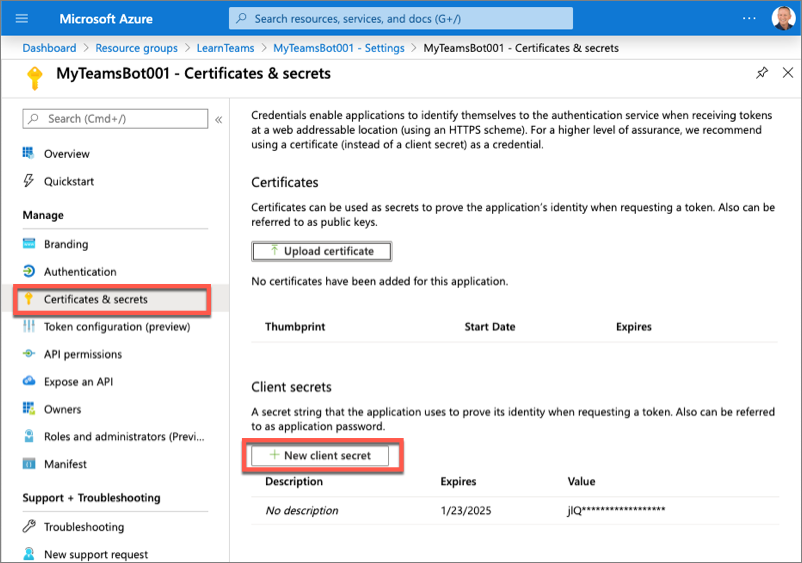

9.  When prompted, give the secret a description and select one of the
    expiration duration options provided and select **Add**.

10. The **Certificate & Secrets** page will display the new secret. It's
    important you copy this value as it's only shown this one time; if you leave
    the page and come back, it will only show as a masked value.

    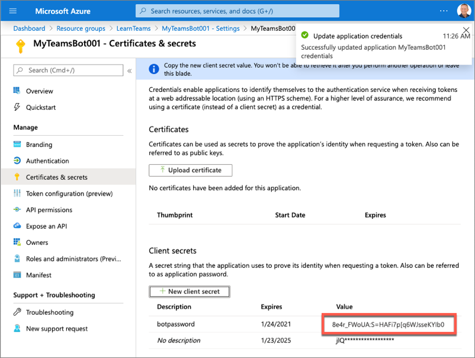

11. Copy the value of the secret to a notepad, as you'll need it later.

### Task 2 – Create Microsoft Teams App

1.  Open **Command Prompt**.

2.  Create a directory **Teams_Projects** under **C:**.

    *mkdir C:\\Teams_Projects*

3.  Change to the **Teams_Projects** directory.

    *cd C:\\Teams_Projects*

4.  Create a new folder **learn-msteams-bots**

    *mkdir learn-msteams-bots*

5.  Change directory to the new folder **learn-msteams-bots**

    *cd learn-msteams-bots*

6.  Run the Yeoman Generator for Microsoft Teams by running the following
    command:

    *yo teams*

    Yeoman will launch and ask you a series of questions. Answer the questions
    with the following values:

-   **What is your solution name?**: MessagingExt

-   **Where do you want to place the files?**: Use the current folder

-   **Title of your Microsoft Teams App project?**: Planet Messaging

-   **Your (company) name? (max 32 characters)**: Contoso

-   **Which manifest version would you like to use?**: v1.8

-   **Enter your Microsoft Partner Id, if you have one?**: (Leave blank to skip)

-   **What features do you want to add to your project?**: *(uncheck the default
    option* **A Tab** *using the space key and press enter)*

-   **The URL where you will host this solution?**: (Accept the default option)

-   **Would you like show a loading indicator when your app/tab loads?**: No

-   **Would you like personal apps to be rendered without a tab header-bar?** No

-   **Would you like to include Test framework and initial tests?**: No

-   **Would you like to use Azure Applications Insights for telemetry?**: No

**Note**

>   Most of the answers to these questions can be changed after creating the
>   project. For example, the URL where the project will be hosted isn't
>   important at the time of creating or testing the project.

>   After answering the generator's questions, the generator will create the
>   scaffolding for the project and then it will execute npm install that
>   downloads all the dependencies required by the project.

1.  Once the process for the previous step is complete, now you will add a bot
    to the project. Go to the
    **C:\\Teams_Projects\\learn-msteams-bots\\src\\app** folder.

2.  In this folder, create a sub-folder named **planetBot**.

3.  Go to the new sub-folder **planetBot** and create a new file named
    **planetBot.ts**.

4.  Open **planetBot.ts** file and paste the following code in it

~~~~~~~~~~~~~~~~~~~~~~~~~~~~~~~~~~~~~~~~~~~~~~~~~~~~~~~~~~~~~~~~~~~~~~~~~~~~~~~~
import {
TeamsActivityHandler,
TurnContext,
MessageFactory
} from "botbuilder";
import * as Util from "util";
const TextEncoder = Util.TextEncoder;
import * as debug from "debug";
const log = debug("msteams");
export class PlanetBot extends TeamsActivityHandler {
constructor() {
super();
}
}
~~~~~~~~~~~~~~~~~~~~~~~~~~~~~~~~~~~~~~~~~~~~~~~~~~~~~~~~~~~~~~~~~~~~~~~~~~~~~~~~

1.  Save the **planetBot.ts** file and close it.

2.  After creating the bot, the next step is to expose it as part of the app's
    REST API. Go to the folder
    **C:\\Teams_Projects\\learn-msteams-bots\\src\\app**.

3.  Open the file **TeamsAppsComponents.ts**. This file is used in the core web
    server file. This file needs to be updated to expose the bot to the app's
    API and to configure a bot adapter for the app.

4.  Add the following code at the end of the existing code in this file:

~~~~~~~~~~~~~~~~~~~~~~~~~~~~~~~~~~~~~~~~~~~~~~~~~~~~~~~~~~~~~~~~~~~~~~~~~~~~~~~~
export * from "./planetBot/planetBot";
~~~~~~~~~~~~~~~~~~~~~~~~~~~~~~~~~~~~~~~~~~~~~~~~~~~~~~~~~~~~~~~~~~~~~~~~~~~~~~~~

1.  **Save** this file and then close it.

2.  In the same folder, open the file **server.ts**.

3.  Add the following two import statements after the initial existing import
    statements in the file:

~~~~~~~~~~~~~~~~~~~~~~~~~~~~~~~~~~~~~~~~~~~~~~~~~~~~~~~~~~~~~~~~~~~~~~~~~~~~~~~~
import { BotFrameworkAdapter } from "botbuilder";
import { PlanetBot } from "./planetBot/planetBot";
~~~~~~~~~~~~~~~~~~~~~~~~~~~~~~~~~~~~~~~~~~~~~~~~~~~~~~~~~~~~~~~~~~~~~~~~~~~~~~~~

1.  Now configure the bot framework and call the bot when requests are received
    through the /api/messages path. Add the following code to the end of the
    file:

~~~~~~~~~~~~~~~~~~~~~~~~~~~~~~~~~~~~~~~~~~~~~~~~~~~~~~~~~~~~~~~~~~~~~~~~~~~~~~~~
// register and load the bot
const botAdapter = new BotFrameworkAdapter({
appId: process.env.MICROSOFT_APP_ID,
appPassword: process.env.MICROSOFT_APP_PASSWORD
});
// configure what happens when there is an unhandled error by the bot
botAdapter.onTurnError = async (context, error) => {
console.error(`\n [bot.onTurnError] unhandled error: ${error}`);
await context.sendTraceActivity("OnTurnError Trace", `${error}`, "https://www.botframework.com/schemas/error", "TurnError");
await context.sendActivity("bot error");
};
// run the bot when messages are received on the specified path
const bot = new PlanetBot();
express.post("/api/messages", (request, response) => {
botAdapter.processActivity(request, response, async (context) => {
await bot.run(context);
});
});
~~~~~~~~~~~~~~~~~~~~~~~~~~~~~~~~~~~~~~~~~~~~~~~~~~~~~~~~~~~~~~~~~~~~~~~~~~~~~~~~

1.  **Save** this file and then close it.

2.  Open the **C:\\Teams_Projects\\learn-msteams-bots\\.env** file.

3.  Locate the following section in the file, and set the values of the two
    properties, **Application Id** and secret **Value**, that you obtained when
    registering the bot in Task 1:

~~~~~~~~~~~~~~~~~~~~~~~~~~~~~~~~~~~~~~~~~~~~~~~~~~~~~~~~~~~~~~~~~~~~~~~~~~~~~~~~
# App Id and App Password for the Bot Framework bot
MICROSOFT_APP_ID=
MICROSOFT_APP_PASSWORD=
~~~~~~~~~~~~~~~~~~~~~~~~~~~~~~~~~~~~~~~~~~~~~~~~~~~~~~~~~~~~~~~~~~~~~~~~~~~~~~~~

1.  **Save** the file and then close it.

### Task 3 - Register the messaging extension in the Microsoft Teams app

1.  Open the file
    **C:\\Teams_Projects\\learn-msteams-bots\\src\\manifest\\manifest.json**.

2.  Locate the property **\$schema**. Change its value to
    [**https://developer.microsoft.com/en-us/json-schemas/teams/v1.7/MicrosoftTeams.schema.json**](https://developer.microsoft.com/en-us/json-schemas/teams/v1.7/MicrosoftTeams.schema.json)

3.  Locate the property **manifestVersion**. Change its value to **1.7**.

4.  Locate the property **version**. Change its value to **1.0.0**.

5.  Locate the property **id**. Change its value to match the GUID of the Azure
    AD app that was created when creating the bot in the Azure portal.

6.  Locate the property **composeExtensions**. Add a new action command
    messaging extension to the collection of extensions registered with this
    Microsoft Teams app by updating the composeExtensions property the following
    JSON. This code will add our action command to the compose box and the
    action command in a message when it is installed.

~~~~~~~~~~~~~~~~~~~~~~~~~~~~~~~~~~~~~~~~~~~~~~~~~~~~~~~~~~~~~~~~~~~~~~~~~~~~~~~~
"composeExtensions": [
{
"botId": "<REPLACE_WITH_MICROSOFT_APP_ID>",
"canUpdateConfiguration": false,
"commands": [
{
"id": "planetExpanderAction",
"type": "action",
"title": "Planet Expander",
"description": "Lookup the details of a planet.",
"context": [
"compose",
"message"
],
"fetchTask": true
}
]
}
]
~~~~~~~~~~~~~~~~~~~~~~~~~~~~~~~~~~~~~~~~~~~~~~~~~~~~~~~~~~~~~~~~~~~~~~~~~~~~~~~~

1.  Replace the \<REPLACE_WITH_MICROSOFT_APP_ID\> with the Azure AD app ID you
    obtained when registering the bot.

2.  **Save** the file and then close it.

3.  On your **Command prompt** window, run the npm command to install the latest
    version of the SDK

    *npm install @microsoft/teams-js -S*

### Task 4 – Code the messaging extension

In this section, you will code the action command for the messaging extension.
Your action command, when triggered, will present the user with a modal dialog
where they can select a planet from our solar system. The modal dialog is
implemented using an Adaptive Card. After submitting the dialog, the action
command will use another adaptive card to add details about the selected planet.

1.  Go to **C:\\Teams_Projects\\learn-msteams-bots\\src\\app\\planetBot**
    folder.

2.  Create a new file named **planets.json** and add the following JSON to it.

~~~~~~~~~~~~~~~~~~~~~~~~~~~~~~~~~~~~~~~~~~~~~~~~~~~~~~~~~~~~~~~~~~~~~~~~~~~~~~~~
[
{
"id": "1",
"name": "Mercury",
"summary": "Mercury is the smallest and innermost planet in the Solar System. Its orbit around the Sun takes 87.97 days, the shortest of all the planets in the Solar System. It is named after the Roman deity Mercury, the messenger of the gods.",
"solarOrbitYears": 0.24,
"solarOrbitAvgDistanceKm": 57909050,
"numSatellites": 0,
"wikiLink": "https://en.wikipedia.org/wiki/Mercury_(planet)",
"imageLink": "https://upload.wikimedia.org/wikipedia/commons/d/d9/Mercury_in_color_-_Prockter07-edit1.jpg",
"imageAlt": "NASA/Johns Hopkins University Applied Physics Laboratory/Carnegie Institution of Washington [Public domain]"
},
{
"id": "2",
"name": "Venus",
"summary": "Venus is the second planet from the Sun. It is named after the Roman goddess of love and beauty. As the second-brightest natural object in the night sky after the Moon, Venus can cast shadows and, rarely, is visible to the naked eye in broad daylight. Venus lies within Earth's orbit, and so never appears to venture far from the Sun, setting in the west just after dusk and rising in the east a bit before dawn.",
"solarOrbitYears": 0.62,
"solarOrbitAvgDistanceKm": 108208000,
"numSatellites": 0,
"wikiLink": "https://en.wikipedia.org/wiki/Venus",
"imageLink": "https://upload.wikimedia.org/wikipedia/commons/e/e5/Venus-real_color.jpg",
"imageAlt": "&quot;Image processing by R. Nunes&quot;, link to http://www.astrosurf.com/nunes [Public domain]"
},
{
"id": "3",
"name": "Earth",
"summary": "Earth is the third planet from the Sun and the only astronomical object known to harbor life. According to radiometric dating and other sources of evidence, Earth formed over 4.5 billion years ago. Earth's gravity interacts with other objects in space, especially the Sun and the Moon, which is Earth's only natural satellite. Earth orbits around the Sun in 365.256 days, a period known as an Earth sidereal year. During this time, Earth rotates about its axis about 366.256 times.",
"solarOrbitYears": 1.00,
"solarOrbitAvgDistanceKm": 149597500,
"numSatellites": 1,
"wikiLink": "https://en.wikipedia.org/wiki/Earth",
"imageLink": "https://upload.wikimedia.org/wikipedia/commons/9/97/The_Earth_seen_from_Apollo_17.jpg",
"imageAlt": "Apollo 17 [Public domain]"
},
{
"id": "4",
"name": "Mars",
"summary": "Mars is the fourth planet from the Sun and the second-smallest planet in the Solar System after Mercury. In English, Mars carries a name of the Roman god of war and is often referred to as the 'Red Planet'. The latter refers to the effect of the iron oxide prevalent on Mars' surface, which gives it a reddish appearance distinctive among the astronomical bodies visible to the naked eye.",
"solarOrbitYears": 1.88,
"solarOrbitAvgDistanceKm": 134935000,
"numSatellites": 2,
"wikiLink": "https://en.wikipedia.org/wiki/Mars",
"imageLink": "https://upload.wikimedia.org/wikipedia/commons/0/02/OSIRIS_Mars_true_color.jpg",
"imageAlt": "ESA - European Space Agency &amp; Max-Planck Institute for Solar System Research for OSIRIS Team ESA/MPS/UPD/LAM/IAA/RSSD/INTA/UPM/DASP/IDA [CC BY-SA 3.0-IGO (https://creativecommons.org/licenses/by-sa/3.0-igo)]"
},
{
"id": "5",
"name": "Jupiter",
"summary": "Jupiter is the fifth planet from the Sun and the largest in the Solar System. It is a gas giant with a mass one-thousandth that of the Sun, but two-and-a-half times that of all the other planets in the Solar System combined. Jupiter is one of the brightest objects visible to the naked eye in the night sky, and has been known to ancient civilizations since before recorded history. It is named after the Roman god Jupiter. When viewed from Earth, Jupiter can be bright enough for its reflected light to cast shadows, and is on average the third-brightest natural object in the night sky after the Moon and Venus.",
"solarOrbitYears": 11.86,
"solarOrbitAvgDistanceKm": 445336000,
"numSatellites": 78,
"wikiLink": "https://en.wikipedia.org/wiki/Jupiter",
"imageLink": "https://upload.wikimedia.org/wikipedia/commons/5/50/Jupiter%2C_image_taken_by_NASA%27s_Hubble_Space_Telescope%2C_June_2019_-_Edited.jpg",
"imageAlt": "NASA, ESA, and A. Simon (NASA Goddard), edited by PlanetUser [Public domain]"
},
{
"id": "6",
"name": "Saturn",
"summary": "Saturn is the sixth planet from the Sun and the second-largest in the Solar System, after Jupiter. It is a gas giant with an average radius about nine times that of Earth. It has only one-eighth the average density of Earth; however, with its larger volume, Saturn is over 95 times more massive. Saturn is named after the Roman god of wealth and agriculture; its astronomical symbol (♄) represents the god's sickle.",
"solarOrbitYears": 29.46,
"solarOrbitAvgDistanceKm": 1433525000,
"numSatellites": 82,
"wikiLink": "https://en.wikipedia.org/wiki/Saturn",
"imageLink": "https://upload.wikimedia.org/wikipedia/commons/c/c7/Saturn_during_Equinox.jpg",
"imageAlt": "NASA / JPL / Space Science Institute [Public domain]"
},
{
"id": "7",
"name": "Uranus",
"summary": "Uranus is the seventh planet from the Sun. It has the third-largest planetary radius and fourth-largest planetary mass in the Solar System. Uranus is similar in composition to Neptune, and both have bulk chemical compositions which differ from that of the larger gas giants Jupiter and Saturn. For this reason, scientists often classify Uranus and Neptune as \"ice giants\" to distinguish them from the gas giants.",
"solarOrbitYears": 84.02,
"solarOrbitAvgDistanceKm": 2883000000,
"numSatellites": 27,
"wikiLink": "https://en.wikipedia.org/wiki/Uranus",
"imageLink": "https://upload.wikimedia.org/wikipedia/commons/3/3d/Uranus2.jpg",
"imageAlt": "NASA/JPL-Caltech [Public domain]"
},
{
"id": "8",
"name": "Neptune",
"summary": "Neptune is the eighth and farthest known planet from the Sun in the Solar System. In the Solar System, it is the fourth-largest planet by diameter, the third-most-massive planet, and the densest giant planet. Neptune is 17 times the mass of Earth, slightly more massive than its near-twin Uranus. Neptune is denser and physically smaller than Uranus because its greater mass causes more gravitational compression of its atmosphere.",
"solarOrbitYears": 164.80,
"solarOrbitAvgDistanceKm": 4500000000,
"numSatellites": 14,
"wikiLink": "https://en.wikipedia.org/wiki/Neptune",
"imageLink": "https://upload.wikimedia.org/wikipedia/commons/6/63/Neptune_-%2829347980845%29_flatten_crop.jpg",
"imageAlt": "Justin Cowart [CC BY (https://creativecommons.org/licenses/by/2.0)]"
}
]
~~~~~~~~~~~~~~~~~~~~~~~~~~~~~~~~~~~~~~~~~~~~~~~~~~~~~~~~~~~~~~~~~~~~~~~~~~~~~~~~

1.  **Save** the file and then close it.

2.  In the same folder, create a new file named **planetSelectorCard.json** and
    add the following JSON to it. This file contains the Adaptive Card used to
    display the modal dialog

~~~~~~~~~~~~~~~~~~~~~~~~~~~~~~~~~~~~~~~~~~~~~~~~~~~~~~~~~~~~~~~~~~~~~~~~~~~~~~~~
{
"$schema": "http://adaptivecards.io/schemas/adaptive-card.json",
"type": "AdaptiveCard",
"version": "1.0",
"body": [
{
"type": "Container",
"items": [
{
"type": "TextBlock",
"size": "medium",
"isSubtle": true,
"text": "Select a planet to insert into the message:"
}
]
},
{
"type": "Input.ChoiceSet",
"id": "planetSelector",
"choices": []
}
],
"actions": [
{
"type": "Action.Submit",
"title": "Insert selected planet",
"data":
{
"submitLocation": "messagingExtensionFetchTask"
}
}
]
}
~~~~~~~~~~~~~~~~~~~~~~~~~~~~~~~~~~~~~~~~~~~~~~~~~~~~~~~~~~~~~~~~~~~~~~~~~~~~~~~~

1.  **Save** the file and then close it.

2.  To simplify working with collections, install the Lodash library. On your
    **Command prompt** window, make sure you are in
    **C:\\Teams_Projects\\learn-msteams-bots** directory and run the following
    commands:

    *npm install lodash -S*

    *npm install @types/lodash -D*

3.  Open the
    **C:\\Teams_Projects\\learn-msteams-bots\\src\\app\\planetBot\\planetBot.ts**
    file and add the

    following import statement to import two functions from Lodash into the bot:

~~~~~~~~~~~~~~~~~~~~~~~~~~~~~~~~~~~~~~~~~~~~~~~~~~~~~~~~~~~~~~~~~~~~~~~~~~~~~~~~
import { find, sortBy } from "lodash";
~~~~~~~~~~~~~~~~~~~~~~~~~~~~~~~~~~~~~~~~~~~~~~~~~~~~~~~~~~~~~~~~~~~~~~~~~~~~~~~~

1.  Implement the action command messaging extension by implementing a
    well-known method to the bot. Update the import statement for the
    **botbuilder** package to include the objects CardFactory,
    MessagingExtensionAction, MessagingExtensionActionResponse, &
    MessagingExtensionAttachment:

~~~~~~~~~~~~~~~~~~~~~~~~~~~~~~~~~~~~~~~~~~~~~~~~~~~~~~~~~~~~~~~~~~~~~~~~~~~~~~~~
import {
TeamsActivityHandler,
TurnContext,
MessageFactory,
CardFactory, MessagingExtensionAction, MessagingExtensionActionResponse, MessagingExtensionAttachment,
} from "botbuilder";
~~~~~~~~~~~~~~~~~~~~~~~~~~~~~~~~~~~~~~~~~~~~~~~~~~~~~~~~~~~~~~~~~~~~~~~~~~~~~~~~

1.  Add the following method to the **PlanetBot** class:

~~~~~~~~~~~~~~~~~~~~~~~~~~~~~~~~~~~~~~~~~~~~~~~~~~~~~~~~~~~~~~~~~~~~~~~~~~~~~~~~
protected handleTeamsMessagingExtensionFetchTask(context: TurnContext, action: MessagingExtensionAction): Promise<MessagingExtensionActionResponse> {
// load planets & sort them by their order from the sun
const planets: any = require("./planets.json");
const sortedPlanets: any = sortBy(planets, ["id"])
.map((planet) => {
return { value: planet.id, title: planet.name };
});
// load card template
const adaptiveCardSource: any = require("./planetSelectorCard.json");
// locate the planet selector
const planetChoiceSet: any = find(adaptiveCardSource.body, { id: "planetSelector" });
// update choice set with planets
planetChoiceSet.choices = sortedPlanets;
// load the adaptive card
const adaptiveCard = CardFactory.adaptiveCard(adaptiveCardSource);
const response: MessagingExtensionActionResponse = {
task: {
type: "continue",
value: {
card: adaptiveCard,
title: "Planet Selector",
height: 150,
width: 500
}
}
} as MessagingExtensionActionResponse;
return Promise.resolve(response);
}
~~~~~~~~~~~~~~~~~~~~~~~~~~~~~~~~~~~~~~~~~~~~~~~~~~~~~~~~~~~~~~~~~~~~~~~~~~~~~~~~

This method will first load the planets and sort them by their order from the
sun. It then loads the Adaptive Card for the modal and updates the
planetSelector dropdown box with the sorted planets. Finally, it returns an
object of type MessagingExtensionActionResponse that defines the task module,
implemented using an Adaptive Card, to the Bot Framework. The Bot Framework will
communicate with Microsoft Teams to display the card.

1.  **Save** the file and close it.

2.  Go to **C:\\Teams_Projects\\learn-msteams-bots\\src\\app\\planetBot**
    folder.

3.  Create a new file named **planetDisplayCard.json** and add the following
    JSON to it. This file contains the Adaptive Card used to generate the
    details of the planet:

~~~~~~~~~~~~~~~~~~~~~~~~~~~~~~~~~~~~~~~~~~~~~~~~~~~~~~~~~~~~~~~~~~~~~~~~~~~~~~~~
{
"$schema": "http://adaptivecards.io/schemas/adaptive-card.json",
"type": "AdaptiveCard",
"version": "1.0",
"body": [
{
"id": "cardHeader",
"type": "Container",
"items": [
{
"id": "planetName",
"type": "TextBlock",
"weight": "bolder",
"size": "medium"
}
]
},
{
"type": "Container",
"id": "cardBody",
"items": [
{
"id": "planetSummary",
"type": "TextBlock",
"wrap": true
},
{
"id": "planetDetails",
"type": "ColumnSet",
"columns": [
{
"type": "Column",
"width": "100",
"items": [
{
"id": "planetImage",
"size": "stretch",
"type": "Image"
}
]
},
{
"type": "Column",
"width": "250",
"items": [
{
"type": "FactSet",
"facts": [
{
"id": "orderFromSun",
"title": "Order from the sun:"
},
{
"id": "planetNumSatellites",
"title": "Known satellites:"
},
{
"id": "solarOrbitYears",
"title": "Solar orbit (*Earth years*):"
},
{
"id": "solarOrbitAvgDistanceKm",
"title": "Average distance from the sun (*km*):"
}
]
}
]
}
]
},
{
"id": "imageAttribution",
"type": "TextBlock",
"size": "medium",
"isSubtle": true,
"wrap": true
}
]
}
],
"actions": [
{
"type": "Action.OpenUrl",
"title": "Learn more on Wikipedia"
}
]
}
~~~~~~~~~~~~~~~~~~~~~~~~~~~~~~~~~~~~~~~~~~~~~~~~~~~~~~~~~~~~~~~~~~~~~~~~~~~~~~~~

1.  **Save** this file and close it.

2.  Now, we will add a handler to process the message when the messaging
    extension's Adaptive Card is submitted. Open the file
    **C:\\Teams_Projects\\learn-msteams-bots\\src\\app\\planetBot\\planetBot.ts**.

3.  Add the following content to the **PlanetBot** class.

~~~~~~~~~~~~~~~~~~~~~~~~~~~~~~~~~~~~~~~~~~~~~~~~~~~~~~~~~~~~~~~~~~~~~~~~~~~~~~~~
protected handleTeamsMessagingExtensionSubmitAction(context: TurnContext, action: MessagingExtensionAction): Promise<MessagingExtensionActionResponse> {
switch (action.commandId) {
case "planetExpanderAction":
// load planets
const planets: any = require("./planets.json");
// get the selected planet
const selectedPlanet: any = planets.filter((planet) => planet.id === action.data.planetSelector)[0];
const adaptiveCard = this.getPlanetDetailCard(selectedPlanet);
// generate the response
return Promise.resolve({
composeExtension: {
type: "result",
attachmentLayout: "list",
attachments: [adaptiveCard]
}
} as MessagingExtensionActionResponse);
break;
default:
throw new Error("NotImplemented");
}
}
~~~~~~~~~~~~~~~~~~~~~~~~~~~~~~~~~~~~~~~~~~~~~~~~~~~~~~~~~~~~~~~~~~~~~~~~~~~~~~~~

The handleTeamsMessagingExtensionSubmitAction() method first retrieves the
planet selected in the selector Adaptive Card from the in-memory planets data
set. It then uses a utility function to load and update the display Adaptive
Card with the planet's details. Finally, it returns a
MessagingExtensionActionResponse object that sets the Adaptive Card on the
composeExtension property. Microsoft Teams will use this to display the details
of the planet selected.

1.  Add the utility method getPlanetDetailCard() to the PlanetBot class:

~~~~~~~~~~~~~~~~~~~~~~~~~~~~~~~~~~~~~~~~~~~~~~~~~~~~~~~~~~~~~~~~~~~~~~~~~~~~~~~~
private getPlanetDetailCard(selectedPlanet: any): MessagingExtensionAttachment {
// load display card
const adaptiveCardSource: any = require("./planetDisplayCard.json");
// update planet fields in display card
adaptiveCardSource.actions[0].url = selectedPlanet.wikiLink;
find(adaptiveCardSource.body, { id: "cardHeader" }).items[0].text = selectedPlanet.name;
const cardBody: any = find(adaptiveCardSource.body, { id: "cardBody" });
find(cardBody.items, { id: "planetSummary" }).text = selectedPlanet.summary;
find(cardBody.items, { id: "imageAttribution" }).text = "*Image attribution: " + selectedPlanet.imageAlt + "*";
const cardDetails: any = find(cardBody.items, { id: "planetDetails" });
cardDetails.columns[0].items[0].url = selectedPlanet.imageLink;
find(cardDetails.columns[1].items[0].facts, { id: "orderFromSun" }).value = selectedPlanet.id;
find(cardDetails.columns[1].items[0].facts, { id: "planetNumSatellites" }).value = selectedPlanet.numSatellites;
find(cardDetails.columns[1].items[0].facts, { id: "solarOrbitYears" }).value = selectedPlanet.solarOrbitYears;
find(cardDetails.columns[1].items[0].facts, { id: "solarOrbitAvgDistanceKm" }).value = Number(selectedPlanet.solarOrbitAvgDistanceKm).toLocaleString();
// return the adaptive card
return CardFactory.adaptiveCard(adaptiveCardSource);
}
~~~~~~~~~~~~~~~~~~~~~~~~~~~~~~~~~~~~~~~~~~~~~~~~~~~~~~~~~~~~~~~~~~~~~~~~~~~~~~~~

1.  **Save** the file and close it.

### Task 5 – Test the conversation bot

1.  On your **Command Prompt** window, ensure that you are in the
    **C:\\Teams_Projects\\learn-msteams-bots** directory.

2.  Run the following commands:

    *npm i -D @types/react*

    *npm i react --save*

    *npm i --save-dev react-dom*

3.  Run the following command:

    *gulp ngrok-serve*

This gulp task will run many other tasks all displayed within the command-line
console. The **ngrok-serve** task builds your project and starts a local web
server (http://localhost:3007). It then starts ngrok with a random subdomain
that creates a secure URL to your local webserver.

**Note -** Microsoft Teams requires all content displayed within a tab be loaded
from an HTTPS request. In development, can be done using the tool
[**ngrok**](https://www.ngrok.com/) that creates a secure rotatable URL to your
local HTTP webserver. Ngrok is included as a dependency within the project so
there is nothing to setup or configure.

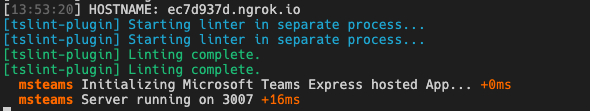

Note the URL of the Ngrok URL displayed in the console. In the previous
screenshot, NGrok has created the temporary URL **ec7d937d.ngrok.io** that will
map to our locally running web server. In order for the Bot Framework to route
messages from Microsoft Teams to our locally running bot, you need to update the
bot's messaging endpoint in the Azure portal.

1.  Open a new browser tab and navigate to the following URL:

    <https://portal.azure.com>

2.  If not already signed in, then click **Sign in** and sign in with your lab
    admin credentials.

3.  Locate the bot by selecting the Azure Resource Group and Bot Channels
    Registration resource you created at the beginning of this exercise.

4.  Using the left-hand navigation, select **Bot management** \> **Settings**.

5.  Locate the property **Configuration** \> **Messaging endpoint** and set the
    domain to the NGrok domain.

6.  Finally, save your changes to the bot configuration using the **Save**
    button at the top of the page.

    **Important**

    The free version of Ngrok will create a new URL each time you restart the
    web server. Make sure you update the **Messaging endpoint** of your URL each
    time you restart the web server when you are testing the app.

7.  Open a new browser tab and navigate to the following URL:

    <https://teams.microsoft.com>

8.  Click on **Use the web app instead**.

9.  Using the left navigation menu, select the **More added apps** button
    (**…**) and then select **More apps**.

    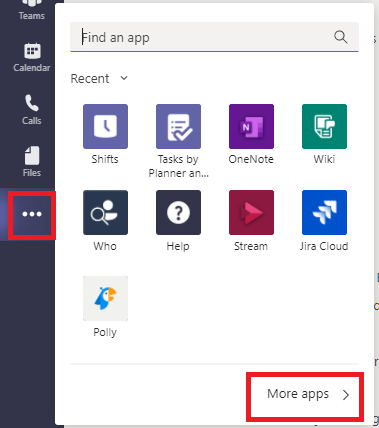

10. Under **Apps** section, click on **Upload a custom app** and then **Upload
    for Contoso**.

    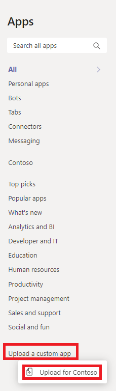

11. Browse and select
    **C:\\Teams_Projects\\learn-msteams-bots\\package\\MessageExt.zip** and
    click **Open**. The package should be uploaded.

12. Microsoft Teams will display a tile for **Planet Messaging** app. Click on
    this tile.

13. Here you can see some **TODO** items to address. *None of these "todo" items
    are important to this exercise, so you will leave them as is.*

    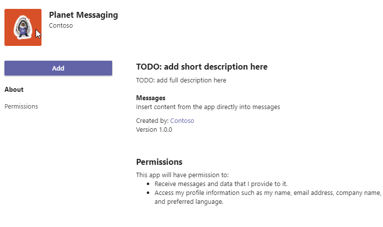

14. Select the **Add** button to install the app.

15. After installing the app, Microsoft Teams will take you to the 1:1 chat with
    the Microsoft Teams app and show the first dialog:

    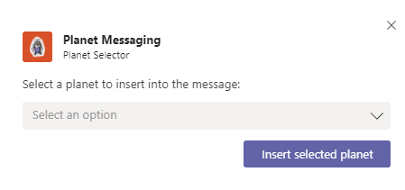

16. Cancel this dialog by selecting the **X** close icon in the upper-right
    corner.

17. Now, in the compose box in the chat, select either the **Planet Messaging**
    icon or the **...** icon below the chat box. If you select the **...** icon,
    enter **planet** in the search box and select the **Planet Messaging**
    extension.

    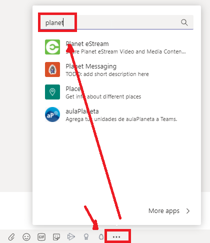

18. When the **Planet Messaging** pop-up is displayed, select a planet from the
    drop-down list and then select the **Insert selected planet** button.

19. The messaging extension's submit action handler is called which will add the
    updated Adaptive Card to the compose box:

    

20. You can send this message to the **Test User** that you created in
    **Exercise 0**. Just enter and then select this user in the **To** section
    of the **Chat** window and then send the message.

21. You can also trigger the messaging extension from an existing message in the
    chat using the **...** menu in the upper-right corner of the message. Select
    **More actions** and then select the **Planet Expander** option.

    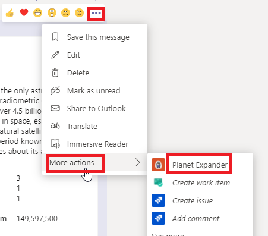

22. Back on your **Command Prompt** window, stop the running process by pressing
    **Ctrl**+**C**.

23. On **Terminate your batch job (Y/N)?**, enter **Y** and press enter key.

## Exercise 2 - Create search command messaging extensions

In this exercise, you’ll learn how to execute a messaging extension search
command from an existing message.

### Task 1 - Add a new search messaging extension to the Teams app

1.  Open the file
    **C:\\Teams_Projects\\learn-msteams-bots\\src\\manifest\\manifest.json**.

2.  You must increment the version of the app to upgrade an existing installed
    version. Locate the property **version** and increment the version to
    **1.0.1**.

3.  Next, locate the **composeExtensions.commands** array. Add the following
    object to the array to add the search extension:

~~~~~~~~~~~~~~~~~~~~~~~~~~~~~~~~~~~~~~~~~~~~~~~~~~~~~~~~~~~~~~~~~~~~~~~~~~~~~~~~
{
"id": "planetExpanderSearch",
"type": "query",
"title": "Planet Lookup",
"description": "Search for a planet.",
"context": ["compose"],
"parameters": [{
"name": "searchKeyword",
"description": "Enter 'inner','outer' or the name of a specific planet",
"title": "Planet"
}]
}
~~~~~~~~~~~~~~~~~~~~~~~~~~~~~~~~~~~~~~~~~~~~~~~~~~~~~~~~~~~~~~~~~~~~~~~~~~~~~~~~

1.  **Save** the file and close it.

2.  The next step is to update the bot's code. Open the file
    **C:\\Teams_Projects\\learn-msteams-bots\\src\\app\\planetBot\\planetBot.ts**.

3.  Update the import statement for the **botbuilder** package to include the
    objects MessagingExtensionQuery and MessagingExtensionResponse:

~~~~~~~~~~~~~~~~~~~~~~~~~~~~~~~~~~~~~~~~~~~~~~~~~~~~~~~~~~~~~~~~~~~~~~~~~~~~~~~~
import {
TeamsActivityHandler,
TurnContext,
MessageFactory,
CardFactory, MessagingExtensionAction, MessagingExtensionActionResponse, MessagingExtensionAttachment,
MessagingExtensionQuery, MessagingExtensionResponse
} from "botbuilder";
~~~~~~~~~~~~~~~~~~~~~~~~~~~~~~~~~~~~~~~~~~~~~~~~~~~~~~~~~~~~~~~~~~~~~~~~~~~~~~~~

1.  Next, add the following method to the **PlanetBot** class:

~~~~~~~~~~~~~~~~~~~~~~~~~~~~~~~~~~~~~~~~~~~~~~~~~~~~~~~~~~~~~~~~~~~~~~~~~~~~~~~~
protected handleTeamsMessagingExtensionQuery(context: TurnContext, query: MessagingExtensionQuery): Promise<MessagingExtensionResponse> {
// get the search query
let searchQuery = "";
if (query && query.parameters && query.parameters[0].name === "searchKeyword" && query.parameters[0].value) {
searchQuery = query.parameters[0].value.trim().toLowerCase();
}
// load planets
const planets: any = require("./planets.json");
// search results
let queryResults: string[] = [];
switch (searchQuery) {
case "inner":
// get all planets inside asteroid belt
queryResults = planets.filter((planet) => planet.id <= 4);
break;
case "outer":
// get all planets outside asteroid belt
queryResults = planets.filter((planet) => planet.id > 4);
break;
default:
// get the specified planet
queryResults.push(planets.filter((planet) => planet.name.toLowerCase() === searchQuery)[0]);
}
// get the results as cards
const searchResultsCards: MessagingExtensionAttachment[] = [];
queryResults.forEach((planet) => {
searchResultsCards.push(this.getPlanetResultCard(planet));
});
const response: MessagingExtensionResponse = {
composeExtension: {
type: "result",
attachmentLayout: "list",
attachments: searchResultsCards
}
} as MessagingExtensionResponse;
return Promise.resolve(response);
}
~~~~~~~~~~~~~~~~~~~~~~~~~~~~~~~~~~~~~~~~~~~~~~~~~~~~~~~~~~~~~~~~~~~~~~~~~~~~~~~~

This method will first get the search keyword from the query sent to the bot
from Microsoft Teams. It then will retrieve planets based on three different
queries:

-   **inner**: this will return all the planets inside the asteroid belt
    (*Mercury to Mars*)

-   **outer**: this will return all planets outside the asteroid belt (*Jupiter
    to Neptune*)

-   *keyword*: this will retrieve the specific planet entered

It will then take the query results, convert them to cards and add them to the
MessagingExtensionResponse returned to the Bot Framework and ultimately to
Microsoft Teams.

1.  Add the following utility method to the **PlanetBot** class to create the
    card for each search result:

~~~~~~~~~~~~~~~~~~~~~~~~~~~~~~~~~~~~~~~~~~~~~~~~~~~~~~~~~~~~~~~~~~~~~~~~~~~~~~~~
private getPlanetResultCard(selectedPlanet: any): MessagingExtensionAttachment {
return CardFactory.heroCard(selectedPlanet.name, selectedPlanet.summary, [selectedPlanet.imageLink]);
}
~~~~~~~~~~~~~~~~~~~~~~~~~~~~~~~~~~~~~~~~~~~~~~~~~~~~~~~~~~~~~~~~~~~~~~~~~~~~~~~~

1.  **Save** this file and close it.

### Task 2 - Test the updated messaging extension

1.  On your **Command Prompt** window, ensure that you are in
    **C:\\Teams_Projects\\learn-msteams-bots** directory. Run the following
    command:

    *gulp ngrok-serve*

2.  Recall from a previous exercise, Ngrok will create a new subdomain. Update
    your bot registration's **Messaging endpoint** in the **Azure Portal**
    (*shown in a previous exercise*) with this new subdomain domain before
    proceeding with the testing.

3.  Now update the existing installed version of the bot. Go back to your
    browser tab where you have **Microsoft Teams**
    (<https://teams.microsoft.com>) open.

4.  Using the left navigation menu, select the **More added apps** button
    (**…**). Then select **More apps**.

5.  Select the menu in the top-right corner of the **Planet Messaging** app tile
    and select **Update**.

    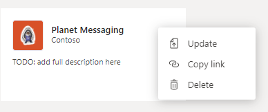

6.  Browse and select
    **C:\\Teams_Projects\\learn-msteams-bots\\package\\MessageExt.zip** and
    click **Open**.

7.  Refresh your browser window. Microsoft Teams will update the app to the new
    version.

8.  After updating the app, go back to the 1:1 chat where you tested the
    messaging extension in the previous exercise. Select the **Planet
    Messaging** icon below the compose message box in the chat. This will now
    present the search experience.

9.  Enter the string **outer** in the search box and wait a few seconds.
    Microsoft Teams will execute the search and return the results:

    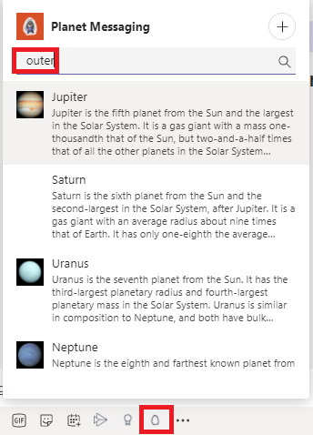

10. Back on your **Command Prompt** window, stop the running process by pressing
    **Ctrl**+**C**.

11. On **Terminate your batch job (Y/N)?**, enter **Y** and press enter key.

## Exercise 3 - Implement link unfurling messaging extensions

In this exercise, you’ll learn how to add link unfurling to your Microsoft Teams
app and how to implement this type of messaging extension.

### Task 1 - Add a new search messaging extension to the Teams app

In this section, you'll add a search messaging extension to find a specific
planet.

1.  First, update app's manifest to add the new messaging extension. Open the
    file
    **C:\\Teams_Projects\\learn-msteams-bots\\src\\manifest\\manifest.json**.

    1.  You must increment the version of the app to upgrade an existing
        installed version. Locate the property **version** and increment the
        version to **1.0.2**.

    2.  Next, locate the **composeExtensions** property. Add the following
        property after the **commands** property to add the link unfurling
        messaging extension:

~~~~~~~~~~~~~~~~~~~~~~~~~~~~~~~~~~~~~~~~~~~~~~~~~~~~~~~~~~~~~~~~~~~~~~~~~~~~~~~~
"messageHandlers": [
{
"type": "link",
"value": {
"domains": [
"*.wikipedia.org"
]
}
}
]
~~~~~~~~~~~~~~~~~~~~~~~~~~~~~~~~~~~~~~~~~~~~~~~~~~~~~~~~~~~~~~~~~~~~~~~~~~~~~~~~

1.  Next, locate the **validDomains** property. Add the following domain to the
    array of valid domains: **"\*.wikipedia.org"**

    1.  **Save** this file and close it.

    2.  The next step is to update the bot's code. Open the file
        **C:\\Teams_Projects\\learn-msteams-bots\\src\\app\\planetBot\\planetBot.ts**.

    3.  Update the import statement for the **botbuilder** package to include
        the object AppBasedLinkQuery:

~~~~~~~~~~~~~~~~~~~~~~~~~~~~~~~~~~~~~~~~~~~~~~~~~~~~~~~~~~~~~~~~~~~~~~~~~~~~~~~~
import {
TeamsActivityHandler,
TurnContext,
MessageFactory,
CardFactory, MessagingExtensionAction, MessagingExtensionActionResponse, MessagingExtensionAttachment,
MessagingExtensionQuery, MessagingExtensionResponse,
AppBasedLinkQuery
} from "botbuilder";
~~~~~~~~~~~~~~~~~~~~~~~~~~~~~~~~~~~~~~~~~~~~~~~~~~~~~~~~~~~~~~~~~~~~~~~~~~~~~~~~

1.  Add the following method to the **PlanetBot** class:

~~~~~~~~~~~~~~~~~~~~~~~~~~~~~~~~~~~~~~~~~~~~~~~~~~~~~~~~~~~~~~~~~~~~~~~~~~~~~~~~
protected handleTeamsAppBasedLinkQuery(context: TurnContext, query: AppBasedLinkQuery): Promise<MessagingExtensionResponse> {
// load planets
const planets: any = require("./planets.json");
// get the selected planet
const selectedPlanet: any = planets.filter((planet) => planet.wikiLink === query.url)[0];
const adaptiveCard = this.getPlanetDetailCard(selectedPlanet);
// generate the response
return Promise.resolve({
composeExtension: {
type: "result",
attachmentLayout: "list",
attachments: [adaptiveCard]
}
} as MessagingExtensionActionResponse);
}
~~~~~~~~~~~~~~~~~~~~~~~~~~~~~~~~~~~~~~~~~~~~~~~~~~~~~~~~~~~~~~~~~~~~~~~~~~~~~~~~

This method is called by the Bot Framework when a URL matching the domain listed
in the app's manifest. It will find a planet with the matching URL and return a
MessagingExtensionActionResponse object that contains the updated card matching
the URL to the existing message.

1.  **Save** this file and close it.

### Task 2 - Test the updated messaging extension

1.  On your **Command Prompt** window, ensure that you are in
    **C:\\Teams_Projects\\learn-msteams-bots** directory. Run the following
    command:

    *gulp ngrok-serve*

2.  Recall from a previous exercise, Ngrok will create a new subdomain. Update
    your bot registration's **Messaging endpoint** in the **Azure Portal**
    (*shown in a Exercise 1 Task 5*) with this new subdomain domain before
    proceeding with the testing.

3.  Now update the existing installed version of the bot. Go back to your
    browser tab where you have **Microsoft Teams**
    (<https://teams.microsoft.com>) open.

4.  Using the left navigation menu, select the **More added apps** button
    (**…**). Then select **More apps**.

5.  Select the menu in the top-right corner of the **Planet Messaging** app tile
    and select **Update**.

    

6.  Browse and select
    **C:\\Teams_Projects\\learn-msteams-bots\\package\\MessageExt.zip** and
    click **Open**.

7.  Refresh your browser window. Microsoft Teams will update the app to the new
    version.

8.  After updating the app, go back to the 1:1 chat where you tested the
    messaging extension in the previous exercise.

9.  Copy and paste the URL of one of the planets from the **planets.json** file
    into the compose box. Notice the message has been updated to include the
    card, which is also included when you send the message:

    

10. Back on your **Command Prompt** window, stop the running process by pressing
    **Ctrl**+**C**.

11. On **Terminate your batch job (Y/N)?**, enter **Y** and press enter key.
