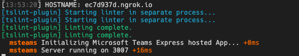
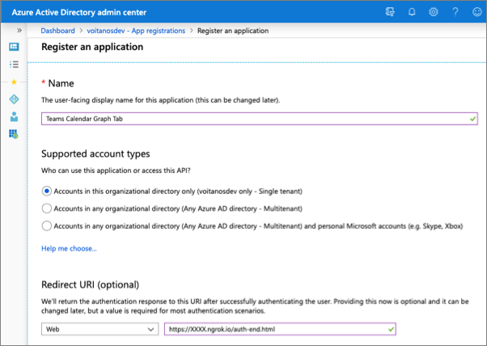

# Lab 3 – Messaging Extensions

## **Exercise 1 - Create a custom Microsoft Teams personal tab**

In this exercise, you'll create a new Microsoft Teams personal tab by using the
Microsoft Teams Yeoman generator, Visual Studio Code, and App Studio.

### **Task 1 - Create Microsoft Teams app**

1.  Open **Command Prompt**.

2.  Change the directory to **C:\\Teams_Projects**.

    *cd C:\\Teams_Projects*

3.  Create a new sub-directory named **learn-msteams-tabs**.

    *mkdir learn-msteams-tabs*

4.  Change the current directory to the new sub-directory **learn-msteams-tabs**

    *cd learn-msteams-tabs*

5.  Run the Yeoman generator for Microsoft Teams by running the following
    command:

    *yo teams*

    Yeoman starts and asks you a series of questions. Answer the questions with
    the following values:

    **What is your solution name?**: Learn MSTeams Tabs

    **Where do you want to place the files?**: Use the current folder

    **Title of your Microsoft Teams App project**: Learn MSTeams Tabs

    **Your (company) name (max 32 characters)**: Contoso

    **Which manifest version would you like to use?**: v1.8

    **Enter your Microsoft Partner ID, if you have one**: (Leave blank to skip)

    **What features do you want to add to your project?**: A tab

    **The URL where you will host this solution?**: (Accept the default option)

    **Would you like to show a loading indicator when your app/tab loads?** No

**Would you like personal apps to be rendered without a tab header-bar?** No

>   **Would you like to include Test framework and initial tests?**: No

>   **Would you like to use Azure Applications Insights for telemetry?**: No

>   **Default Tab name (max 16 characters)**: LearnPersonalTab

>   **What kind of Tab would you like to create?**: Personal (static)

>   **Do you require Azure AD Single-Sign-On support for the tab?** No

**Note -** Most of the answers to these questions can be changed after you
create the project. For example, the URL where the project will be hosted isn't
important at the time of creating or testing the project.

After you answer the generator's questions, the generator creates the
scaffolding for the project. The generator then automatically runs npm install
that downloads all the dependencies required by the project.

### **Task 2 - Ensure the project is using the latest version of Teams manifest & SDK**

1.  On **Command Prompt**, run the following npm command to install the latest
    version of the SDK:

    *npm i @microsoft/teams-js*

2.  Open the file
    **C:\\Teams_Projects\\learn-msteams-tabs**\\**src\\manifest\\manifest.json**.

3.  Change the **\$schema** property to
    [**https://developer.microsoft.com/en-us/json-schemas/teams/v1.7/MicrosoftTeams.schema.json**](https://developer.microsoft.com/en-us/json-schemas/teams/v1.7/MicrosoftTeams.schema.json)

4.  Change the **manifestVersion** property to **1.7**.

5.  **Save** this file and close it.

### **Task 3 - Test the personal tab**

1.  On your **Command Prompt** window, ensure that you are in the
    **C:\\Teams_Projects\\learn-msteams-tabs** directory.

2.  Run the following command:

    *gulp ngrok-serve*

This gulp task will run many other tasks all displayed within the command-line
console. The **ngrok-serve** task builds your project and starts a local web
server (http://localhost:3007). It then starts ngrok with a random subdomain
that creates a secure URL to your local webserver.

**Note -** Microsoft Teams requires all content displayed within a tab be loaded
from an HTTPS request. In development, can be done using the tool
[**ngrok**](https://www.ngrok.com/) that creates a secure rotatable URL to your
local HTTP webserver. Ngrok is included as a dependency within the project so
there is nothing to setup or configure.

Note the URL of the Ngrok URL displayed in the console. In the previous
screenshot, NGrok has created the temporary URL **ec7d937d.ngrok.io** that will
map to our locally running web server. In order for the Bot Framework to route
messages from Microsoft Teams to our locally running bot, you need to update the
bot's messaging endpoint in the Azure portal.

4\. Open a browser and go to the ngrok URL displayed in the console. Ensure that
you preceed the URL with **https://**.

1.  Update the URL in the browser to load the tab created by the scaffolding
    process (**/learnPersonalTab/index.html**). Here you can see the page can
    determine that it isn't running within the Microsoft Teams client.

1.  Now let's load the tab in Microsoft Teams. In the browser, go to **Microsoft
    Teams** (<https://teams.microsoft.com> ).

2.  If prompted to sign in then sign in with your lab admin credentials.

3.  Choose **Use web client instead**.

4.  In the left navigation pane, select the **More added apps** button **(…)**.
    Then select **More apps**.

    

5.  Under **Apps** section, click on **Upload a custom app** and then **Upload
    for Contoso**.

    

6.  Browse and select **C:\\Teams_Projects\\learn-msteams-tabs\\package\\Learn
    MSTeams Tabs.zip** and click **Open**. The package should be uploaded.

7.  Microsoft Teams will display a tile for **Learn MSTeams Tabs** app. Click on
    this tile.

    

8.  Here you can see some **TODO** items to address. You'll update the todo
    items later in the exercise*.*

    

9.  Select the **Add** button to install the app. You will be taken to the new
    tab.

    

Notice that when the content page is loaded in a tab within the Microsoft teams
client, it displays the entityId property of the tab, not the message "This
isn't hosted in Microsoft Teams" as you saw when you viewed the content page in
the browser. The tab can detect if it's loaded within the Microsoft Teams client
by using the Microsoft Teams JavaScript SDK.

1.  In the left navigation pane, click on **Chat** and then click on **More
    added apps** button (**…**) in the left navigation pane. You can see the
    **Learn MSTeams Tabs** app in the **Recent** apps.

    

2.  Uninstall the app by right-clicking the app and select **Uninstall**. Then
    select **Uninstall** in the confirmation dialog box that appears.

3.  Next, stop the local web server by selecting Ctrl+C in the console to stop
    the running process.

4.  For **Terminate batch job (Y/N)?**, enter **Y** and press enter key.

### **Task 4 - Implement the personal tab's user interface**

1.  Open the file that contains the React component used in the project:
    **C:\\Teams_Projects\\learn-msteams-tabs\\src\\app\\scripts\\learnPersonalTab\\LearnPersonalTab.tsx**.

2.  Update the import statements in this file to add components from the Fluent
    UI - React library. Find the following import statement at the top of the
    file that imports components from the Fluent UI - React library:

    import { Provider, Flex, Text, Button, Header } from
    "@fluentui/react-northstar";

3.  Replace the previous statement with the following import statement:

    import { Provider, Flex, Text, Button, Header, List, Alert, teamsTheme,
    teamsDarkTheme, teamsHighContrastTheme, ThemePrepared, WindowMaximizeIcon,
    ExclamationTriangleIcon, Label, Input, ToDoListIcon } from
    "@fluentui/react-northstar";

4.  Remove all the statements below the last import statement.

5.  Locate the ILearnPersonalTabState interface in the **LearnPersonalTab.tsx**
    file, and add the following properties to it:

    teamsTheme: ThemePrepared;

    todoItems: string[];

    newTodoValue: string;

6.  Add the following method to the LearnPersonalTab class that updates the
    component state to the theme that matches the currently selected Microsoft
    Teams client theme:

    private updateComponentTheme = (currentThemeName: string = "default"): void
    =\> {

    let theme: ThemePrepared;

    switch (currentThemeName) {

    case "default":

    theme = teamsTheme;

    break;

    case "dark":

    theme = teamsDarkTheme;

    break;

    case "contrast":

    theme = teamsHighContrastTheme;

    break;

    default:

    theme = teamsTheme;

    break;

    }

    // update the state

    this.setState(Object.assign({}, this.state, {

    teamsTheme: theme

    }));

    }

7.  Initialize the current theme and state of the component. Locate the line
    this.updateTheme(this.getQueryVariable("theme")); and replace it with the
    following code in the componentWillMount() method:

    this.updateComponentTheme(this.getQueryVariable("theme"));

    this.setState(Object.assign({}, this.state, {

    todoItems: ["Submit time sheet", "Submit expense report"],

    newTodoValue: ""

    }));

8.  Within the componentWillMount() method, locate the following line:

    microsoftTeams.registerOnThemeChangeHandler(this.updateTheme);

This code registers an event handler to update the component's theme to match
the theme of the current Microsoft Teams client when this page is loaded as a
tab. Update this line to call the new handler in the following line to register
another handler to update the component theme:

>   microsoftTeams.registerOnThemeChangeHandler(this.updateComponentTheme);

1.  Locate the render() method, and update it to the following code. The
    render() method now displays the list of items in our state output with a
    brief copyright statement.

public render() {

return (

\<Provider theme={ this.state.teamsTheme }\>

\<Flex column gap="gap.smaller"\>

\<Header\>This is your tab\</Header\>

\<Alert icon={\<ExclamationTriangleIcon /\>} content={this.state.entityId}
dismissible\>\</Alert\>

\<Text content="These are your to-do items:" size="medium"\>\</Text\>

\<List selectable\>

{ this.state.todoItems.map((todoItem, i) =\> (

\<List.Item media={\<WindowMaximizeIcon outline /\>}

content={ todoItem } index={i} \>

\</List.Item\> ))

}

\</List\>

TODO: add new list item form here

\<Text content="(C) Copyright Contoso" size="smallest"\>\</Text\>

\</Flex\>

\</Provider\>

);

}

1.  **Save** this file.

**Tip**

1.  At this point, you can test your tab without loading it in Microsoft Teams.
    Run the command **gulp ngrok-serve** from the command line, and go to
    **https://{your-ngrok-subdomain}.ngrok.io/learnPersonalTab/index.html** in
    the browser.

    

2.  Add the query string value ?theme=dark to the URL to see the theme change:

    

3.  Next, stop the local web server by selecting Ctrl+C in the console to stop
    the running process.

4.  For **Terminate batch job (Y/N)?**, enter **Y** and press enter key.

5.  The next step is to add some interactivity to the tab. Add the following
    methods to the LearnPersonalTab class. These methods handle updating the
    state when specific events happen on the form that you'll add to the
    component.

    private handleOnChanged = (event): void =\> {

    this.setState(Object.assign({}, this.state, { newTodoValue:
    event.target.value }));

    }

    private handleOnClick = (event: React.MouseEvent\<HTMLButtonElement\>): void
    =\> {

    const newTodoItems = this.state.todoItems;

    newTodoItems.push(this.state.newTodoValue);

    this.setState(Object.assign({}, this.state, {

    todoItems: newTodoItems,

    newTodoValue: ""

    }));

    }

6.  Finally, locate the string TODO: add new list item form here in the render()
    method, and replace it with the following code. This code displays a form
    that the user can use to add items to the list.

    \<Flex gap="gap.medium"\>

    \<Flex.Item grow\>

    \<Flex\>

    \<Label icon={\<ToDoListIcon /\>}

    styles={{

    background: "darkgray",

    height: "auto",

    padding: "0 15px"

    }}\>\</Label\>

    \<Flex.Item grow\>

    \<Input placeholder="New todo item" fluid

    value={this.state.newTodoValue}

    onChange={this.handleOnChanged}\>\</Input\>

    \</Flex.Item\>

    \</Flex\>

    \</Flex.Item\>

    \<Button content="Add Todo" primary

    onClick={this.handleOnClick}\>\</Button\>

    \</Flex\>

7.  **Save** this file and close it.

### **Task 5 - Use App Studio to update the Microsoft Teams app manifest**

At this point, the app is complete. Recall from our initial test that when the
app was added to Microsoft Teams, it had a few todo strings for the description
of the app. While you could change these values in the project's
**./src/manifest/manifest.json** file, you will use App Studio to make these
changes.

1.  First, build, and run the project by running the command **gulp
    ngrok-serve** in the command line like you did previously. This step also
    creates the Microsoft Teams app package.

2.  In the browser, go to <https://teams.microsoft.com> and sign in with lab
    admin credentials.

3.  Using the **More added apps** link in the app bar on the left, select **App
    Studio**.

    

4.  Select the **Manifest editor** tab in App Studio, and then select **Import
    an existing app**. Browse to
    **C:\\Teams_Projects\\learn-msteams-tabs\\package\\Learn MSTeams Tabs.zip**
    and open it.

5.  Under **Complete these steps** section, Click on **App details**.

6.  On the **App details** page, change the **Full name** of the app to **Learn
    Microsoft Teams Tabs**. Update the **Version** to **0.0.2**.

7.  On the **App details** page, scroll down to the **Descriptions** section and
    enter the following values:

-   **Short description**: My first custom Teams app

-   **Full description**: *enter a long description*

1.  Update the name of the tab by selecting **Capabilities** \> **Tabs** in the
    left pane in App Studio.

2.  Locate the only personal tab in the project. Select the menu for more
    options on the tab, and select **Edit**. Change the name of the tab to **My
    First Tab**. Update the **Content URL** property with your new ngrok
    subdomain. Ensure that \&theme={theme} is added to the end of the Content
    URL property.

3.  Select **Save** to save your changes.

    The changes made to the app within App Studio aren't saved to your project.
    If you want to update the project, download the app package from App Studio.

4.  To download the project, select **Finish** \> **Test and distribute** in the
    left pane in App Studio. Then select **Download**.

### **Task 6 - Install and test the Microsoft Teams app**

1.  In left navigation pane, click on **More added apps** button (**…**) and
    then select **More apps**.

2.  Hover over the tile for **Learn MSTeams Tabs** and click on the **…** at the
    top-right corner of this tile. Click **Update**.

3.  Browse to the zip file that you downloaded at the end of the previous task
    and open it.

4.  Refresh your browser window. Your **Learn MSTeams Tabs** app should be
    updated.

5.  Click on **Learn MSTeams Tabs** tile

    

6.  Click **Open**.

    

7.  Next, stop the local web server by selecting Ctrl+C in the console to stop
    the running process.

8.  For **Terminate batch job (Y/N)?**, enter **Y** and press enter key.

## **Exercise 2 - Create a custom Microsoft Teams channel or group tab**

In this exercise, you'll learn how to create a channel tab with a configuration
page in a Microsoft Teams app.

### **Task 1 - Add a channel app to the Microsoft Teams app project**

1.  On **Command Prompt**, ensure that you are in
    **C:\\Teams_Projects\\learn-msteams-tabs** directory.

2.  Run the following command:

    *yo teams*

    Yeoman starts and asks you a series of questions. Answer the questions with
    the following values:

-   **You are running the generator on an already existing project... are you
    sure you want to continue?**: Yes

-   **What features do you want to add to your project?**: A Tab

-   **Default tab name (max 16 characters)**: ConfigMathTab

-   **Do you want to create a configurable or static tab?**: Configurable

-   **What scopes do you intend to use for your tab?**: In a Team

-   **Do you require Azure AD Single-Sign-On support for the tab?** No

-   **Do you want this tab to be available in SharePoint Online?**: Yes

-   **How do you want your tab to be available in SharePoint?**: As a full-page
    application, as a web part

    After you answer the generator's questions, the generator adds the
    additional files for a new component. Then it runs npm install to ensure
    that any new dependencies are downloaded for the project.

### **Task 2 - Test the channel tab**

1.  On **Command Prompt**, ensure that you are in
    **C:\\Teams_Projects\\learn-msteams-tabs** directory.

2.  Run the following command:

    *gulp ngrok-serve*

3.  In the browser, go to **Microsoft Teams** (<https://teams.microsoft.com> ).

4.  In left navigation pane, click on **More added apps** button (**…**) and
    then select **More apps**.

5.  Hover over the tile for **Learn MSTeams Tabs** and click on the **…** at the
    top-right corner of this tile. Click **Update**.

6.  Browse to the zip file that you downloaded at the end of the previous task
    and open it.

7.  Refresh your browser window. Your **Learn MSTeams Tabs** app should be
    updated.

8.  Click on **Learn MSTeams Tabs** tile and select the arrow next to the
    **Add** button, and select **Add to a team** to install the app:

    

9.  In the **Select a channel to start using** dialog box, select an existing
    team. Then select **Set up a tab**.

10. Before the tab is added to the team, Microsoft Teams displays the tab's
    configuration page:

    

11. Enter anything in the text box and select **Save**.

12. Microsoft Teams adds the tab to the channel and displays it for you. You
    should see the text you entered on the configuration page displayed in the
    tab.

### **Task 3 - Update the configuration tab**

1.  Open the file
    **C:\\Teams_Projects\\learn-msteams-tabs\\src\\app\\scripts\\configMathTab\\configMathTabConfig.tsx**.

2.  Find the following import statement that imports the Fluent UI - React
    library:

    import { Provider, Flex, Header, Input} from "@fluentui/react-northstar";

3.  Replace the previous statement with the following import statement:

    import {

    Provider,

    Flex,

    Header,

    Input,

    ThemePrepared,

    teamsTheme,

    teamsDarkTheme,

    teamsHighContrastTheme,

    DropdownProps,

    Dropdown

    } from "@fluentui/react-northstar";

4.  Locate the IConfigMathTabConfigState interface, and replace its contents
    with the following two members:

    teamsTheme: ThemePrepared;

    mathOperator: string;

5.  Add the following method to the ConfigMathTabConfig class that will update
    the component state to match the currently selected Microsoft Teams client
    theme:

    private updateComponentTheme = (currentThemeName: string = "default"): void
    =\> {

    let componentTheme: ThemePrepared;

    switch (currentThemeName) {

    case "default":

    componentTheme = teamsTheme;

    break;

    case "dark":

    componentTheme = teamsDarkTheme;

    break;

    case "contrast":

    componentTheme = teamsHighContrastTheme;

    break;

    default:

    componentTheme = teamsTheme;

    break;

    }

    // update the state

    this.setState(Object.assign({}, this.state, {

    teamsTheme: componentTheme

    }));

    }

6.  Initialize the current theme and state of the component. Locate the line
    this.updateTheme(this.getQueryVariable("theme")); and replace it with the
    following code in the componentWillMount() method:

    this.updateComponentTheme(this.getQueryVariable("theme"));

7.  Locate the line in the componentWillMount() method that contains the call to
    microsoftTeams.getContext. The function passed into this method sets the
    state of the React component. Replace the this.setState method with the
    following code. (Leave the rest of get getContext delegate unchanged.) This
    new code takes the value of the entityId property on the tab, removes the
    **MathPage** string, and leaves only the operator.

    this.setState(Object.assign({}, this.state, {

    mathOperator: context.entityId.replace("MathPage", "")

    }));

8.  Next, locate the following line in the componentWillMount() method:
    microsoftTeams.settings.registerOnSaveHandler(). This method lets you
    provide the function to execute when the user selects the **Save** button on
    the configuration page. This code should save any settings you need to save
    and notify Microsoft Teams that the configuration page saved the settings
    successfully. Update this code to save the selected math operation and
    change the name of the tab.

    microsoftTeams.settings.registerOnSaveHandler((saveEvent:
    microsoftTeams.settings.SaveEvent) =\> {

    // Calculate host dynamically to enable local debugging

    const host = "https://" + window.location.host;

    microsoftTeams.settings.setSettings({

    contentUrl: host + "/configMathTab/?data=",

    suggestedDisplayName: "Config Math Tab",

    removeUrl: host + "/configMathTab/remove.html",

    entityId: \`\${this.state.mathOperator}MathPage\`

    });

    saveEvent.notifySuccess();

    });

9.  Add the following event handler to the ConfigMathTabConfig class, which
    updates the component state to be the value of the selected operator:

    private handleOnSelectedChange = (event, props: DropdownProps): void =\> {

    this.setState(Object.assign({}, this.state, {

    mathOperator: (props.value) ? props.value.toString() : "add"

    }));

    }

10. Locate the render() method. Replace it with the following code, which adds a
    drop-down list for the user to select the operator they want to use:

    public render() {

    return (

    \<Provider theme={this.state.teamsTheme}\>

    \<Flex gap="gap.smaller" style={{ height: "300px" }}\>

    \<Dropdown placeholder="Select the math operator"

    items={[

    "add",

    "subtract",

    "multiply",

    "divide"

    ]}

    onChange={this.handleOnSelectedChange}\>\</Dropdown\>

    \</Flex\>

    \</Provider\>

    );

    }

11. **Save** this file and close it.

### **Task 4 - Test the configuration page**

1.  Go back to your **Microsoft Teams** browser tab.

2.  Select the down arrow next to **ConfigMathTab** tab and then select
    **Settings**.

    

3.  The configuration page opens with the updated component.

    

4.  Select one of the math operators and save your changes by selecting
    **Save**. The tab should display the selected operator with the **MathPage**
    suffix.

### **Task 5 - Implement the channel tab**

1.  Open the file
    **C:\\Teams_Projects\\learn-msteams-tabs\\src\\app\\scripts\\configMathTab\\configMathTab.tsx**.

2.  Update the import statements in this file to include the components used in
    the configuration tab. Find the following import statement that imports the
    Fluent UI - React library:

    import { Provider, Flex, Text, Button, Header } from
    "@fluentui/react-northstar";

3.  Replace the previous statement with the following import statement:

    import {

    Provider,

    Flex,

    Text,

    Button,

    Header,

    ThemePrepared,

    teamsTheme,

    teamsDarkTheme,

    teamsHighContrastTheme,

    Input

    } from "@fluentui/react-northstar";

4.  Locate the IConfigMathTabState interface, and replace its contents with the
    following:

    teamsTheme: ThemePrepared;

    mathOperator?: string;

    operandA: number;

    operandB: number;

    result: string;

5.  Add the following method to the ConfigMathTab class that will update the
    component state to match the currently selected Microsoft Teams client
    theme:

    private updateComponentTheme = (currentThemeName: string = "default"): void
    =\> {

    let componentTheme: ThemePrepared;

    switch (currentThemeName) {

    case "default":

    componentTheme = teamsTheme;

    break;

    case "dark":

    componentTheme = teamsDarkTheme;

    break;

    case "contrast":

    componentTheme = teamsHighContrastTheme;

    break;

    default:

    componentTheme = teamsTheme;

    break;

    }

    // update the state

    this.setState(Object.assign({}, this.state, {

    teamsTheme: componentTheme

    }));

    }

6.  Initialize the current theme and state of the component. Locate the line
    this.updateTheme(this.getQueryVariable("theme")); and replace it with the
    following code in the componentWillMount() method:

this.updateComponentTheme(this.getQueryVariable("theme"));

1.  Within the componentWillMount() method, locate the following line:

    microsoftTeams.registerOnThemeChangeHandler(this.updateTheme);

2.  This code registers an event handler to update the component's theme to
    match the theme of the current Microsoft Teams client when this page is
    loaded as a tab. Update this line to call the new handler in the following
    line to register another handler to update the component theme.

    microsoftTeams.registerOnThemeChangeHandler(this.updateComponentTheme);

3.  Locate the following line in the componentWillMount() method:
    microsoftTeams.getContext(). The function passed into this method sets the
    state of the React component. Replace the this.setState() method with the
    following code. This new code takes the value of the entityId property on
    the tab, removes the **MathPage** string, and leaves only the operator.

    this.setState(Object.assign({}, this.state, {

    mathOperator: context.entityId.replace("MathPage", "")

    }));

4.  Locate the following code in the componetWillMount() method:

    this.setState({

    entityId: "This is not hosted in Microsoft Teams"

    });

5.  Replace this code with the following code. This new code will cause the math
    operator to add two numbers by default in case this page is loaded outside
    of a Microsoft Teams client.

    this.setState(Object.assign({}, this.state, {

    mathOperator: "add"

    }));

6.  Add the following event handlers to the ConfigMathTab class. These event
    handlers will update the state with the values from the controls and do the
    calculation of the two numbers by using the operator specified on the
    configuration page.

    private handleOnChangedOperandA = (event): void =\> {

    this.setState(Object.assign({}, this.state, { operandA: event.target.value
    }));

    }

>   private handleOnChangedOperandB = (event): void =\> {

>   this.setState(Object.assign({}, this.state, { operandB: event.target.value
>   }));

>   }

>   private handleOperandChange = (): void =\> {

>   let stringResult: string = "n/a";

>   if (!isNaN(Number(this.state.operandA)) &&
>   !isNaN(Number(this.state.operandB))) {

>   switch (this.state.mathOperator) {

>   case "add":

>   stringResult = (Number(this.state.operandA) +
>   Number(this.state.operandB)).toString();

>   break;

>   case "subtract":

>   stringResult = (Number(this.state.operandA) -
>   Number(this.state.operandB)).toString();

>   break;

>   case "multiply":

>   stringResult = (Number(this.state.operandA) \*
>   Number(this.state.operandB)).toString();

>   break;

>   case "divide":

>   stringResult = (Number(this.state.operandA) /
>   Number(this.state.operandB)).toString();

>   break;

>   default:

>   stringResult = "n/a";

>   break;

>   }

>   }

>   this.setState(Object.assign({}, this.state, {

>   result: stringResult

>   }));

>   }

1.  Locate the render() method in the ConfigMathTab class. Replace the existing
    method implementation with the following code. This new code adds two input
    boxes and a button to the page. When the button is selected, it does the
    math operation selected on the configuration page to the two values and
    displays the results.

    public render() {

    return (

    \<Provider theme={this.state.teamsTheme}\>

    \<Flex column gap="gap.smaller"\>

    \<Header\>This is your tab\</Header\>

    \<Text content="Enter the values to calculate" size="medium"\>\</Text\>

    \<Flex gap="gap.smaller"\>

    \<Flex.Item\>

    \<Flex gap="gap.smaller"\>

    \<Flex.Item\>

    \<Input autoFocus

    value={this.state.operandA}

    onChange={this.handleOnChangedOperandA}\>\</Input\>

    \</Flex.Item\>

    \<Text content={this.state.mathOperator}\>\</Text\>

    \<Flex.Item\>

    \<Input value={this.state.operandB}

    onChange={this.handleOnChangedOperandB}\>\</Input\>

    \</Flex.Item\>

    \</Flex\>

    \</Flex.Item\>

    \<Button content="Calculate" primary

    onClick={this.handleOperandChange}\>\</Button\>

    \<Text content={this.state.result}\>\</Text\>

    \</Flex\>

    \<Text content="(C) Copyright Contoso" size="smallest"\>\</Text\>

    \</Flex\>

    \</Provider\>

    );

    }

2.  **Save** this file and close it.

### **Task 6 - Test the channel tab page**

1.  Go back to your **Microsoft Teams** browser tab.

2.  Select the down arrow next to **ConfigMathTab** tab and then select
    **Settings**.

    

3.  The configuration page opens with the updated component.

    

4.  Select one of the math operators and save your changes by selecting
    **Save**.

5.  Enter two values and select the **Calculate** button. The results of the
    calculation appear next to the button.

    

6.  Use the **Settings** link on the tab to open the configuration tab and
    change the math operation.

7.  Stop the local web server by selecting Ctrl+C in the console to stop the
    running process.

8.  For **Terminate batch job (Y/N)?**, enter **Y** and press enter key.

## **Exercise 3 - Implement authentication in a custom tab**

In this exercise, you'll create a custom channel tab that displays information
about the current user, which was retrieved from Microsoft Graph.

### **Task 1 - Create an Azure AD application**

1.  Open a new browser tab and navigate to Azure Active Directory admin center
    using the following URL:

    <https://aad.portal.azure.com>

2.  Sign in using your lab admin credentials.

3.  Select **Azure Active Directory** in the left pane.

    

4.  Select **Manage** \> **App registrations** in the left pane.

5.  On the **App registrations** page, select **New registration**.

    

6.  On the **Register an application** page, set the values as follows:

    -   **Name**: Teams Calendar Graph Tab

    -   **Supported account types**: Accounts in this organizational directory
        only (Contoso only - Single tenant)

    -   **Redirect URI**: Web = <https://XXXX.ngrok.io/auth-end.html>

        

7.  Select **Register**.

8.  On the **Teams Calendar Graph Tab** page, copy the value of the
    **Application (client) ID**. You'll need it later in this exercise.

    

9.  On the **Teams Calendar Graph Tab** page, select the **1 web, 0 spa, 0
    public client** link under the **Redirect URIs**.

10. Locate the section **Implicit grant and hybrid flows**, and select both
    **Access tokens** and **ID tokens**. This action tells Azure AD to return
    these tokens to the authenticated user if requested.

    

11. Save the settings by selecting **Save** in the toolbar at the top of the
    page.

12. Select **API Permissions** in the left pane.

    

13. Select the **Add a permission** button.

14. In the **Request API permissions** panel that appears, select **Microsoft
    Graph** from the **Microsoft APIs** tab.

    

15. When you're prompted for the type of permission, select **Delegated
    permissions**.

16. Enter *Mail.R* in the **Select permissions** search box, and select the
    **Mail.Read** permission. Select the **Add permissions** button at the
    bottom of the panel.

17. On the **API Permissions** panel, select the **Grant admin consent for
    [tenant]** button. Select **Yes** to grant all users in your organization
    this permission.

### **Task 2 - Create Microsoft Teams app**

1.  On **Command Prompt**, change the directory to **C:\\Teams_Projects**.

    *cd C:\\Teams_Projects*

2.  Create a new sub-directory named **auth-tab**.

    *mkdir auth-tab*

3.  Change the current directory to the new sub-directory **auth-tab**

    *cd auth-tab*

4.  Run the Yeoman generator for Microsoft Teams by running the following
    command:

    *yo teams*

    Yeoman starts and asks you a series of questions. Answer the questions with
    the following values:

    **What is your solution name?**: Learn MSTeams Auth Tabs

    **Where do you want to place the files?**: Use the current folder

    **Title of your Microsoft Teams App project**: Learn MSTeams Auth Tabs

    **Your (company) name (max 32 characters)**: Contoso

    **Which manifest version would you like to use?**: v1.8

    **Enter your Microsoft Partner ID, if you have one**: (Leave blank to skip)

    **What features do you want to add to your project?**: A tab

    **The URL where you will host this solution?**: (Accept the default option)

    **Would you like to show a loading indicator when your app/tab loads?** No

    **Would you like personal apps to be rendered without a tab header-bar?** No

    **Would you like to include Test framework and initial tests?**: No

    **Would you like to use Azure Applications Insights for telemetry?**: No

    **Default Tab name (max 16 characters)**: LearnAuthTab

    **Do you want to create a configurable or static tab?**: Configurable

    **What scopes do you intend to use for your tab?**: In a Team

    **Do you require Azure AD Single-Sign-On support for the tab?** No

    **Do you want this tab to be available in SharePoint Online?**: Yes

    **How do you want your tab to be available in SharePoint?**: As a full-page
    application, as a web part

    After you answer the generator's questions, the generator creates the
    scaffolding for the project. The generator then runs npm install that
    downloads all the dependencies required by the project.

5.  The tab you'll create in this exercise will get the latest emails from the
    current user's mailbox by using Microsoft Graph. Install the Microsoft Graph
    JavaScript SDK and associated TypeScript type declarations for Microsoft
    Graph in the project. To install these packages, run the following commands:

    npm install @microsoft/microsoft-graph-client

    npm install @types/microsoft-graph --save-dev

6.  Run the npm command to install the latest version of the SDK

    npm i @microsoft/teams-js

### **Task 3 – Update and Implement the Tab**

1.  Open the file
    **C:\\Teams_Projects\\auth-tab\\src\\app\\scripts\\learnAuthTab\\learnAuthTab.tsx**.

2.  Update the import statements in this file to include the components used in
    the configuration tab. Find the following import statement that imports the
    Fluent UI - React library:

    import { Provider, Flex, Text, Button, Header } from
    "@fluentui/react-northstar";

3.  Replace the previous statement with the following import statement:

    import {

    Provider,

    Flex,

    Text,

    Button,

    Header,

    ThemePrepared,

    teamsTheme,

    teamsDarkTheme,

    teamsHighContrastTheme,

    List

    } from "@fluentui/react-northstar";

4.  Add the following import statement:

    import { EmailIcon } from "@fluentui/react-icons-northstar";

5.  Update the state of the component to contain a property for the current
    theme. Locate the ILearnAuthTabState interface in the LearnAuthTab.tsx file,
    and add the following member to it:

    teamsTheme: ThemePrepared;

6.  Add the following method to the LearnAuthTab class that updates the
    component state to the theme that matches the currently selected Microsoft
    Teams client theme:

    private updateComponentTheme = (currentThemeName: string = "default"): void
    =\> {

    let componentTheme: ThemePrepared;

    switch (currentThemeName) {

    case "default":

    componentTheme = teamsTheme;

    break;

    case "dark":

    componentTheme = teamsDarkTheme;

    break;

    case "contrast":

    componentTheme = teamsHighContrastTheme;

    break;

    default:

    componentTheme = teamsTheme;

    break;

    }

    // update the state

    this.setState(Object.assign({}, this.state, {

    teamsTheme: componentTheme

    }));

    }

7.  Initialize the current theme and state of the component. Locate the line
    this.updateTheme(this.getQueryVariable("theme")); and replace it with the
    following code in the componentWillMount() method:

    this.updateComponentTheme(this.getQueryVariable("theme"));

8.  Within the componentWillMount() method, locate the following line:

    microsoftTeams.registerOnThemeChangeHandler(this.updateTheme);

9.  This code registers an event handler to update the component's theme to
    match the theme of the current Microsoft Teams client when this page is
    loaded as a tab. Update this line to call the new handler in the following
    line to register another handler to update the component theme:

    microsoftTeams.registerOnThemeChangeHandler(this.updateComponentTheme);

10. Add the following import statements after the existing import statements in
    the LearnAuthTab.tsx file. These statements include the Microsoft Graph
    JavaScript SDK and associated TypeScript type declarations into the file:

    import \* as MicrosoftGraphClient from "@microsoft/microsoft-graph-client";

    import \* as MicrosoftGraph from "microsoft-graph";

11. Locate the ILearnAuthTabState interface, and add the following members to
    it. These properties are used to store the OAuth access token used to
    authenticate with and the email messages returned from Microsoft Graph.

    accessToken: string;

    messages: MicrosoftGraph.Message[];

12. Add the following code to the top of the LearnAuthTab class. This action
    creates a new class-scoped member of the Microsoft Graph client and
    initializes the state of the component.

    private msGraphClient: MicrosoftGraphClient.Client;

    constructor(props: ILearnAuthTabProps, state: ILearnAuthTabState) {

    super(props, state);

    state.messages = [];

    state.accessToken = "";

    this.state = state;

    }

13. Locate the render() method, and update the return statement to the following
    code. The render() method displays a button for the user to select to sign
    in and request their emails from Microsoft Graph. It then displays the email
    messages in a list.

    public render() {

    return (

    \<Provider theme={teamsTheme}\>

    \<Flex column gap="gap.small"\>

    \<Header\>Recent messages in current user's mailbox\</Header\>

    \<Button primary

    content="Get My Messages"

    onClick={this.handleGetMyMessagesOnClick}\>\</Button\>

    \<List selectable\>

    {

    this.state.messages.map((message, i) =\> (

    \<List.Item media={\<EmailIcon\>\</EmailIcon\>}

    header={message.receivedDateTime}

    content={message.subject} index={i}\>

    \</List.Item\>

    ))

    }

    \</List\>

    \</Flex\>

    \</Provider\>

    );

    }

14. Add the onclick event handler for the button to the LearnAuthTab class.

    private handleGetMyMessagesOnClick = async (event): Promise\<void\> =\> {

    await this.getMessages();

    }

15. Add the following code to the end of componentWillMount() to initialize the
    Microsoft Graph client:

    // init the graph client

    this.msGraphClient = MicrosoftGraphClient.Client.init({

    authProvider: async (done) =\> {

    if (!this.state.accessToken) {

    const token = await this.getAccessToken();

    this.setState({

    accessToken: token

    });

    }

    done(null, this.state.accessToken);

    }

    });

16. Next, add the following method to the LearnAuthTab class:

    private async getMessages(promptConsent: boolean = false): Promise\<void\> {

    if (promptConsent \|\| this.state.accessToken === "") {

    await this.signin(promptConsent);

    }

    this.msGraphClient

    .api("me/messages")

    .select(["receivedDateTime", "subject"])

    .top(15)

    .get(async (error: any, rawMessages: any, rawResponse?: any) =\> {

    if (!error) {

    this.setState(Object.assign({}, this.state, {

    messages: rawMessages.value

    }));

    Promise.resolve();

    } else {

    console.error("graph error", error);

    // re-sign in but this time force consent

    await this.getMessages(true);

    }

    });

    }

17. Add the following code to implement the signin() method in LearnAuthTab
    class:

    private async signin(promptConsent: boolean = false): Promise\<void\> {

    const token = await this.getAccessToken(promptConsent);

    this.setState({

    accessToken: token

    });

    Promise.resolve();

    }

18. Add the following method in LearnAuthTab class:

    private async getAccessToken(promptConsent: boolean = false):
    Promise\<string\> {

    return new Promise\<string\>((resolve, reject) =\> {

    microsoftTeams.authentication.authenticate({

    url: window.location.origin + "/auth-start.html",

    width: 600,

    height: 535,

    successCallback: (accessToken: string) =\> {

    resolve(accessToken);

    },

    failureCallback: (reason) =\> {

    reject(reason);

    }

    });

    });

    }

19. **Save** this file and close it.s

20. Open the folder **C:\\Teams_Projects\\auth-tab\\src\\app\\web** and create a
    new file **auth-start.html**. Add the following code to it. This file uses
    the Microsoft Teams JavaScript SDK and Azure Active Directory Authentication
    Library JavaScript (ADAL.js) libraries to configure ADAL for the Azure AD
    application created previously in this exercise. It then redirects the user
    to the Azure AD sign-in page and instructs the page to redirect the user
    back to **auth-end.html** on our site.

    \<!DOCTYPE html\>

    \<html\>

    \<body\>

    \<script
    src="https://statics.teams.cdn.office.net/sdk/v1.5.2/js/MicrosoftTeams.min.js"
    crossorigin="anonymous"\>\</script\>

    \<script
    src="https://secure.aadcdn.microsoftonline-p.com/lib/1.0.17/js/adal.min.js"
    crossorigin="anonymous"\>\</script\>

    \<script type="text/javascript"\>

    microsoftTeams.initialize();

    microsoftTeams.getContext(function (msTeamsContext) {

    // ADAL.js configuration

    let config = {

    clientId: "{{REPLACE_AZUREAD_APP_ID}}",

    redirectUri: window.location.origin + "/auth-end.html",

    cacheLocation: "localStorage",

    endpoints: {

    "https://graph.microsoft.com": "https://graph.microsoft.com"

    }

    };

    // add extra query parameters Azure AD login request

    // include scope for OpenID connect and log-in hint by using the current
    Microsoft Teams logged-in user

    config.extraQueryParameters = "scope=open+profile";

    if (msTeamsContext.upn) {

    config.extraQueryParameters += "&login-hint=" +
    encodeURIComponent(msTeamsContext.userProfileName);

    }

    // check if consent required for new permission

    if (getUrlParameter('prompt') !== "") {

    config.extraQueryParameters += "&prompt=" + getUrlParameter('prompt');

    }

    // override URL to Azure AD auth endpoint to include extra query parameters

    config.displayCall = function (urlNavigate) {

    if (urlNavigate) {

    if (config.extraQueryParameters) {

    urlNavigate += "&" + config.extraQueryParameters;

    }

    window.location.replace(urlNavigate);

    }

    }

    // login

    let authContext = new AuthenticationContext(config);

    authContext.clearCache();

    authContext.login();

    });

    function getUrlParameter(name) {

    name = name.replace(/[\\[]/, '\\\\[').replace(/[\\]]/, '\\\\]');

    var regex = new RegExp('[\\\\?&]' + name + '=([\^&\#]\*)');

    var results = regex.exec(location.search);

    return results === null ? '' : decodeURIComponent(results[1].replace(/\\+/g,
    ' '));

    };

    \</script\>

    \</body\>

    \</html\>

21. Replace the string {{REPLACE_AZUREAD_APP_ID}} with the ID of the Azure AD
    application you created in Task 1 of this exercise.

22. **Save** this file and close it.

23. Create another new file named **auth-end.html**. Add the following code to
    it. Like the auth-start.html file, this file uses the Microsoft Teams
    JavaScript SDK and ADAL.js libraries to configure ADAL for the Azure AD
    application created previously in this exercise. It parses the results
    received from Azure AD. If the user successfully authenticated, this page
    requests an access token for Microsoft Graph from Azure AD and then notifies
    Microsoft Teams that the authentication process succeeded or failed. The
    notification process triggers Microsoft Teams to close the pop-up window and
    run the registered callback handlers in our tab:

    \<!DOCTYPE html\>

    \<html\>

    \<body\>

    \<script
    src="https://statics.teams.cdn.office.net/sdk/v1.5.2/js/MicrosoftTeams.min.js"
    crossorigin="anonymous"\>\</script\>

    \<script
    src="https://secure.aadcdn.microsoftonline-p.com/lib/1.0.17/js/adal.min.js"
    crossorigin="anonymous"\>\</script\>

    \<script type="text/javascript"\>

    microsoftTeams.initialize();

    // ADAL.js configuration

    let config = {

    clientId: "{{REPLACE_AZUREAD_APP_ID}}",

    cacheLocation: "localStorage",

    navigateToLoginRequestUrl: false,

    endpoints: {

    "https://graph.microsoft.com": "https://graph.microsoft.com"

    }

    };

    let authContext = new AuthenticationContext(config);

    // ensure page loaded via Azure AD callback

    if (authContext.isCallback(window.location.hash)) {

    authContext.handleWindowCallback(window.location.hash);

    // Only call notifySuccess or notifyFailure if this page is in the
    authentication pop-up

    if (window.opener) {

    // if able to retrieve current user...

    if (authContext.getCachedUser()) {

    // get access token for Microsoft Graph

    authContext.acquireToken("https://graph.microsoft.com", function (error,
    token) {

    if (token) {

    microsoftTeams.authentication.notifySuccess(token);

    } else if (error) {

    microsoftTeams.microsoftTeams.notifyFailure(error);

    } else {

    microsoftTeams.authentication.notifyFailure("UnexpectedFailure");

    }

    });

    } else {

    microsoftTeams.authentication.notifyFailure(authContext.getLoginError());

    }

    }

    }

    \</script\>

    \</body\>

    \</html\>

24. Replace the string {{REPLACE_AZUREAD_APP_ID}} with the ID of the Azure AD
    application you created in Task 1 of this exercise.

25. **Save** this file and close it.

### **Task 4 - Install and test the Microsoft Teams app**

1.  On the **Command Prompt**, ensure that you are in
    **C:\\Teams_Projects\\auth-tab** directory.

2.  Run the following command:

    *gulp ngrok-serve*

3.  Copy the ngrok URL displayed in the console.

4.  Go back to **Azure Active Directory Admin Center** browser tab that you
    opened in Task 1 of this exercise.

5.  In the **Teams Calendar Graph Tab**, in the left navigation pane, select
    **Authentication**.

6.  Update the Redirect URI of the Azure AD application to reflect the ngrok URL
    displayed on the console.. Otherwise, Azure AD won't redirect you back to
    the **auth-end.html** page. The URL should be in the form of
    **https://{ngrok-subdomain}.ngrok.io/auth-end.html**.

7.  In the browser, go to **Microsoft Teams** (<https://teams.microsoft.com> ).

8.  In left navigation pane, click on **More added apps** button (**…**) and
    then select **More apps**.

9.  Click on **Upload a custom app** \> **Upload for Contoso**.

10. Browse to the file **C:\\Teams_Projects\\auth-tab\\package\\Learn MSTeams
    Auth Tabs.zip** and open it.

11. A new app **Learn MSTeams Auth Tabs** app should be added.

    

12. Click on **Learn MSTeams Auth Tabs** tile and select **Add to a team** to
    install the app.

    

13. In the **Select a channel to start using** dialog box, select an existing
    team. Then select **Set up a tab**.

14. On **Configure your tab**, enter anything and click **Save**.

15. This should take you to the new tab **LearnAuthTab**.

    

16. Select the **Get My Messages** button. Microsoft Teams opens the pop-up
    window that will be redirected to Azure AD for sign-in. If you're prompted
    to sign in, enter your lab admin credentials.

17. After you've successfully signed in to Azure AD, Microsoft Teams closes the
    pop-up window and displays the last 15 emails in your mailbox retrieved from
    Microsoft Graph.

    

18. Stop the local web server by selecting Ctrl+C in the console to stop the
    running process.

19. For **Terminate batch job (Y/N)?**, enter **Y** and press enter key.
