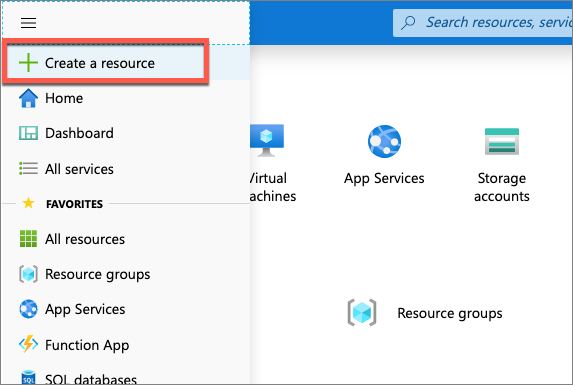
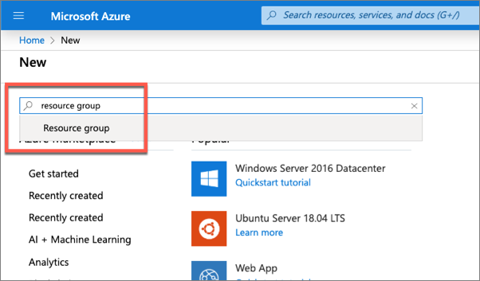
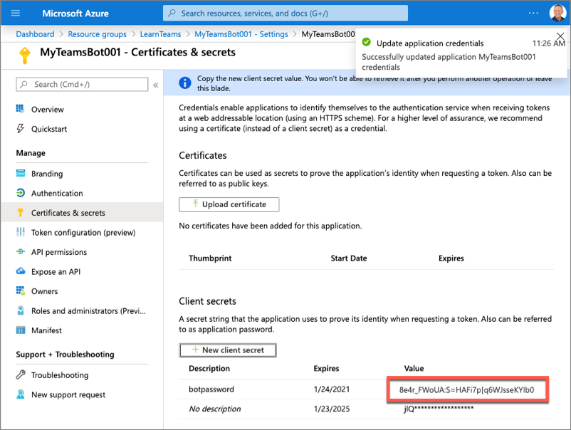
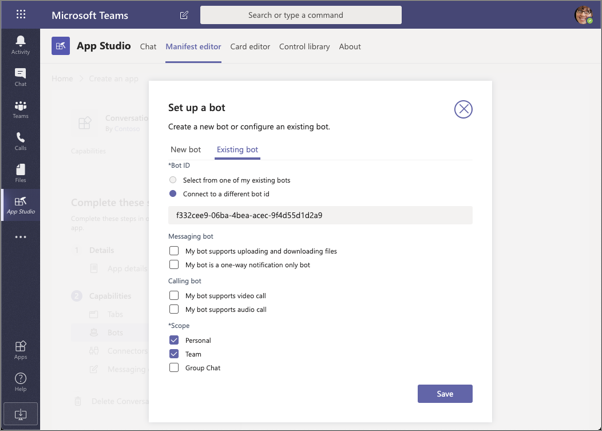
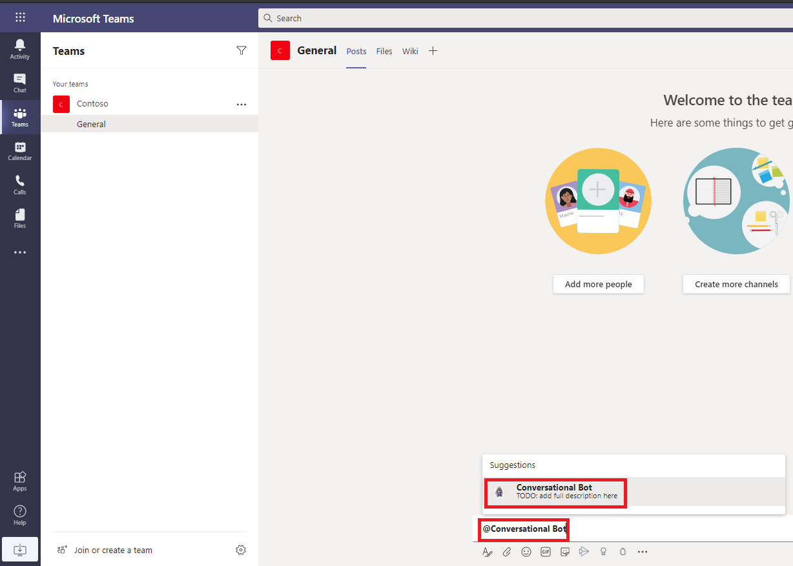

**Exercise 1 - Creating conversational bots for Microsoft Teams**

In this exercise, you’ll learn how to create and add a new bot to a Microsoft
Teams app and interact with it from the Microsoft Teams client.

### **Task 1 - Register a new bot** 

1.  Open a new browser tab and navigate to the following URL:

    <https://portal.azure.com>

2.  Click **Sign in** and then sign in with your lab admin credentials.

3.  Select **Create a resource** in the left-hand navigation.

    

4.  Enter **resource group** in the **Search the marketplace** input box, and
    select **Resource group**.

    

5.  On the **Resource Group** page, select the **Create** button to create a new
    resource group.

6.  Select a valid subscription, enter a name for the resource group, and select
    the wanted region.

    

7.  Complete the wizard to create the resource group. Once Azure has completed
    the resource group creation process, navigate to the resource group.

8.  From the resource group, select the **Add** or **Create resources** button.

    

9.  Enter **bot** in the **Search the marketplace** input box and select **Bot
    Channels Registration** from the list of resources returned. Then select
    **Create** on the next page to start the process of registering a new bot
    resource:

    

10. In the **Bot Channels Registration** blade, enter the following values and
    then select **Create**:

-   **Bot handle**: *Enter a globally unique name for the bot*

-   **Subscription**: *Select the subscription you selected previously when
    creating the resource group*

-   **Resource group**: *Select the resource group you created previously*

-   **Location**: *Select your preferred Azure region*

-   **Pricing tier**: *Select a preferred pricing tier; the F0 tier is free*

-   **Messaging endpoint**:
    [https://REPLACE_THIS.ngrok.io/api/messages](https://replace_this.ngrok.io/api/messages)

    The bot registration needs to know the endpoint of the web service where the
    bot is implemented. This will change each time you start the ngrok utility
    used in previous exercises.

-   **Application Insights**: Off

-   **Microsoft App ID and password**: Auto create App ID and password

1.  Azure will start to provision the new resource. This will take a moment or
    two. Once it's finished, navigate to the bot resource in the resource group.

    

2.  In order for the bot to interact with Microsoft Teams, you must enable the
    Teams channel. From the bot resource in Azure, select **Channels** in the
    left-hand navigation.

3.  On the **Connect to channels** pane, select the **Microsoft Teams** channel,
    then select **Save** to confirm the action.

    

4.  Once this process is complete, you should see both the Web Chat and
    Microsoft Teams listed in your enabled channels:

    

5.  Select **Settings** from the left-hand navigation. Scroll down to the
    **Microsoft App ID** section. Copy the ID of the bot to a notepad, as you'll
    need it later.

    

6.  Select **Manage** to navigate to the Azure AD app blade.

7.  Select **Certificates & secrets** from the left-hand navigation panel.

8.  Select the **New client secret** button:

    

9.  When prompted, give the secret a description and select one of the
    expiration duration options provided and select **Add**.

10. The **Certificate & Secrets** page will display the new secret. It's
    important you copy this value as it's only shown this one time; if you leave
    the page and come back, it will only show as a masked value.

    

11. Copy the value of the secret to a notepad, as you'll need it later.

### **Task 2 – Create Microsoft Teams App**

1.  Open **Command Prompt**.

2.  Go to the **C:\\Teams_Projects** directory.

    *cd C:\\Teams_Projects*

3.  Create a new folder **learn-msteams-bots2**

    *mkdir learn-msteams-bots2*

4.  Change directory to the new folder **learn-msteams-bots2**

    *cd learn-msteams-bots2*

5.  

6.  Run the Yeoman Generator for Microsoft Teams by running the following
    command:

    *yo teams*

    Yeoman will launch and ask you a series of questions. Answer the questions
    with the following values:

    **What is your solution name?**: ConversationalBot

    **Where do you want to place the files?**: Use the current folder

    **Title of your Microsoft Teams App project?**: Conversational Bot

    **Your (company) name? (max 32 characters)**: Contoso

    **Which manifest version would you like to use?**: v1.8

    **Enter your Microsoft Partner Id, if you have one?**: (Leave blank to skip)

    **What features do you want to add to your project?**: A bot

    **The URL where you will host this solution?**: (Accept the default option)

    **Would you like show a loading indicator when your app/tab loads?**: No

    **Would you like personal apps to be rendered without a tab header-bar?** No

    **Would you like to include Test framework and initial tests?**: No

    **Would you like to use Azure Applications Insights for telemetry?**: No

    **What type of Bot would you like to use?** A new Bot Framework bot

    **What is the name of your bot?** Conversational Bot

    **What is the Microsoft App ID for the Bot. It's found in the Bot Framework
    portal
    (**[**https://dev.botframework.com**](https://dev.botframework.com/)**).**
    (Enter the **Application (client) ID** value that you noted down in Task 1)

    **Do you want to add a static tab to your bot?** No

    **Do you want to support file upload to the bot?** No

    **Do you want to include bot calling support?** No

### **Task 3 - Update the default bot**

The first version of this bot will respond to the message **MentionMe** in a 1:1
chat conversation. The response will mention the user who started the
conversation.

1.  Open the file
    **C:\\Teams_Projects\\learn-msteams-bots2\\src\\app\\conversationalBot\\ConversationalBot.ts**.

2.  Add the following method to the **ConversationalBot** class:

    private async handleMessageMentionMeOneOnOne(context: TurnContext):
    Promise\<void\> {

    const mention = {

    mentioned: context.activity.from,

    text: \`\<at\>\${new
    TextEncoder().encode(context.activity.from.name)}\</at\>\`,

    type: "mention"

    };

    const replyActivity = MessageFactory.text(\`Hi \${mention.text} from a 1:1
    chat.\`);

    replyActivity.entities = [mention];

    await context.sendActivity(replyActivity);

    }

3.  The method handler you added contains a reference to two objects you haven't
    imported into the bot file. Add the following code after the existing import
    statements at the top of the file to import the TextEncoder object:

    import \* as Util from "util";

    const TextEncoder = Util.TextEncoder;

4.  Add a reference to the MessageFactory object, by adding it to the existing
    list of object references in the **botbuilder** package import at the top of
    the file:

    import {

    StatePropertyAccessor,

    CardFactory,

    TurnContext,

    MemoryStorage,

    ConversationState,

    ActivityTypes,

    TeamsActivityHandler,

    MessageFactory

    } from 'botbuilder';

5.  Locate the handler onMessage() within the constructor().

6.  Locate and replace the line if (text.startsWith("hello")) { in the
    onMessage() handler with the following code:

    if (text.startsWith("mentionme")) {

    await this.handleMessageMentionMeOneOnOne(context);

    return;

    } else if (text.startsWith("hello")) {

7.  **Save** the file and close it.

### **Task 4 - Update the project's environment variables**

The project contains a file used during development to set environment variables
to store secure values, such as the Azure AD application's ID and secret that
the bot is associated with. You need to set these two values for the bot to
work:

1.  Open the file **C:\\Teams_Projects\\learn-msteams-bots2\\.env**.

2.  Locate the following section in the file, and set the values of the
    **Application Id** and secret **Value** properties that you obtained when
    registering the bot:

    \# App Id and App Password fir the Bot Framework bot

    MICROSOFT_APP_ID=

    MICROSOFT_APP_PASSWORD=

3.  **Save** the file and close it.

### **Task 5 - Register the bot in the Microsoft Teams app**

The last step before you can test bot is to add it to the Microsoft Teams app
manifest. You can use App Studio to do this.

1.  In the browser, navigate to <https://teams.microsoft.com> and sign in with
    your lab admin credentials.

2.  Using the app bar navigation menu, select the **More added apps** button.
    Then select **App Studio**.

3.  Select the **Manifest editor** tab and then the **Create a new app** button:

    

4.  In **Short name** field, enter **Conversational Bot**. Select **Generate**
    for a new App ID. Provide a Package Name and Version. Provide a Short
    Description and Full Description.

    

5.  From the **(2) Capabilities** \> **Bots** page, select **Set up** to add a
    bot to the manifest.

6.  Select **Existing bot** tab and set the following values:

    **Bot ID**

-   Connect to a different bot ID: \<REPLACE_WITH_MICROSOFT_APP_ID\>

    **Scope**: Personal, Team

1.  Select **Save**.

    

2.  Within the **Commands** section, select **Add** to add a new command to the
    bot.

3.  On the **New command** dialog, enter the following values:

-   **Command text**: MentionMe

-   **Help text**: Sends message with @mention of the sender

-   **Scope**: Personal

1.  Click **Save**

2.  With the bot added to the Teams app, you need to update the manifest in your
    project. From the **(3) Finish** \> **Test and distribute** section, select
    the **Download** button from the **Download** section.

3.  This will download the app package as a ZIP. Unpack the zip and open the
    **manifest.json** file in it.

4.  In the
    **C:\\Teams_Projects\\learn-msteams-bots2\\src\\manifest\\manifest.json**
    file, locate the property id. Change its value to match the GUID of the
    Azure AD app that was created when creating the bot in the Azure portal.

5.  Update the **bots** section to include the **commands** for **MentionMe**.
    You can get this from **manifest.json** file that you extracted in step 12.

    "bots": [

    {

    "botId": "{{MICROSOFT_APP_ID}}",

    "supportsFiles": false,

    "isNotificationOnly": false,

    "scopes": [ "team", "personal" ],

    "commandLists": [

    {

    "scopes": [ "team", "personal" ],

    "commands": [

    {

    "title": "Help",

    "description": "Shows help information"

    },

    {

    "title": "MentionMe",

    "description": "Sends message with @mention of the sender"

    }

    ]

    }

    ]

    }

    ],

6.  **Save** this file and close it.

**Important**

Notice the botId property value. This will be replaced with the value listed in
the **./.env** file when you build the project.

At this point, your bot is ready to test!

### **Task 6 - Test the conversation bot**

1.  On your **Command Prompt** window, ensure that you are in the
    **C:\\Teams_Projects\\learn-msteams-bots2** directory.

2.  Run the following commands:

    *npm i -D @types/react*

    *npm i react --save*

    *npm i --save-dev react-dom*

3.  Run the following command:

    *gulp ngrok-serve*

This gulp task will run many other tasks all displayed within the command-line
console. The **ngrok-serve** task builds your project and starts a local web
server (http://localhost:3007). It then starts ngrok with a random subdomain
that creates a secure URL to your local webserver.

**Note -** Microsoft Teams requires all content displayed within a tab be loaded
from an HTTPS request. In development, can be done using the tool
[**ngrok**](https://www.ngrok.com/) that creates a secure rotatable URL to your
local HTTP webserver. Ngrok is included as a dependency within the project so
there is nothing to setup or configure.

Note the URL of the Ngrok URL displayed in the console. In the previous
screenshot, NGrok has created the temporary URL **ec7d937d.ngrok.io** that will
map to our locally running web server. In order for the Bot Framework to route
messages from Microsoft Teams to our locally running bot, you need to update the
bot's messaging endpoint in the Azure portal.

1.  Open a new browser tab and navigate to the following URL:

    <https://portal.azure.com>

2.  If not already signed in, then click **Sign in** and sign in with your lab
    admin credentials.

3.  Locate the bot by selecting the Azure Resource Group and Bot Channels
    Registration resource you created at the beginning of this exercise.

4.  Using the left-hand navigation, select **Bot management** \> **Settings**.

5.  Locate the property **Configuration** \> **Messaging endpoint** and set the
    domain to the NGrok domain.

6.  Finally, save your changes to the bot configuration using the **Save**
    button at the top of the page.

    **Important**

    The free version of Ngrok will create a new URL each time you restart the
    web server. Make sure you update the **Messaging endpoint** of your URL each
    time you restart the web server when you are testing the app.

7.  Open a new browser tab and navigate to the following URL:

    <https://teams.microsoft.com>

8.  Click on **Use the web app instead**.

9.  Using the left navigation menu, select the **More added apps** button
    (**…**) and then select **More apps**.

    

10. Under **Apps** section, click on **Upload a custom app** and then **Upload
    for Contoso**.

    

11. Browse and select
    **C:\\Teams_Projects\\learn-msteams-bots2\\package\\ConversationalBot.zip**
    and click **Open**. The package should be uploaded.

12. Microsoft Teams will display a tile for **Conversational Bot** app. Click on
    this tile.

    

13. It will show some details about the **Conversational Bot***.*

    

14. Select the **Add** button to install the app.

15. After installing the app, Microsoft Teams will take you to the 1:1 chat with
    the Microsoft Teams app and show the first dialog:

    

16. Select the **MentionMe** command, or manually type **mentionme** in the
    compose box, then press enter.

17. After a few seconds, you should see the bot respond mentioning the user you
    are signed in with:

    

18. Stop the local web server by selecting Ctrl+C in the console to stop the
    running process.

19. For **Terminate batch job (Y/N)?**, enter **Y** and press enter key.

## **Exercise 2 - Bots in Microsoft Teams channels and group chats**

Conversation bots can do many things within the Microsoft Teams client. They can
proactively send a message to a channel or group chat, listen for and act on
Microsoft Teams specific events and even update their own messages.

In this exercise, you’ll modify the existing Microsoft Teams app to update your
bot to respond to message reactions, and update or delete messages capabilities.

### **Task 1 - Add channel support to a conversation bot**

1.  Open the file
    **C:\\Teams_Projects\\learn-msteams-bots2\\src\\manifest\\manifest.json**.

    1.  Locate the property **version** and increment the value to **0.0.2**.

    2.  **Save** this file and close it.

    3.  Open the file
        **C:\\Teams_Projects\\learn-msteams-bots2\\src\\app\\conversationalBot\\ConversationalBot.ts**.

    4.  Locate the existing **onMessage()** handler in the class constructor and
        find the if statement that checks for the **mentionme** string. Replace
        the contents of the if statement to check the type of conversation the
        message was sent from to call the corresponding handler.

        if (context.activity.conversation.conversationType == "personal") {

        await this.handleMessageMentionMeOneOnOne(context);

        } else {

        await this.handleMessageMentionMeChannelConversation(context);

        }

    5.  The complete if statement in the **onMessage()** handler should now look
        like the following:

        if (text.startsWith("mentionme")) {

        if (context.activity.conversation.conversationType == "personal") {

        await this.handleMessageMentionMeOneOnOne(context);

        } else {

        await this.handleMessageMentionMeChannelConversation(context);

        }

        return;

        } else if (text.startsWith("hello")) {

        await context.sendActivity("Oh, hello to you as well!");

        return;

        } else if (text.startsWith("help")) {

        const dc = await this.dialogs.createContext(context);

        await dc.beginDialog("help");

        } else {

        await context.sendActivity(\`I\\'m terribly sorry, but my developer
        hasn\\'t trained me to do anything yet...\`);

        }

    6.  Finally, add the following method to the **ConversationalBot** class to
        implement the handler for our new scenario:

        private async handleMessageMentionMeChannelConversation(context:
        TurnContext): Promise\<void\> {

        const mention = {

        mentioned: context.activity.from,

        text: \`\<at\>\${new
        TextEncoder().encode(context.activity.from.name)}\</at\>\`,

        type: "mention"

        };

        const replyActivity = MessageFactory.text(\`Hi \${mention.text}!\`);

        replyActivity.entities = [mention];

        const followupActivity = MessageFactory.text(\`\*We are in a channel
        conversation\*\`);

        await context.sendActivities([replyActivity, followupActivity]);

        }

    7.  **Save** the file and close it.

### **Task 2 - Test the conversation bot in a channel**

1.  On **Command Prompt**, ensure that you are in
    **C:\\Teams_Projects\\learn-msteams-bots2** directory.

2.  Run the following command:

    *gulp ngrok-serve*

**Important -** Recall from a previous exercise, Ngrok will create a new
subdomain. You need to update your bot registration's **Messaging endpoint** in
the Azure portal (*shown in a previous exercise*) with this new domain before
testing it.

1.  Open a new browser tab and navigate to the following URL:

    <https://teams.microsoft.com>

2.  Click on **Use the web app instead**.

3.  Using the left navigation menu, select the **Apps** button at the bottom.

4.  Hover over **Conversational Bot** tile, click on **…** at the top right
    corner of the tile and click **Update**.

5.  Browse and select
    **C:\\Teams_Projects\\learn-msteams-bots2\\package\\ConversationalBot.zip**
    and click **Open**. The package should be uploaded.

6.  Refresh your web browser page. Microsoft Teams will display a tile for
    **Conversational Bot** app. Click on this tile.

7.  Click on the down arrow next to **Open** and select **Add to a team**.

    

8.  In the **Type a team or channel name** dialog box, click on the search icon
    and select an existing team.

    

9.  Then select **Set up a bot.**

10. This will take you to the Teams channel that you selected earlier. In the
    message box, @mention the bot. The first time you @mention the bot, you'll
    be prompted to install it into the team.

    

11. After installing the bot, when you @mention it and include the message
    *mentionme*, the bot will reply to your message:

    

### **Task 3 - Reply to messages with Adaptive cards**

In this section, you'll update the bot to respond to unknown messages using an
Adaptive card. The card's single action will trigger the bot to update the
existing message with a new Adaptive card. The updated message will include an
additional action that will trigger the bot to delete the message.

1.  Open the file
    **C:\\Teams_Projects\\learn-msteams-bots2\\src\\app\\conversationalBot\\ConversationalBot.ts**.

2.  Locate the existing **onMessage()** handler in the class constructor.
    Replace the else statement's contents with the following code to the
    existing if statement to respond with an adaptive card if the bot receives
    an unknown command:

    const value = { cardAction: "update", count: 0 };

    const card = CardFactory.adaptiveCard({

    "\$schema": "http://adaptivecards.io/schemas/adaptive-card.json",

    "type": "AdaptiveCard",

    "version": "1.0",

    "body": [

    {

    "type": "Container",

    "items": [

    {

    "type": "TextBlock",

    "text": "Adaptive card response",

    "weight": "bolder",

    "size": "large"

    }

    ]

    },

    {

    "type": "Container",

    "items": [

    {

    "type": "TextBlock",

    "text": "Demonstrates how to respond with a card, update the card &
    ultimately delete the response.",

    "wrap": true

    }

    ]

    }

    ],

    "actions": [

    {

    "type": "Action.Submit",

    "title": "Update card",

    "data": value

    }

    ]

    });

    await context.sendActivity({ attachments: [card] });

    return;

3.  The **onMessage()** handler's if statement should now look similar to the
    following:

    if (text.startsWith("mentionme")) {

    if (context.activity.conversation.conversationType == "personal") {

    await this.handleMessageMentionMeOneOnOne(context);

    } else {

    await this.handleMessageMentionMeChannelConversation(context);

    }

    return;

    } else if (text.startsWith("hello")) {

    await context.sendActivity("Oh, hello to you as well!");

    return;

    } else if (text.startsWith("help")) {

    const dc = await this.dialogs.createContext(context);

    await dc.beginDialog("help");

    } else {

    const value = { cardAction: "update", count: 0 };

    const card = CardFactory.adaptiveCard({..});

    await context.sendActivity({ attachments: [card] });

    return;

    });

Notice the else statement will send a card to the conversation that contains a
data object in the single actions. This object has a count property & cardAction
property. When a user triggers the action, this object will be sent to the bot.

1.  Add the following methods to implement the updateCardActivity() & the
    deleteCardActivity() handlers:

    private async updateCardActivity(context): Promise\<void\> {

    const value = {

    cardAction: "update",

    count: context.activity.value.count + 1

    };

    const card = CardFactory.adaptiveCard({

    "\$schema": "http://adaptivecards.io/schemas/adaptive-card.json",

    "type": "AdaptiveCard",

    "version": "1.0",

    "body": [

    {

    "type": "Container",

    "items": [

    {

    "type": "TextBlock",

    "text": "Adaptive card response",

    "weight": "bolder",

    "size": "large"

    }

    ]

    },

    {

    "type": "Container",

    "items": [

    {

    "type": "TextBlock",

    "text": \`Updated count: \${ value.count }\`,

    "wrap": true

    }

    ]

    }

    ],

    "actions": [

    {

    "type": "Action.Submit",

    "title": "Update card",

    "data": value

    },

    {

    "type": "Action.Submit",

    "title": "Delete card",

    "data": { cardAction: "delete"}

    }

    ]

    });

    await context.updateActivity({ attachments: [card], id:
    context.activity.replyToId, type: 'message' });

    }

    private async deleteCardActivity(context): Promise\<void\> {

    await context.deleteActivity(context.activity.replyToId);

    }

In the code you've added, notice the updateCardActivity() retrieves and
increments the count property it received. It then creates a new card with the
same data, but with an additional action to delete the card. Finally, the method
uses the updateActivity() method to update an existing message.

The deleteCardActivity() deletes the card using the deleteActivity() method.

1.  Within the **onMessage()** method, locate the following line of code:

    case ActivityTypes.Message:

2.  You're going to add a conditional check to determine if the message is an
    action from our card or a message from the user. First, wrap the entire
    contents of this **case** statement in the else part of a new **if-else**
    block:

    case ActivityTypes.Message:

    // if a value property exists = adaptive card submit action

    if () {

    // TODO - insert card action logic

    } else {

    // existing code goes here

    }

    break;

3.  Next, update the if statement to check if the message contains a **value**
    property:

    case ActivityTypes.Message:

    // if a value property exists = adaptive card submit action

    if (context.activity.value) {

    // TODO - insert card action logic

    } else {

    // existing code goes here

    }

    break;

4.  Finally, add the following switch statement to the if block, replacing the
    **// TODO - insert card action logic** comment, to determine if the action
    requested should update or delete the card:

    switch (context.activity.value.cardAction) {

    case "update":

    await this.updateCardActivity(context);

    break;

    case "delete":

    await this.deleteCardActivity(context);

    break;

    }

5.  The final **onMessage()** method should look like the following code:

    this.onMessage(async (context: TurnContext): Promise\<void\> =\> {

    switch (context.activity.type) {

    case ActivityTypes.Message:

    // if a value property exists = adaptive card submit action

    if (context.activity.value) {

    switch (context.activity.value.cardAction) {

    case "update":

    await this.updateCardActivity(context);

    break;

    case "delete":

    await this.deleteCardActivity(context);

    break;

    }

    } else {

    let text = TurnContext.removeRecipientMention(context.activity);

    text = text.toLowerCase();

    if (text.startsWith("mentionme")) {

    if (context.activity.conversation.conversationType == "personal") {

    await this.handleMessageMentionMeOneOnOne(context);

    } else {

    await this.handleMessageMentionMeChannelConversation(context);

    }

    return;

    } else if (text.startsWith("hello")) {

    await context.sendActivity("Oh, hello to you as well!");

    return;

    } else if (text.startsWith("help")) {

    const dc = await this.dialogs.createContext(context);

    await dc.beginDialog("help");

    } else {

    const value = { cardAction: "update", count: 0 };

    const card = CardFactory.adaptiveCard({

    // code omitted for brevity

    });

    await context.sendActivity({ attachments: [card] });

    return;

    }

    break;

    }

    default:

    break;

    }

    // Save state changes

    return this.conversationState.saveChanges(context);

    });

6.  **Save** this file.

### **Task 4 - Test the bot updating existing messages**

1.  In the Microsoft Teams client, go to the channel you installed the bot in
    the previous section. Click **New Conversation** and @mention the bot with a
    random string to trigger the else condition.

    

2.  Select the button **Update card**. After a few seconds, the card should be
    updated with a new card containing an incremented counter value and a new
    button:

    

3.  Select the **Update card** button a few more times to see the counter get
    updated.

4.  Finally, select the **Delete card** button. After a few seconds, the card
    will be removed by the bot.

### **Task 5 - Reply to message reactions**

In this section, you'll update the bot to respond when someone likes a message
from the bot.

1.  Open the file
    **C:\\Teams_Projects\\learn-msteams-bots2\\src\\app\\conversationalBot\\ConversationalBot.ts**.

2.  Locate the existing this.onMessageReaction() handler in the class
    constructor method and replace its contents with the following code:

    if (context.activity.reactionsAdded) {

    context.activity.reactionsAdded.forEach(async (reaction) =\> {

    if (reaction.type === "like") {

    await context.sendActivity("Thank you!");

    }

    });

    }

This code will execute when a user adds a reaction to a message from the bot. If
the reaction is a *like*, the bot will reply with a *"Thank you!"* message.

1.  **Save** this file.

### **Task 6 - Test the bot reacting to message reactions**

1.  On **Command Prompt**, ensure that you are in
    **C:\\Teams_Projects\\learn-msteams-bots2** directory.

2.  Run the following command:

    *gulp ngrok-serve*

**Important -** Recall from a previous exercise, Ngrok will create a new
subdomain. You need to update your bot registration's **Messaging endpoint** in
the Azure portal (*shown in a previous exercise*) with this new domain before
testing it.

1.  In the Microsoft Teams, go to the channel you installed the bot in the
    previous section. Click **New Conversation** and @mention the bot with a
    random string. Then apply a *like* reaction to it. The bot will respond with
    a **Thank you!**

    

## **Exercise 3 - Proactive messages from bots**

In this exercise, you’ll update the existing Teams app to send a proactive
message from your bot.

### **Task 1 - Start a proactive message from the bot**

1.  Open the file
    **C:\\Teams_Projects\\learn-msteams-bots2\\src\\app\\conversationalBot\\ConversationalBot.ts**.

2.  Add the following objects to the existing import {...} from "botbuilder";
    statement you'll need:

    import {

    ChannelInfo,

    TeamsChannelData,

    ConversationParameters,

    teamsGetChannelId,

    Activity,

    BotFrameworkAdapter,

    ConversationReference,

    ConversationResourceResponse,

    // existing imports omitted for clarity

    } from "botbuilder";

3.  Locate the card in the **else** statement in the **onMessage()** handler you
    added in the previous section. Add a second action button to the card that
    will trigger the creation of a new message:

    {

    "type": "Action.Submit",

    "title": "Create new thread in this channel",

    "data": { cardAction: "newconversation" }

    }

4.  The card should now look like the following:

    const card = CardFactory.adaptiveCard({

    "\$schema": "http://adaptivecards.io/schemas/adaptive-card.json",

    "type": "AdaptiveCard",

    "version": "1.0",

    "body": [

    {

    "type": "Container",

    "items": [

    {

    "type": "TextBlock",

    "text": "Adaptive card response",

    "weight": "bolder",

    "size": "large"

    }

    ]

    },

    {

    "type": "Container",

    "items": [

    {

    "type": "TextBlock",

    "text": "Demonstrates how to respond with a card, update the card &
    ultimately delete the response.",

    "wrap": true

    }

    ]

    }

    ],

    "actions": [

    {

    "type": "Action.Submit",

    "title": "Update card",

    "data": value

    },

    {

    "type": "Action.Submit",

    "title": "Create new thread in this channel",

    "data": { cardAction: "newconversation" }

    }

    ]

    });

5.  Next, add another case statement to the switch
    (context.activity.value.cardAction) statement the **onMessage()** handler to
    detect this new action:

    case "newconversation":

    const message = MessageFactory.text("This will be the first message in a new
    thread");

    await this.createConversation(context, message);

    break;

6.  The last step is to add the **createConversation()** method that will create
    the new conversation. Add the following method to the **ConversationalBot**
    class:

    private async createConversation(context: TurnContext, message:
    Partial\<Activity\>): Promise\<void\> {

    // get a reference to the bot adapter & create a connection to the Teams API

    const adapter = \<BotFrameworkAdapter\>context.adapter;

    // create a new conversation and get a reference to it

    const conversationReference =
    \<ConversationReference\>TurnContext.getConversationReference(context.activity);

    // send message

    await adapter.continueConversation(conversationReference, async turnContext
    =\> {

    await turnContext.sendActivity(message);

    });

    }

7.  **Save** this file.

### **Task 2 - Test the bot sending new messages**

1.  In the Microsoft Teams, go to the channel you installed the bot in the
    previous section. Click **New Conversation** and @mention the bot with a
    random string. The bot will reply to the message with the updated card that
    contains two buttons:

    

2.  Select the second button, **Create new thread in this channel**. Within a
    few seconds, you should see a new conversation appear in the channel:
