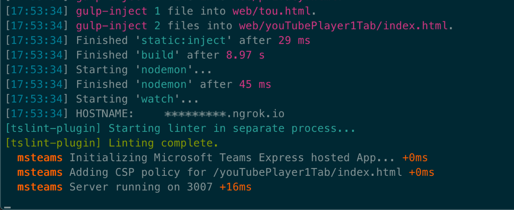
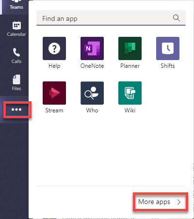
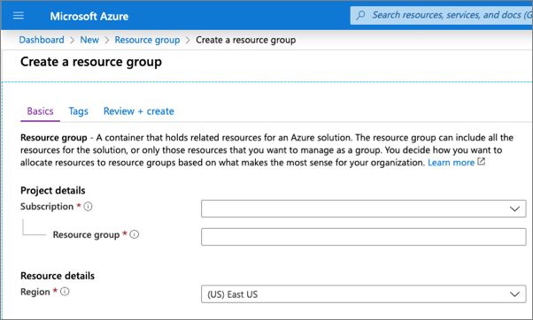
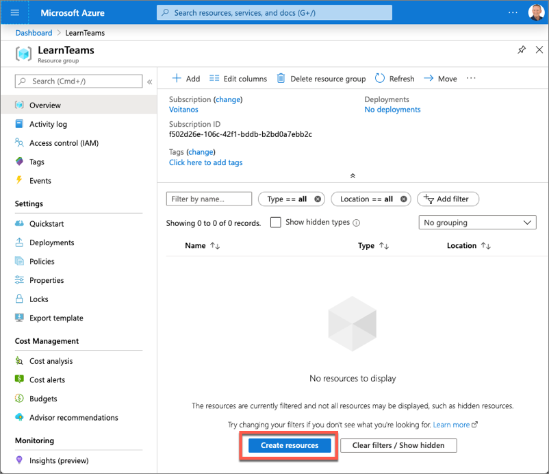
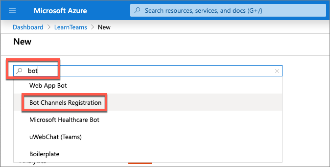
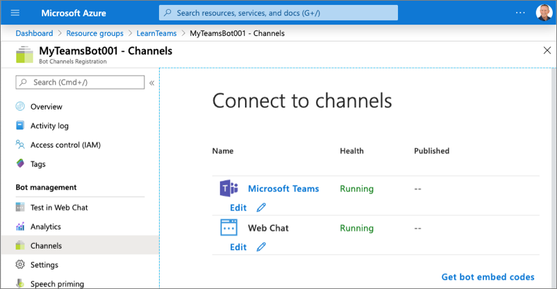
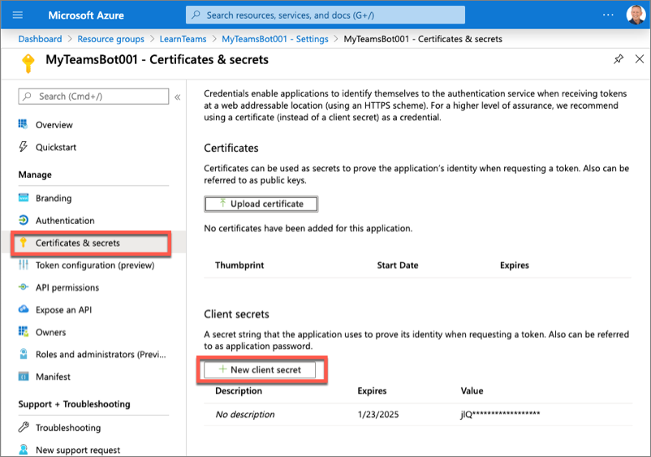

**Lab 5 – Task Modules**

## **Exercise 1 - Collecting user input with task modules**

In this exercise, you'll learn the basics of task modules in Microsoft Teams and
how to collect input from users in a custom Teams tab. After creating a new
Microsoft Teams personal tab, you'll add two task modules to it.

One is a standard HTML page that accepts the ID of a video on YouTube. When the
task module is invoked, it will display the video using the YouTube embedded
player. This task module will get the video ID from the query string, but it
will not need to return any information back to the tab.

The other task module is implemented using React, the same way custom tabs are
implemented using the Yeoman Generator for Microsoft Teams. This task module
enables the user to specify the ID of the YouTube video to display. Once
changed, when the user saves their changes, it will use the callback to close
submit the new ID back to the tab.

### **Task 1 - Create Microsoft Teams app**

1.  Open **Command Prompt** and change the directory to C:\\Teams_Projects.

    *cd C:\\Teams_Projects*

2.  Create a new sub-directory for the new app.

    *mkdir learn-msteams-taskmodules*

3.  Change current directory to the new sub-directory.

    *cd learn-msteams-taskmodules*

4.  Run the Yeoman Generator for Microsoft Teams by running the following
    command:

    *yo teams*

Yeoman will launch and ask you a series of questions. Answer the questions with
the following values:

-   **What is your solution name?**: YouTubePlayer

-   **Where do you want to place the files?**: Use the current folder

-   **Title of your Microsoft Teams App project?**: YouTube Player

-   **Your (company) name? (max 32 characters)**: Contoso

-   **Which manifest version would you like to use?**: v1.8

-   **Enter your Microsoft Partner ID, if you have one?**: (Leave blank to skip)

-   **What features do you want to add to your project?**: A Tab

-   **The URL where you will host this solution?**: (Accept the default option)

-   **Would you like to show a loading indicator when your app/tab loads?** No

-   **Would you like personal apps to be rendered without a tab header-bar?** No

-   **Would you like to include Test framework and initial tests?**: No

-   **Would you like to use Azure Applications Insights for telemetry?**: No

-   **Default Tab name? (max 16 characters)**: YouTube Player 1

-   **Do you want to create a configurable or static tab?**: Static

-   **Do you require Azure AD Single-Sign-On support for the tab?** No

**Note** - Most of the answers to these questions can be changed after creating
the project. For example, the URL where the project will be hosted isn't
important at the time of creating or testing the project.

After answering the generator's questions, the generator will create the
scaffolding for the project and then automatically execute npm install that
downloads all the dependencies required by the project.

### **Task 2 - Test the personal tab**

1.  On **Command Prompt**, ensure that you are in
    **C:\\Teams_Projects\\learn-msteams-taskmodules** directory and run the
    following command:

    *gulp ngrok-serve*

This gulp task will run many other tasks all displayed within the command-line
console. The **ngrok-serve** task builds your project and starts a local web
server (http://localhost:3007). It then starts ngrok with a random subdomain
that creates a secure URL to your local webserver.

**Note**

Microsoft Teams requires all content displayed within a tab be loaded from an
HTTPS request. In development, can be done using the tool
[**ngrok**](https://www.ngrok.com/) that creates a secure rotatable URL to your
local HTTP webserver. Ngrok is included as a dependency within the project so
there is nothing to setup or configure.

**Important**

Each time ngrok is started, it will generate a new dynamic subdomain for the
URL. If you have to restart ngrok, you will need to repackage and and update the
app in Microsoft Teams to make the installed app aware of the new URL. The
optional licensed version of ngrok allows you to define and reuse the same
subdomain.

1.  Open a browser and navigate to the ngrok URL displayed in the console:

    

2.  Update the URL in the browser to load the tab created by the scaffolding
    process (**/youTubePlayer1Tab/index.html**). Here you can see the page can
    determine that it isn't running within the Microsoft Teams client.

    

3.  Now let's load the tab in Microsoft Teams. In the browser, navigate to
    <https://teams.microsoft.com> and if prompted, sign in with your lab admin
    credentials.

4.  Click on **Use web client instead.**

5.  In the left navigation pane, select the **More added apps** button **(…)**.
    Then select **More apps**.

    

6.  Under **Apps** section, click on **Upload a custom app** and then **Upload
    for Contoso**.

    

7.  Browse and select
    **C:\\Teams_Projects\\learn-msteams-taskmodules\\package\\YouTubePlayer.zip**
    and click **Open**. The package should be uploaded.

8.  Refresh your web browser window. Microsoft Teams will display a tile for
    **YouTube Player** app. Click on this tile.

    

9.  Here you can see some **TODO** items to address. You'll update the todo
    items later in the exercise*.*

    

10. Select the **Add** button to install the app. You will be taken to the new
    tab.

    

Notice that when the content page is loaded in a tab within the Microsoft teams
client, it's displaying the value of the entityId property of the tab, not the
message "This isn't hosted in Microsoft Teams" as you saw when viewing the
content page in the browser. The tab can detect if it's loaded within the
Microsoft Teams client using the Microsoft Teams JavaScript SDK.

1.  On your **Command Prompt**, stop the running process by pressing Ctrl+C and
    then enter **Y** and press enter key.

### **Task 3 - Implement the personal tab's user interface**

1.  Open the file
    **C:\\Teams_Projects\\learn-msteams-taskmodules\\src\\app\\scripts\\youTubePlayer1Tab\\youTubePlayer1Tab.tsx**.

2.  Update the import statements in this file to add components from the Fluent
    UI - React library. Find the following import statement at the top of the
    file that imports components from the Fluent UI - React library:

    import { Provider, Flex, Text, Button, Header } from
    "@fluentui/react-northstar";

3.  Replace the previous statement with the following import statement:

    import {

    Provider,

    Flex,

    Text,

    Button,

    Header,

    ThemePrepared,

    teamsTheme,

    teamsDarkTheme,

    teamsHighContrastTheme,

    Input

    } from "@fluentui/react-northstar";

4.  Update the state of the component to contain a list of items and a property
    for a new item. Locate the IYouTubePlayer1TabState interface in the
    YouTubePlayer1Tab.tsx file and add the following properties to it:

    teamsTheme: ThemePrepared;

    youTubeVideoId?: string;

5.  Add the following method to the YouTubePlayer1Tab class that updates the
    component state to the theme that matches the currently selected Microsoft
    Teams client theme:

    private updateComponentTheme = (currentThemeName: string = "default"): void
    =\> {

    let theme: ThemePrepared;

    switch (currentThemeName) {

    case "default":

    theme = teamsTheme;

    break;

    case "dark":

    theme = teamsDarkTheme;

    break;

    case "contrast":

    theme = teamsHighContrastTheme;

    break;

    default:

    theme = teamsTheme;

    break;

    }

    // update the state

    this.setState(Object.assign({}, this.state, {

    teamsTheme: theme

    }));

    }

6.  Initialize the current theme and state of the component. Locate the line
    **this.updateTheme(this.getQueryVariable("theme"));** and replace it with
    the following code in the **componentWillMount()** method:

    this.updateComponentTheme(this.getQueryVariable("theme"));

    this.setState(Object.assign({}, this.state, {

    youTubeVideoId: "VlEH4vtaxp4"

    }));

7.  Within the **componentWillMount()** method, locate the following line:

    microsoftTeams.registerOnThemeChangeHandler(this.updateTheme);

8.  This code registers an event handler to update the component's theme to
    match the theme of the current Microsoft Teams client when this page is
    loaded as a tab. Update this line to call the new handler in the following
    line to register another handler to update the component theme:

    microsoftTeams.registerOnThemeChangeHandler(this.updateComponentTheme);

9.  Locate the **render()** method and update it to the following code. The
    **render()** method will now display the list of items in our state out with
    a brief copyright statement:

    public render() {

    return (

    \<Provider theme={this.state.teamsTheme}\>

    \<Flex column gap="gap.smaller"\>

    \<Header\>Task Module Demo\</Header\>

    \<Text\>YouTube Video ID:\</Text\>

    \<Input value={this.state.youTubeVideoId} disabled\>\</Input\>

    \<Button content="Change Video ID" onClick={this.onChangeVideo}\>\</Button\>

    \<Button content="Show Video" primary
    onClick={this.onShowVideo}\>\</Button\>

    \<Text content="(C) Copyright Contoso" size="smallest"\>\</Text\>

    \</Flex\>

    \</Provider\>

    );

    }

10. The next step is to add some interactivity to the tab. Add the following
    methods to the **YouTubePlayer1Tab** class. These methods will handle
    updating the state when specific events happen on the form you'll add to the
    component:

    private onShowVideo = (event: React.MouseEvent\<HTMLButtonElement\>): void
    =\> {

    }

    private onChangeVideo = (event: React.MouseEvent\<HTMLButtonElement\>): void
    =\> {

    }

11. **Save** this file.

### **Task 4 - Test the personal tab**

1.  On **Microsoft Teams** browser tab where you opened **YouTube Player**
    application, refresh the browser window.

2.  Notice the new UI you've implemented for the tab.

    

3.  Stop the local web server by selecting Ctrl+C in the console to stop the
    running process.

4.  For **Terminate batch job (Y/N)?**, enter **Y** and press enter key.

### **Task 5 - Add video player task module**

1.  Open the folder
    **C:\\Teams_Projects\\learn-msteams-taskmodules\\src\\app\\web\\youTubePlayer1Tab**.

2.  Create a new file named **player.html.**

3.  Add the following HTML to the **player.html** file:

    \<!DOCTYPE html\>

    \<html lang="en"\>

    \<head\>

    \<title\>YouTube Player Task Module\</title\>

    \<style\>

    \#embed-container iframe {

    position: absolute;

    top: 0;

    left: 0;

    width: 95%;

    height: 95%;

    padding-left: 20px;

    padding-right: 20px;

    padding-top: 10px;

    padding-bottom: 10px;

    border-style: none;

    }

    \</style\>

    \</head\>

    \<body\>

    \
\</div\>

    \</body\>

    \</html\>

4.  Implement the \<iframe\> embedded video player by adding the following
    JavaScript before the closing \</body\> tag in the **player.html** file:

    \<script\>

    function getUrlParameter(name) {

    name = name.replace(/[\\[]/, '\\\\[').replace(/[\\]]/, '\\\\]');

    var regex = new RegExp('[\\\\?&]' + name + '=([\^&\#]\*)');

    var results = regex.exec(location.search);

    return results === null ? '' : decodeURIComponent(results[1].replace(/\\+/g,
    ' '));

    };

    var element = document.createElement("iframe");

    element.src = "https://www.youtube.com/embed/" + getUrlParameter("vid");

    element.width = "1000";

    element.height = "700";

    element.frameborder = "0";

    element.allow = "autoplay; encrypted-media";

    element.allowfullscreen = "";

    document.getElementById("embed-container").appendChild(element);

    \</script\>

5.  **Save** this file and close it.

6.  Open the file
    **C:\\Teams_Projects\\learn-msteams-taskmodules\\src\\app\\scripts\\youTubePlayer1Tab\\YouTubePlayer1Tab.tsx**.

7.  First, add the following utility method to the YouTubePlayer1Tab class:

    private appRoot(): string {

    if (typeof window === "undefined") {

    return "https://{{HOSTNAME}}";

    } else {

    return window.location.protocol + "//" + window.location.host;

    }

    }

8.  Next, add the following code to the onShowVideo() method:

    private onShowVideo = (event: React.MouseEvent\<HTMLButtonElement\>): void
    =\> {

    const taskModuleInfo = {

    title: "YouTube Player",

    url: this.appRoot() +
    \`/youTubePlayer1Tab/player.html?vid=\${this.state.youTubeVideoId}\`,

    width: 1000,

    height: 700

    };

    microsoftTeams.tasks.startTask(taskModuleInfo);

    }

    This code will create a new taskInfo object with the details of the task
    module. It will then launch the task module. This task module does nothing
    but display information, so we don't need to implement the callback.

9.  **Save** this file.

10. Open the file
    **C:\\Teams_Projects\\learn-msteams-taskmodules\\src\\manifest\\manifest.json**.

11. Locate the **version** property and assign it a value of **0.0.3**.

12. **Save** this file and close it.

### **Task 6 – Test the video player task module**

1.  On **Command Prompt**, ensure that you are in
    **C:\\Teams_Projects\\learn-msteams-taskmodules** directory and run the
    following command:

    *gulp ngrok-serve*

2.  On **Microsoft Teams** browser tab, click on **Apps** at the bottom of the
    left navigation pane.

3.  Hover over **YouTube Player** tile and click on **…** at the top-right
    corner of this tile.

4.  Click **Update**.

5.  Browse and select
    **C:\\Teams_Projects\\learn-msteams-taskmodules\\package\\YouTubePlayer.zip**
    and click **Open**. The app should be updated.

6.  Refresh your web browser window. Microsoft Teams will display a tile for
    **YouTube Player** app. Click on this tile.

7.  Click **Open**.

8.  Click **Show Video** button.

9.  Microsoft Teams will load the video player task module with the specified
    video loaded in the embedded player:

    

10. Stop the local web server by selecting Ctrl+C in the console to stop the
    running process.

11. For **Terminate batch job (Y/N)?**, enter **Y** and press enter key.

## **Exercise 2 - Using adaptive cards and deep links in task modules**

In this exercise, you'll learn how to use adaptive cards in a custom task module
in a custom Microsoft Teams app. You'll also learn how to invoke task modules
from anywhere within Microsoft Teams using deep links.

### **Task 1 - Create video selector as an adaptive card**

1.  On your **Microsoft Teams** browser tab, click on **More added apps** button
    (**…**) and then select **App Studio**.

    

2.  In App Studio, select the **Card editor** tab and then select the **Create a
    new card** button.

3.  Select the **Create** button for an **Adaptive Card** in the list of card
    types you can create in the **Create a new card** dialog.

4.  Click **Create** for **Adaptive Card**.

5.  The App Studio Card editor will show a default card and its live preview.
    You can use this interface to design your card and see how it will be
    rendered.

6.  From the **json** tab, replace the contents of the default card with the
    following JSON:

    {

    "\$schema": "http://adaptivecards.io/schemas/adaptive-card.json",

    "type": "AdaptiveCard",

    "version": "1.0",

    "body": [

    {

    "type": "Container",

    "items": [

    {

    "type": "TextBlock",

    "text": "YouTube Video Selector",

    "weight": "bolder",

    "size": "extraLarge"

    }

    ]

    },

    {

    "type": "Container",

    "items": [

    {

    "type": "TextBlock",

    "text": "Enter the ID of a YouTube video to show in the task module
    player.",

    "wrap": true

    },

    {

    "type": "Input.Text",

    "id": "youTubeVideoId",

    "value": ""

    }

    ]

    }

    ],

    "actions": [

    {

    "type": "Action.Submit",

    "title": "Update"

    }

    ]

    }

1.  This JSON code instructs Microsoft Teams to render a textbox and button.
    When the button is selected, it will submit the card.

2.  Copy and paste this JSON into a new file, **YouTubeSelectorCard.json**, into
    the folder
    **C:\\Teams_Projects\\learn-msteams-taskmodules\\src\\app\\scripts\\youTubePlayer1Tab**.

### **Task 2 - Create a new task module that uses the Adaptive Card**

1.  Open the file
    **C:\\Teams_Projects\\learn-msteams-taskmodules\\src\\app\\scripts\\youTubePlayer1Tab\\YouTubePlayer1Tab.tsx**.

2.  Locate the render() method and add the following code to add a button after
    one of the existing buttons:

    \<Button content="Change Video ID (AdaptiveCard)"
    onClick={this.onChangeVideoAdaptiveCard}\>\</Button\>

3.  Next, add the following method to the YouTubePlayer1Tab class:

    private onChangeVideoAdaptiveCard = (event:
    React.MouseEvent\<HTMLButtonElement\>): void =\> {

    const taskModuleInfo = {

    title: "YouTube Video Selector",

    width: 350,

    height: 250

    };

    const submitHandler = (err: string, result: any): void =\> {

    };

    microsoftTeams.tasks.startTask(taskModuleInfo, submitHandler);

    }

4.  The first step is to load the Adaptive Card and set the value of the video
    ID to display when it loads. Do this by adding the following code to the
    beginnings of the onChangeVideoAdaptiveCard() method:

    // load adaptive card

    const adaptiveCard: any = require("./YouTubeSelectorCard.json");

    // update card with current video ID

    adaptiveCard.body.forEach((container: any) =\> {

    if (container.type === "Container") {

    container.items.forEach((item: any) =\> {

    if (item.id && item.id === "youTubeVideoId") {

    item.value = this.state.youTubeVideoId;

    }

    });

    }

    });

5.  Next, implement the callback. When the Adaptive Card executes the submit
    action, it will send an object back with all the input objects as
    properties. Add the following code to the existing submitHandler() in the
    onChangeVideoAdaptiveCard() function. This code will update the state with
    the value of the video ID specified in the Adaptive Card:

    this.setState(Object.assign({}, this.state, {

    youTubeVideoId: result.youTubeVideoId

    }));

6.  Lastly, add a new card property to the taskModuleInfo object, and set its
    value to the adaptive card. The resulting taskModuleInfo should look like
    the following code:

    const taskModuleInfo = {

    title: "YouTube Video Selector",

    card: adaptiveCard,

    width: 350,

    height: 250

    };

7.  **Save** this file.

8.  Open the file
    **C:\\Teams_Projects\\learn-msteams-taskmodules\\src\\manifest\\manifest.json**.

9.  Locate the **version** property and assign it a value of **0.0.4**.

10. **Save** this file and close it.

### **Task 3 - Test the Adaptive Card task module**

1.  On **Command Prompt**, ensure that you are in
    **C:\\Teams_Projects\\learn-msteams-taskmodules** directory and run the
    following command:

    *gulp ngrok-serve*

2.  On **Microsoft Teams** browser tab, click on **Apps** at the bottom of the
    left navigation pane.

3.  Hover over **YouTube Player** tile and click on **…** at the top-right
    corner of this tile.

4.  Click **Update**.

5.  Browse and select
    **C:\\Teams_Projects\\learn-msteams-taskmodules\\package\\YouTubePlayer.zip**
    and click **Open**. The app should be updated.

6.  Refresh your web browser window. Microsoft Teams will display a tile for
    **YouTube Player** app. Click on this tile.

7.  Click **Open**.

8.  Click **Change Video ID (AdaptiveCard) button.**

9.  Microsoft Teams will open a task module with the rendered Adaptive Card:

    

10. Replace the video ID in the input box and select **Update**.

11. Notice the video ID displayed in the tab is updated to reflect this new
    value.

### **Task 4 - Invoking task modules with deep links**

Task modules can be invoked by selecting a button in the Microsoft Teams
experience, or using a deep link. Deep links allow you to trigger a task module
invocation from outside of teams, or within teams from a conversation.

The format for a deep link is as follows:

https://teams.microsoft.com/l/task/\<APP_ID\>?url=\<TaskInfo.url\>&height=\<TaskInfo.height\>&width=\<TaskInfo.width\>&title=\<TaskInfo.title\>

Consider if you wanted to open a task module from a conversation that would
display the following video on an [**Overview of teams and
channels**](https://www.youtube.com/watch?v=VlEH4vtaxp4).

As you learned in a previous exercise, the URL to display the video in the
player task module would be the following:

https://{{REPLACE_WITH_YOUR_NGROK_URL}}/youTubePlayer1Tab/player.html?vid=VlEH4vtaxp4

The deep link to launch the video player task module would be the following
(*assuming your custom Microsoft Teams app's ID is
3386faf0-109f-11ea-9799-77a28170bd5d*):

https://teams.microsoft.com/l/task/3386faf0-109f-11ea-9799-77a28170bd5d?url=https://{{REPLACE_WITH_YOUR_NGROK_URL}}/youTubePlayer1Tab/player.html?vid=VlEH4vtaxp4&height=700&width=1000&title=YouTube%20Player:%20Overview%20of%20teams%20and%20channels

1.  In Microsoft teams, in the left navigation pane, click **Teams**. Go to a
    channel and click **New conversation**.

2.  select the **Conversations** tab, and select the **Format** button below the
    message box:

1.  Enter a message to post to the channel. Select some of the text and then
    click on **insert link** option to add a link to the message:

    

2.  In **Insert link** panel, in **Address** field, provide the link

    https://teams.microsoft.com/l/task/{{APP_ID}}?url=https://{{REPLACE_WITH_YOUR_NGROK_URL}}/youTubePlayer1Tab/player.html?vid=VlEH4vtaxp4&height=700&width=1000&title=YouTube%20Player:%20Overview%20of%20teams%20and%20channels

3.  Replace the **{{APP_ID}}** with the **APPLICATION_ID** value available in
    **C:\\Teams_Projects\\learn-msteams-taskmodules\\.env** file. And also
    update the **{{REPLACE_WITH_YOUR_NGROK_URL}}** with your ngrok url value.

4.  Click **Insert**.

5.  Now click **Send** to send this message.

6.  Now, click on the link to see the task module open without having to trigger
    it from the custom tab.

7.  Stop the local web server by selecting Ctrl+C in the console to stop the
    running process.

8.  For **Terminate batch job (Y/N)?**, enter **Y** and press enter key.

## **Exercise 3 - Using task modules with bots**

In this exercise, you'll learn how to use task modules with bots in Microsoft
Teams.

The first step will be to create a bot and add it to our existing Microsoft
Teams app. You'll then extend the bot to support the existing task modules to
display a video and change the selected video.

### **Task 1 - Register a new bot** 

1.  Open a new browser tab and navigate to the following URL:

    <https://portal.azure.com>

2.  Click **Sign in** and then sign in with your lab admin credentials.

3.  Select **Create a resource** in the left-hand navigation.

    

4.  Enter **resource group** in the **Search the marketplace** input box, and
    select **Resource group**.

    

5.  On the **Resource Group** page, select the **Create** button to create a new
    resource group.

6.  Select a valid subscription, enter a name for the resource group, and select
    the wanted region.

    

7.  Complete the wizard to create the resource group. Once Azure has completed
    the resource group creation process, navigate to the resource group.

8.  From the resource group, select the **Add** or **Create resources** button.

    

9.  Enter **bot** in the **Search the marketplace** input box and select **Bot
    Channels Registration** from the list of resources returned. Then select
    **Create** on the next page to start the process of registering a new bot
    resource:

    

10. In the **Bot Channels Registration** blade, enter the following values and
    then select **Create**:

-   **Bot handle**: *Enter a globally unique name for the bot*

-   **Subscription**: *Leave the default subscription*

-   **Resource group**: *Select the resource group you created previously*

-   **Location**: *Select your preferred Azure region*

-   **Pricing tier**: *Select a preferred pricing tier; the F0 tier is free*

-   **Messaging endpoint**:
    [https://REPLACE_THIS.ngrok.io/api/messages](https://replace_this.ngrok.io/api/messages)

    The bot registration needs to know the endpoint of the web service where the
    bot is implemented. This will change each time you start the ngrok utility
    used in previous exercises.

-   **Application Insights**: Off

-   **Microsoft App ID and password**: Auto create App ID and password

1.  Azure will start to provision the new resource. This will take a moment or
    two. Once it's finished, navigate to the bot resource in the resource group.

    

2.  In order for the bot to interact with Microsoft Teams, you must enable the
    Teams channel. From the bot resource in Azure, select **Channels** in the
    left-hand navigation.

3.  On the **Connect to channels** pane, select the **Microsoft Teams** channel,
    then select **Save** to confirm the action.

    

4.  Once this process is complete, you should see both the Web Chat and
    Microsoft Teams listed in your enabled channels:

    

5.  Select **Settings** from the left-hand navigation. Scroll down to the
    **Microsoft App ID** section. Copy the ID of the bot to a notepad, as you'll
    need it later.

    

6.  Select **Manage** to navigate to the Azure AD app blade.

7.  Select **Certificates & secrets** from the left-hand navigation panel.

8.  Select the **New client secret** button:

    

9.  When prompted, give the secret a description and select one of the
    expiration duration options provided and select **Add**.

10. The **Certificate & Secrets** page will display the new secret. It's
    important you copy this value as it's only shown this one time; if you leave
    the page and come back, it will only show as a masked value.

    

11. Copy the value of the secret to a notepad, as you'll need it later.

### **Task 2 - Update the Microsoft Teams app project** 

1.  Open the file **C:\\Teams_Projects\\learn-msteams-taskmodules\\.env**.

    1.  Locate the properties **MICROSOFT_APP_ID** and
        **MICROSOFT_APP_PASSWORD** and copy the values of the bot's application
        ID and secret to these values.

    2.  **Save** this file and close it.

    3.  Open the file
        **C:\\Teams_Projects\\learn-msteams-taskmodules\\src\\manifest\\manifest.json**.

    4.  Locate the **id** property and change its value to the same ID as the
        Azure AD application created for the bot.

    5.  Locate the section "bots": [], in the **manifest.json** file. Replace
        this empty collection with the following. Ensure you use the same Azure
        AD app ID for the botId in the following code:

        "bots": [

        {

        "botId": "{{MICROSOFT_APP_ID}}",

        "scopes": [

        "personal"

        ],

        "supportsFiles": false,

        "isNotificationOnly": false,

        "commandLists": [

        {

        "scopes": [ "personal" ],

        "commands": [

        {

        "title": "MentionMe",

        "description": "Sends message with @mention of the sender"

        }

        ]

        }

        ]

        }

        ],

    6.  **Save** this file and close it.

    7.  Go to the folder
        **C:\\Teams_Projects\\learn-msteams-taskmodules\\src\\app**.

    8.  Create a new sub-folder named **learningTeamsBot**.

    9.  In this new sub-folder, create a new file named **learningTeamsBot.ts**.

    10. Add the following code to the **learningTeamsBot.ts** file:

        import { BotDeclaration, } from "express-msteams-host";

        import {

        ActionTypes,

        CardFactory, MemoryStorage, MessageFactory,

        TeamsActivityHandler, TaskModuleTaskInfo,

        TurnContext, TaskModuleRequest, TaskModuleResponse

        } from "botbuilder";

        import \* as Util from "util";

        const TextEncoder = Util.TextEncoder;

        @BotDeclaration(

        "/api/messages",

        new MemoryStorage(),

        process.env.MICROSOFT_APP_ID,

        process.env.MICROSOFT_APP_PASSWORD)

        export class LearningTeamsBot extends TeamsActivityHandler {

        constructor() {

        super();

        // create handlers

        this.onMessage(async (context, next) =\> {

        switch (context.activity.text.trim().toLowerCase()) {

        case "mentionme":

        await this.mentionActivity(context);

        break;

        default:

        const card = CardFactory.heroCard("Learn Microsoft Teams", undefined, [
        ]);

        await context.sendActivity({ attachments: [card] });

        break;

        }

        await next();

        });

        }

        private async mentionActivity(context: TurnContext) {

        const mention = {

        mentioned: context.activity.from,

        text: \`\<at\>\${new
        TextEncoder().encode(context.activity.from.name)}\</at\>\`,

        type: "mention"

        };

        const replyActivity = MessageFactory.text(\`Hi \${mention.text}\`);

        replyActivity.entities = [mention];

        await context.sendActivity(replyActivity);

        }

        }

    11. **Save** this file and close it.

    12. Open the file
        **C:\\Teams_Projects\\learn-msteams-taskmodules\\src\\app\\TeamsAppsComponents.ts.**

    13. Add the following line to the to this file:

        export \* from "./learningTeamsBot/learningTeamsBot";

    14. **Save** this file and close it.

### **Task 3 - Test the bot in Microsoft Teams**

1.  On **Command Prompt**, ensure that you are in
    **C:\\Teams_Projects\\learn-msteams-taskmodules** directory and run the
    following command:

    *gulp ngrok-serve*

2.  Open a new browser tab and navigate to the following URL:

    <https://portal.azure.com>

3.  If not already signed in, then click **Sign in** and sign in with your lab
    admin credentials.

4.  Locate the bot by selecting the Azure Resource Group and Bot Channels
    Registration resource you created at the beginning of this exercise.

5.  Using the left-hand navigation, select **Bot management** \> **Settings**.

6.  Locate the property **Configuration** \> **Messaging endpoint** and set the
    domain to the NGrok domain.

7.  Finally, save your changes to the bot configuration using the **Save**
    button at the top of the page.

    **Important**

    The free version of Ngrok will create a new URL each time you restart the
    web server. Make sure you update the **Messaging endpoint** of your URL each
    time you restart the web server when you are testing the app.

8.  On **Microsoft Teams** browser tab, click on **Apps** at the bottom of the
    left navigation pane.

9.  In the left navigation pane, select the **More added apps** button **(…)**.
    Then select **More apps**.

    

10. Under **Apps** section, click on **Upload a custom app** and then **Upload
    for Contoso**.

    

11. Browse and select
    **C:\\Teams_Projects\\learn-msteams-taskmodules\\package\\YouTubePlayer.zip**
    and click **Open**. The package should be uploaded.

12. Refresh your web browser window. Microsoft Teams will display a tile for
    **YouTube Player** app. Click on this tile.
    

13. Click **Add**.

    

14. Notice there's a new **Chat** tab. Focus on the message box at the bottom of
    the user interface. Microsoft Teams is displaying the things this bot can
    do, including the **MentionMe** action. Let's try that out. Enter MentionMe
    following in the message box and press enter.

    

15. Next, enter some random text. Because the bot is looking for specific text,
    it will display the default message:

    

### **Task 4 - Add the video player task module**

1.  Open the file
    **C:\\Teams_Projects\\learn-msteams-taskmodules\\src\\app\\learningTeamsBot\\learningTeamsBot.ts**.

2.  Locate the class constructor. Locate Hero card statement in the switch
    statement's default path in the onMessage() handler:

    const card = CardFactory.heroCard("Learn Microsoft Teams", undefined, [ ]);

3.  Update this statement to add a new action to the card. The type of this
    action is special: invoke.

    const card = CardFactory.heroCard("Learn Microsoft Teams", undefined, [

    {

    type: "invoke",

    title: "Watch 'Task-oriented interactions in Microsoft Teams with messaging
    extensions'",

    value: { type: "task/fetch", taskModule: "player", videoId: "aHoRK8cr6Og" }

    }

    ]);

4.  **Save** this file.

5.  The project's **ngrok-serve** task will detect the code change, rebuild &
    restart the web server. After a moment, enter another random string in the
    **Conversations** tab for the bot and notice the new card:

    

6.  In the file
    **C:\\Teams_Projects\\learn-msteams-taskmodules\\src\\app\\learningTeamsBot\\learningTeamsBot.ts**,
    the bot framework is looking for messages of type invoke with their
    value.type property set to task/fetch. For each one it finds, it passes it
    into a handler handleTeamsTaskModuleFetch(). To handle what happens when you
    select the action, implement the method. Add the following code to the
    LearningTeamsBot class:

    protected handleTeamsTaskModuleFetch(context: TurnContext, request:
    TaskModuleRequest): Promise\<TaskModuleResponse\> {

    let response: TaskModuleResponse;

    switch (request.data.taskModule) {

    case "player":

    response = ({

    task: {

    type: "continue",

    value: {

    title: "YouTube Player",

    url:
    \`https://\${process.env.HOSTNAME}/youTubePlayer1Tab/player.html?vid=\${request.data.videoId}\`,

    width: 1000,

    height: 700

    } as TaskModuleTaskInfo

    }

    } as TaskModuleResponse);

    break;

    default:

    response = ({

    task: {

    type: "continue",

    value: {

    title: "YouTube Player",

    url:
    \`https://\${process.env.HOSTNAME}/youTubePlayer1Tab/player.html?vid=X8krAMdGvCQ&default=1\`,

    width: 1000,

    height: 700

    } as TaskModuleTaskInfo

    }

    } as TaskModuleResponse);

    break;

    };

    console.log("handleTeamsTaskModuleFetch() response", response);

    return Promise.resolve(response);

    }

7.  **Save** this file.

8.  The project's **ngrok-serve** task will detect the code change, rebuild &
    restart the web server. Once that's happened, in **Microsoft Teams**, click
    on the **Watch Task oriented interactions in Microsoft Teams with messaging
    extensions** button in the Hero card. Notice the task module from the
    previous exercise is displayed.

    

9.  Create a few more buttons to the Hero card that reference different videos
    by duplicating the existing button. Make sure to create one that has the
    **value.taskModule** property set to something other than player so the
    handler takes the default path:

    const card = CardFactory.heroCard("Learn Microsoft Teams", undefined, [

    {

    type: "invoke",

    title: "Watch 'Task-oriented interactions in Microsoft Teams with messaging
    extensions'",

    value: { type: "task/fetch", taskModule: "player", videoId: "aHoRK8cr6Og" }

    },

    {

    type: "invoke",

    title: "Watch 'Microsoft Teams embedded web experiences'",

    value: { type: "task/fetch", taskModule: "player", videoId: "AQcdZYkFPCY" }

    },

    {

    type: "invoke",

    title: "Watch a invalid action...",

    value: { type: "task/fetch", taskModule: "something", videoId: "hello-world"
    }

    }

    ]);

10. **Save** the file.

11. The project's **ngrok-serve** task will detect the code change, rebuild &
    restart the web server. Once that’s happened, enter a random message and
    notice the new card:

    

### **Task 5 - Add the video selector Adaptive Card task module**

1.  In the file
    **C:\\Teams_Projects\\learn-msteams-taskmodules\\src\\app\\learningTeamsBot\\learningTeamsBot.ts**,
    locate the code in the learningTeamsBot class constructor that created the
    Hero card. Add another action to the end, but notice this action specifies a
    different value.taskModule property:

    {

    type: "invoke",

    title: "Watch Specific Video",

    value: { type: "task/fetch", taskModule: "selector", videoId: "QHPBw7F4OL4"
    }

    }

2.  You'll chain two task modules together. The first will display the Adaptive
    Card selector. Within the handleTeamsTaskModuleFetch() method, add the
    following case statement to the existing switch statement:

    case "selector":

    response = ({

    task: {

    type: "continue",

    value: {

    title: "YouTube Video Selector",

    card: this.getSelectorAdaptiveCard(request.data.videoId),

    width: 350,

    height: 250

    } as TaskModuleTaskInfo

    }

    } as TaskModuleResponse);

    break;

3.  Add the following method to the LearningTeamsBot class. This will create an
    Adaptive Card with an input control. This is the programmatic way of
    creating the same adaptive card from a previous exercise.

    private getSelectorAdaptiveCard(defaultVideoId: string = "") {

    return CardFactory.adaptiveCard({

    type: "AdaptiveCard",

    version: "1.0",

    body: [

    {

    type: "Container",

    items: [

    {

    type: "TextBlock",

    text: "YouTube Video Selector",

    weight: "bolder",

    size: "extraLarge"

    }

    ]

    },

    {

    type: "Container",

    items: [

    {

    type: "TextBlock",

    text: "Enter the ID of a YouTube video to show in the task module player.",

    wrap: true

    },

    {

    type: "Input.Text",

    id: "youTubeVideoId",

    value: defaultVideoId

    }

    ]

    }

    ],

    actions: [

    {

    type: "Action.Submit",

    title: "Update"

    }

    ]

    });

    }

4.  Next, add the handler for the Adaptive Card handler method. Similar to the
    task/fetch, we need to handle a submit, or task/submit. Do this by adding
    the following method to the LearningTeamsBot class:

    protected handleTeamsTaskModuleSubmit(context: TurnContext, request:
    TaskModuleRequest): Promise\<TaskModuleResponse\> {

    const response: TaskModuleResponse = {

    task: {

    type: "continue",

    value: {

    title: "YouTube Player",

    url:
    \`https://\${process.env.HOSTNAME}/youTubePlayer1Tab/player.html?vid=\${request.data.youTubeVideoId}\`,

    width: 1000,

    height: 700

    } as TaskModuleTaskInfo

    }

    } as TaskModuleResponse;

    return Promise.resolve(response);

    }

This handler will fetch the submitted video ID from the Adaptive Card and use it
to present the player task module.

1.  **Save** this file.

### **Task 6 - Test the video selector Adaptive Card task module**

1.  After saving your changes and giving the project a moment to rebuild and
    restart the webserver, enter another message and notice the card:

    

2.  Select the **Watch Specific Video** button. When the Adaptive Card task
    module loads, either accept the default value or enter the ID of a video on
    YouTube.

    

3.  Select the **Update** button. Notice the Adaptive Card task module
    disappears and the player task module loads with the specified video.

4.  Stop the local web server by pressing CTRL+C in the console to stop the
    running process.
