# Lab 6 - **Webhooks O365 Connectors**

## **Exercise 1 - Create outgoing webhooks**

### **Task 1 - Create Microsoft Teams app**

1.  Open **Command Prompt**.

2.  Change the directory to **C:\\Teams_Projects**.

    *cd C:\\Teams_Projects*

3.  Create a new sub-directory named **learn-msteams**.

    *mkdir learn-msteams*

4.  Change the current directory to the new sub-directory **learn-msteams**

    *cd learn-msteams*

5.  Run the Yeoman generator for Microsoft Teams by running the following
    command:

    *yo teams*

    Yeoman starts and asks you a series of questions. Answer the questions with
    the following values:

-   **What is your solution name?**: TeamsWebhooks

-   **Where do you want to place the files?**: Use the current folder

-   **Title of your Microsoft Teams App project?**: Teams Webhooks

-   **Your (company) name? (max 32 characters)**: Contoso

-   **Which manifest version would you like to use?**: v1.8

-   **Enter your Microsoft Partner Id, if you have one?**: (Leave blank to skip)

-   **What features do you want to add to your project?**: An Outgoing Webhook

-   **The URL where you will host this solution?**: (Accept the default option)

-   **Would you like show a loading indicator when your app/tab loads?**: No

-   **Would you like personal apps to be rendered without a tab header-bar?** No

-   **Would you like to include Test framework and initial tests?**: No

-   **Would you like to use Azure Applications Insights for telemetry?**: No

-   **Name of your outgoing webhook?**: Teams Webhooks Outgoing Webhook

**Note -** Most of the answers to these questions can be changed after creating
the project. For example, the URL where the project will be hosted isn't
important at the time of c reating or testing the project.

After answering the generator's questions, the generator will create the
scaffolding for the project and then execute npm install that downloads all the
dependencies required by the project.

1.  Our web service will need one more NPM package to simplify finding data in
    an array. Execute the following command in the command prompt from the root
    folder of the project to install the library Lodash:

    *npm install lodash -S*

### **Task 2 - Code the outgoing webhook**

1.  Open the folder
    **C:\\Teams_Projects\\learn-msteams\\src\\app\\teamsWebhooksOutgoingWebhook**.

2.  Create a new file named **planets.json** and add the following JSON to it.
    This file will contain an array of planet details:

    [

    {

    "id": "1",

    "name": "Mercury",

    "summary": "Mercury is the smallest and innermost planet in the Solar
    System. Its orbit around the Sun takes 87.97 days, the shortest of all the
    planets in the Solar System. It is named after the Roman deity Mercury, the
    messenger of the gods.",

    "solarOrbitYears": 0.24,

    "solarOrbitAvgDistanceKm": 57909050,

    "numSatellites": 0,

    "wikiLink": "https://en.wikipedia.org/wiki/Mercury_(planet)",

    "imageLink":
    "https://upload.wikimedia.org/wikipedia/commons/d/d9/Mercury_in_color_-_Prockter07-edit1.jpg",

    "imageAlt": "NASA/Johns Hopkins University Applied Physics
    Laboratory/Carnegie Institution of Washington [Public domain]"

    },

    {

    "id": "2",

    "name": "Venus",

    "summary": "Venus is the second planet from the Sun. It is named after the
    Roman goddess of love and beauty. As the second-brightest natural object in
    the night sky after the Moon, Venus can cast shadows and, rarely, is visible
    to the naked eye in broad daylight. Venus lies within Earth's orbit, and so
    never appears to venture far from the Sun, setting in the west just after
    dusk and rising in the east a bit before dawn.",

    "solarOrbitYears": 0.62,

    "solarOrbitAvgDistanceKm": 108208000,

    "numSatellites": 0,

    "wikiLink": "https://en.wikipedia.org/wiki/Venus",

    "imageLink":
    "https://upload.wikimedia.org/wikipedia/commons/e/e5/Venus-real_color.jpg",

    "imageAlt": "&quot;Image processing by R. Nunes&quot;, link to
    http://www.astrosurf.com/nunes [Public domain]"

    },

    {

    "id": "3",

    "name": "Earth",

    "summary": "Earth is the third planet from the Sun and the only astronomical
    object known to harbor life. According to radiometric dating and other
    sources of evidence, Earth formed over 4.5 billion years ago. Earth's
    gravity interacts with other objects in space, especially the Sun and the
    Moon, which is Earth's only natural satellite. Earth orbits around the Sun
    in 365.256 days, a period known as an Earth sidereal year. During this time,
    Earth rotates about its axis about 366.256 times.",

    "solarOrbitYears": 1.00,

    "solarOrbitAvgDistanceKm": 149597500,

    "numSatellites": 1,

    "wikiLink": "https://en.wikipedia.org/wiki/Earth",

    "imageLink":
    "https://upload.wikimedia.org/wikipedia/commons/9/97/The_Earth_seen_from_Apollo_17.jpg",

    "imageAlt": "Apollo 17 [Public domain]"

    },

    {

    "id": "4",

    "name": "Mars",

    "summary": "Mars is the fourth planet from the Sun and the second-smallest
    planet in the Solar System after Mercury. In English, Mars carries a name of
    the Roman god of war and is often referred to as the 'Red Planet'. The
    latter refers to the effect of the iron oxide prevalent on Mars' surface,
    which gives it a reddish appearance distinctive among the astronomical
    bodies visible to the naked eye.",

    "solarOrbitYears": 1.88,

    "solarOrbitAvgDistanceKm": 134935000,

    "numSatellites": 2,

    "wikiLink": "https://en.wikipedia.org/wiki/Mars",

    "imageLink":
    "https://upload.wikimedia.org/wikipedia/commons/0/02/OSIRIS_Mars_true_color.jpg",

    "imageAlt": "ESA - European Space Agency \&amp; Max-Planck Institute for
    Solar System Research for OSIRIS Team
    ESA/MPS/UPD/LAM/IAA/RSSD/INTA/UPM/DASP/IDA [CC BY-SA 3.0-IGO
    (https://creativecommons.org/licenses/by-sa/3.0-igo)]"

    },

    {

    "id": "5",

    "name": "Jupiter",

    "summary": "Jupiter is the fifth planet from the Sun and the largest in the
    Solar System. It is a gas giant with a mass one-thousandth that of the Sun,
    but two-and-a-half times that of all the other planets in the Solar System
    combined. Jupiter is one of the brightest objects visible to the naked eye
    in the night sky, and has been known to ancient civilizations since before
    recorded history. It is named after the Roman god Jupiter. When viewed from
    Earth, Jupiter can be bright enough for its reflected light to cast shadows,
    and is on average the third-brightest natural object in the night sky after
    the Moon and Venus.",

    "solarOrbitYears": 11.86,

    "solarOrbitAvgDistanceKm": 445336000,

    "numSatellites": 78,

    "wikiLink": "https://en.wikipedia.org/wiki/Jupiter",

    "imageLink":
    "https://upload.wikimedia.org/wikipedia/commons/5/50/Jupiter%2C_image_taken_by_NASA%27s_Hubble_Space_Telescope%2C_June_2019_-_Edited.jpg",

    "imageAlt": "NASA, ESA, and A. Simon (NASA Goddard), edited by PlanetUser
    [Public domain]"

    },

    {

    "id": "6",

    "name": "Saturn",

    "summary": "Saturn is the sixth planet from the Sun and the second-largest
    in the Solar System, after Jupiter. It is a gas giant with an average radius
    about nine times that of Earth. It has only one-eighth the average density
    of Earth; however, with its larger volume, Saturn is over 95 times more
    massive. Saturn is named after the Roman god of wealth and agriculture; its
    astronomical symbol (♄) represents the god's sickle.",

    "solarOrbitYears": 29.46,

    "solarOrbitAvgDistanceKm": 1433525000,

    "numSatellites": 82,

    "wikiLink": "https://en.wikipedia.org/wiki/Saturn",

    "imageLink":
    "https://upload.wikimedia.org/wikipedia/commons/c/c7/Saturn_during_Equinox.jpg",

    "imageAlt": "NASA / JPL / Space Science Institute [Public domain]"

    },

    {

    "id": "7",

    "name": "Uranus",

    "summary": "Uranus is the seventh planet from the Sun. It has the
    third-largest planetary radius and fourth-largest planetary mass in the
    Solar System. Uranus is similar in composition to Neptune, and both have
    bulk chemical compositions which differ from that of the larger gas giants
    Jupiter and Saturn. For this reason, scientists often classify Uranus and
    Neptune as \\"ice giants\\" to distinguish them from the gas giants.",

    "solarOrbitYears": 84.02,

    "solarOrbitAvgDistanceKm": 2883000000,

    "numSatellites": 27,

    "wikiLink": "https://en.wikipedia.org/wiki/Uranus",

    "imageLink":
    "https://upload.wikimedia.org/wikipedia/commons/3/3d/Uranus2.jpg",

    "imageAlt": "NASA/JPL-Caltech [Public domain]"

    },

    {

    "id": "8",

    "name": "Neptune",

    "summary": "Neptune is the eighth and farthest known planet from the Sun in
    the Solar System. In the Solar System, it is the fourth-largest planet by
    diameter, the third-most-massive planet, and the densest giant planet.
    Neptune is 17 times the mass of Earth, slightly more massive than its
    near-twin Uranus. Neptune is denser and physically smaller than Uranus
    because its greater mass causes more gravitational compression of its
    atmosphere.",

    "solarOrbitYears": 164.80,

    "solarOrbitAvgDistanceKm": 4500000000,

    "numSatellites": 14,

    "wikiLink": "https://en.wikipedia.org/wiki/Neptune",

    "imageLink":
    "https://upload.wikimedia.org/wikipedia/commons/6/63/Neptune_-_Voyager_2_%2829347980845%29_flatten_crop.jpg",

    "imageAlt": "Justin Cowart [CC BY
    (https://creativecommons.org/licenses/by/2.0)]"

    }

    ]

3.  **Save** this file and close it.

4.  Create a new file named **planetDisplayCard.json** and add the following
    JSON to it. This file will contain a template of the adaptive card the web
    service will respond with:

    {

    "\$schema": "http://adaptivecards.io/schemas/adaptive-card.json",

    "type": "AdaptiveCard",

    "version": "1.0",

    "body": [

    {

    "id": "cardHeader",

    "type": "Container",

    "items": [

    {

    "id": "planetName",

    "type": "TextBlock",

    "weight": "bolder",

    "size": "medium"

    }

    ]

    },

    {

    "type": "Container",

    "id": "cardBody",

    "items": [

    {

    "id": "planetSummary",

    "type": "TextBlock",

    "wrap": true

    },

    {

    "id": "planetDetails",

    "type": "ColumnSet",

    "columns": [

    {

    "type": "Column",

    "width": "100",

    "items": [

    {

    "id": "planetImage",

    "size": "stretch",

    "type": "Image"

    }

    ]

    },

    {

    "type": "Column",

    "width": "250",

    "items": [

    {

    "type": "FactSet",

    "facts": [

    {

    "id": "orderFromSun",

    "title": "Order from the sun:"

    },

    {

    "id": "planetNumSatellites",

    "title": "Known satellites:"

    },

    {

    "id": "solarOrbitYears",

    "title": "Solar orbit (\*Earth years\*):"

    },

    {

    "id": "solarOrbitAvgDistanceKm",

    "title": "Average distance from the sun (\*km\*):"

    }

    ]

    }

    ]

    }

    ]

    },

    {

    "id": "imageAttribution",

    "type": "TextBlock",

    "size": "medium",

    "isSubtle": true,

    "wrap": true

    }

    ]

    }

    ],

    "actions": [

    {

    "type": "Action.OpenUrl",

    "title": "Learn more on Wikipedia"

    }

    ]

    }

5.  **Save** this file and close it.

6.  Open the file
    **C:\\Teams_Projects\\learn-msteams\\src\\app\\teamsWebhooksOutgoingWebhook\\TeamsWebhooksOutgoingWebhook.ts**,
    just after the existing import statements:

    import { find, sortBy } from "lodash";

7.  Add the following method to the TeamsWebhooksOutgoingWebhook class. The
    getPlanetDetailCard() method will load and populate the adaptive card
    template with details using the provided planet object:

    private static getPlanetDetailCard(selectedPlanet: any): builder.Attachment
    {

    // load display card

    const adaptiveCardSource: any = require("./planetDisplayCard.json");

    // update planet fields in display card

    adaptiveCardSource.actions[0].url = selectedPlanet.wikiLink;

    find(adaptiveCardSource.body, { id: "cardHeader" }).items[0].text =
    selectedPlanet.name;

    const cardBody: any = find(adaptiveCardSource.body, { id: "cardBody" });

    find(cardBody.items, { id: "planetSummary" }).text = selectedPlanet.summary;

    find(cardBody.items, { id: "imageAttribution" }).text = "\*Image
    attribution: " + selectedPlanet.imageAlt + "\*";

    const cardDetails: any = find(cardBody.items, { id: "planetDetails" });

    cardDetails.columns[0].items[0].url = selectedPlanet.imageLink;

    find(cardDetails.columns[1].items[0].facts, { id: "orderFromSun" }).value =
    selectedPlanet.id;

    find(cardDetails.columns[1].items[0].facts, { id: "planetNumSatellites"
    }).value = selectedPlanet.numSatellites;

    find(cardDetails.columns[1].items[0].facts, { id: "solarOrbitYears" }).value
    = selectedPlanet.solarOrbitYears;

    find(cardDetails.columns[1].items[0].facts, { id: "solarOrbitAvgDistanceKm"
    }).value = Number(selectedPlanet.solarOrbitAvgDistanceKm).toLocaleString();

    // return the adaptive card

    return builder.CardFactory.adaptiveCard(adaptiveCardSource);

    }

8.  Next, add the following method to the TeamsWebhooksOutgoingWebhook class.:

    private static processAuthenticatedRequest(incomingText: string):
    Partial\<builder.Activity\> {

    const message: Partial\<builder.Activity\> = {

    type: builder.ActivityTypes.Message

    };

    // load planets

    const planets: any = require("./planets.json");

    // get the selected planet

    const selectedPlanet: any = planets.filter((planet) =\> (planet.name as
    string).trim().toLowerCase() === incomingText.trim().toLowerCase());

    if (!selectedPlanet \|\| !selectedPlanet.length) {

    message.text = \`Echo \${incomingText}\`;

    } else {

    const adaptiveCard =
    TeamsWebhooksOutgoingWebhook.getPlanetDetailCard(selectedPlanet[0]);

    message.type = "result";

    message.attachmentLayout = "list";

    message.attachments = [adaptiveCard];

    }

    return message;

    }

9.  Add the following scrubMessage() method to the TeamsWebhooksOutgoingWebhook
    class.

    private static scrubMessage(incomingText: string): string {

    const cleanMessage = incomingText

    .slice(incomingText.lastIndexOf("\>")+1, incomingText.length)

    .replace("&nbsp;", "");

    return cleanMessage;

    }

10. In the requestHandler() method, locate the following code and change the
    **message** declaration from a **const** to **let** as you'll change this
    value.

    const message: Partial\<builder.Activity\> = {

    type: builder.ActivityTypes.Message

    };

    ...

11. In the requestHandler() method, locate the following code:

    message.text = \`Echo \${incoming.text}\`;

12. And replace with the following code:

    const scrubbedText =
    TeamsWebhooksOutgoingWebhook.scrubMessage(incoming.text);

    message =
    TeamsWebhooksOutgoingWebhook.processAuthenticatedRequest(scrubbedText);

13. **Save** the file and close it.

### **Task 3 - Test the outgoing webhook**

1.  On **Command Prompt**, ensure that you are in
    **C:\\Teams_Projects\\learn-msteams** directory and run the following
    command:

    *gulp serve*

2.  In a new browser tab, navigate to <https://ngrok.com/download> and click
    **Download for Windows**.

3.  Extract the downloaded zip file. You should see a **ngrok.exe** file.

4.  Next, open a new command prompt window, change directory to the directory
    where you extracted the **ngrok.exe** in the previous step. and execute the
    following command:

    *ngrok http 3007*

5.  This command will create dynamic HTTP and HTTPS URLs with unique subdomains
    that will redirect to your local web server. Make a note of the dynamic
    HTTPS URL because you'll need it later.

    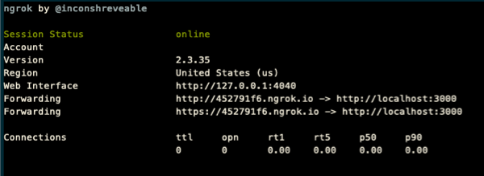

**Important -** Be careful to not stop and restart ngrok. Each time you start
ngrok, it will create a new unique URL. This will require you to reconfigure
your webhooks each time you restart it. However, you can restart the web server
you started with **gulp serve** without impacting ngrok.

1.  In the browser, navigate to <https://teams.microsoft.com> and if prompted,
    sign in with your lab admin credentials.

2.  Once you're signed in, select a channel in a team you want to add the
    webhook to. From the channel's page, select the **+** in the top navigation:

    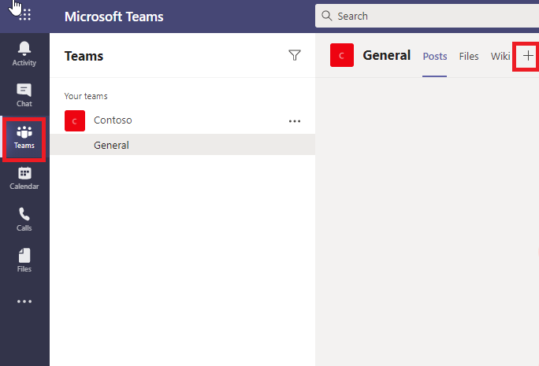

3.  On the **Add a tab** dialog, select **Manage apps** in the lower right
    corner:

    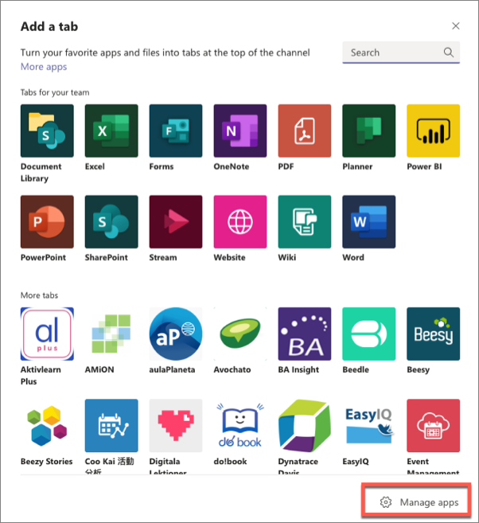

4.  This will take you to the **Manage Channel** page. Select the **Create an
    outgoing webhook** in the lower right corner:

    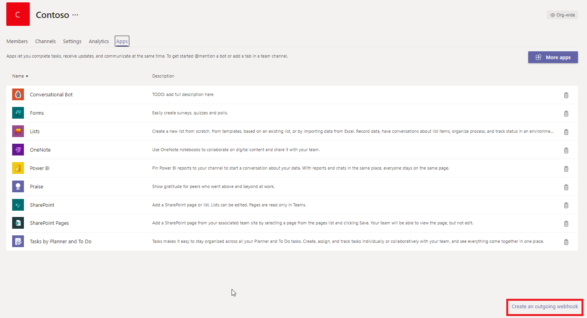

5.  In the **Create an outgoing webhook** dialog, enter the following values,
    and select **Create**:

-   **Name**: Planet Details

-   **Callback URL**: https://{{REPLACE_NGROK_SUBDOMAIN}}.ngrok.io/api/webhook

    **Important**

    Replace the {{REPLACE_NGROK_SUBDOMAIN}} with the value of your dynamically
    created Ngrok URL displayed in the console when you ran ngrok http 3007.

-   **Description**: View details about the planet entered in the message.

1.  After creating the outgoing webhook, Microsoft Teams will display a security
    token.

    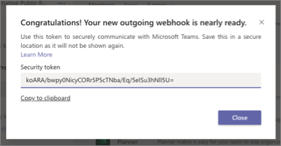

2.  Copy this value and set the SECURITY_TOKEN property in the
    **C:\\Teams_Projects\\learn-msteams\\.env** file in the project. **Save**
    this file and close it.

3.  On the **Command Prompt** window where you executed *gulp serve* command,
    stop the process by pressing Ctrl+C and then start it again but running the
    following command:

    *gulp serve*

4.  Now you can test the webhook. In **Microsoft Teams**, go to a Teams channel
    and enter the message **@Planet Details Venus**. Notice that as you're
    typing the message, Microsoft Teams detects the name of the webhook:

    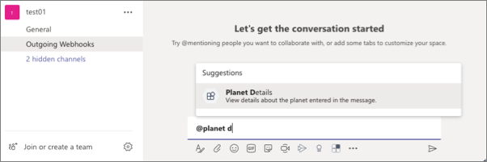

5.  A few seconds after submitting the message, you'll see a reply to your
    message appear that contains the customized adaptive card with details about
    the planet:

    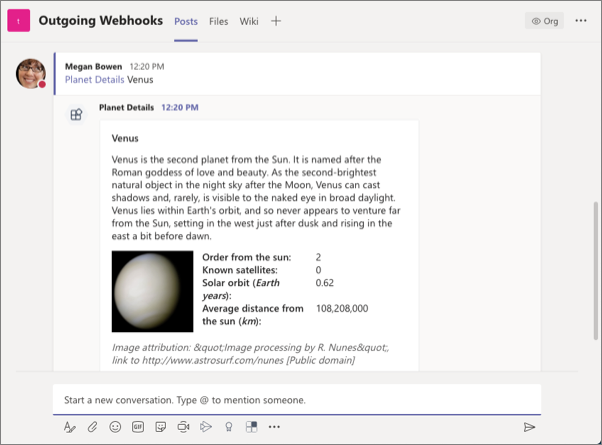

6.  You've successfully tested your outgoing webhook! Stop the local web server
    by pressing CTRL+C in the console.

## **Exercise 2 - Create incoming webhooks**

In this exercise, you’ll learn how to register an incoming webhook in a
Microsoft Teams channel and post a message to it.

### **Task 1 - Register a new incoming webhook**

1.  In the browser, navigate to
    [**https://teams.microsoft.com**](https://teams.microsoft.com/) and sign in
    with the your lab admin credentials.

2.  Once you're signed in, select a channel in a team you want to add the
    webhook to. From the channel's page, select the **+** in the top navigation:

    

3.  On the **Add a tab** dialog, select **Manage apps** in the lower right
    corner:

    

4.  This will take you to the **Manage Channel** page. Click on **More apps**.

    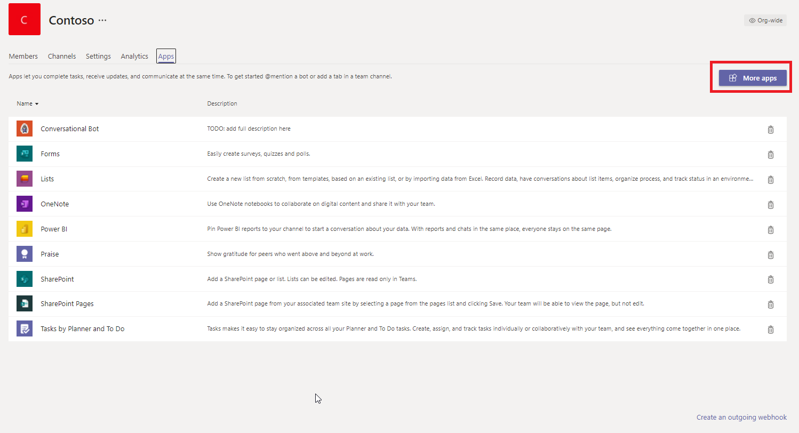

5.  On the **Apps** page, search for the **incoming webhook** app and select it.

    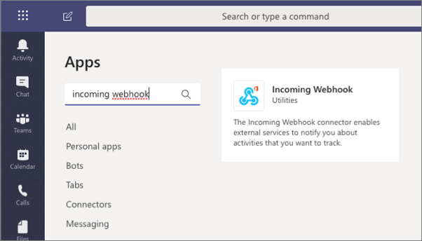

6.  Select the **Add to a team** button. On the next page, select a channel to
    add the webhook to, and select the **Set up a connector**:

7.  On the **Incoming Webhook** configuration screen, enter the name **Dwarf
    Planet Details** and select the **Create** button (*you may need to scroll
    down in the dialog as the Create button isn't visible by default, as in the
    following screenshot*):

8.  After creating the incoming webhook, the dialog will add a new input box
    that contains the endpoint for you should post to. Copy this value to a
    notepad:

    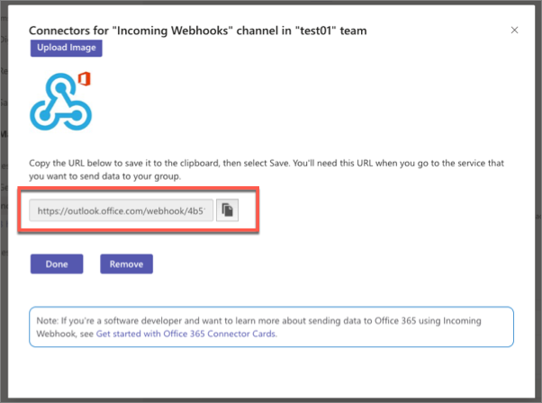

9.  Scroll down and click **Done**. Close the pop-up window.

### **Task 2 - Test the incoming webhook**

After configuring the incoming webhook, the next step is to submit a post to it
to display a message in the channel. We will do this by submitting an HTTPS
request to the webhook endpoint provided.

1.  Open the **Postman** application.

2.  Click on **Create a request**.

-   set the request to a **POST**

-   set the endpoint to the webhook endpoint you copied at the end of the
    previous task.

-   set the Content-Type header to application/json on the **Headers** tab:

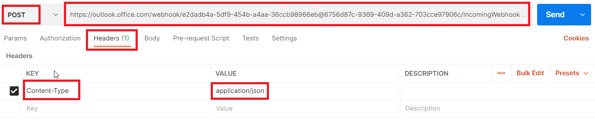

-   add the following JSON to the **Body** tab and select the **raw** option:

    {

    "@type": "MessageCard",

    "@context": "http://schema.org/extensions",

    "summary": "Dwarf planet Pluto details",

    "sections": [{

    "activityTitle": "Dwarf planet Pluto details",

    "activityImage":
    "https://upload.wikimedia.org/wikipedia/commons/e/ef/Pluto_in_True_Color_-_High-Res.jpg",

    "facts": [

    {

    "name": "Description",

    "value": "Pluto is an icy dwarf planet in the Kuiper belt, a ring of bodies
    beyond the orbit of Neptune. It was the first Kuiper belt object to be
    discovered and is the largest known dwarf planet. Pluto was discovered by
    Clyde Tombaugh in 1930 as the ninth planet from the Sun. After 1992, its
    status as a planet was questioned following the discovery of several objects
    of similar size in the Kuiper belt. In 2005, Eris, a dwarf planet in the
    scattered disc which is 27% more massive than Pluto, was discovered. This
    led the International Astronomical Union (IAU) to define the term
    \\"planet\\" formally in 2006, during their 26th General Assembly. That
    definition excluded Pluto and reclassified it as a dwarf planet."

    },

    {

    "name": "Order from the sun",

    "value": "9"

    },

    {

    "name": "Known satellites",

    "value": "5"

    },

    {

    "name": "Solar orbit (\*Earth years\*)",

    "value": "247.9"

    },

    {

    "name": "Average distance from the sun (\*km\*)",

    "value": "590637500000"

    },

    {

    "name": "Image attribution",

    "value": "NASA/Johns Hopkins University Applied Physics Laboratory/Southwest
    Research Institute/Alex Parker [Public domain]"

    }

    ]

    }],

    "potentialAction": [{

    "@context": "http://schema.org",

    "@type": "ViewAction",

    "name": "Learn more on Wikipedia",

    "target": ["https://en.wikipedia.org/wiki/Pluto"]

    }]

    }

    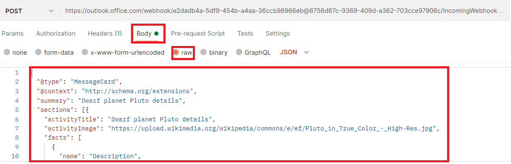

**Important -** If you include a card in a message sent to an incoming webhook,
it must be an Office 365 Connector Cards; adaptive cards aren't supported when
sending messages to incoming webhooks.

1.  Send the card to Microsoft Teams by selecting the **Send** button.

2.  In the browser, navigate back to the **Microsoft Teams** channel where you
    installed the incoming webhook. You should see a message containing your
    card:

    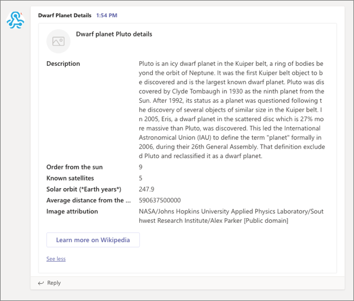

## **Exercise 3 - Create and add Office 365 Connectors to teams**

In this unit, you’ll learn how to create an Office 365 Connector and add it to
Microsoft Teams.

The first step will be to register a new Office 365 Connector with the
**Connectors Developer Dashboard**. Then you'll create a new Microsoft Teams app
that contains a web service and the necessary details to associate the Office
365 Connector to connect it to Microsoft Teams.

### **Task 1 - Register an Office 365 Connector**

1.  Open a browser and navigate to the **Connectors Developer Dashboard**:
    <https://aka.ms/ConnectorsDashboard>

2.  Select **New Connector**.

3.  On the **Register Connector** page, complete the required fields in the form
    with anything you like and accept any default options presented, with the
    following exceptions:

-   **Connector name**: My First Teams Connector

-   **Short Description**: My First Teams Connector

-   **Detailed Description**: My First Teams Connector

-   **Company Website**: <https://www.contoso.com>

-   **Configuration page for your Connector**:
    [https://REPLACE.ngrok.io/MyFirstTeamsConnector/config.html](https://replace.ngrok.io/MyFirstTeamsConnector/config.html)

**Note -** In this exercise, it isn't necessary to come back and update the
address of the configuration page because we are only testing the Connector in
Microsoft Teams.

1.  Select the **I accept the terms and conditions...** checkbox and select
    **Save** to register the Connector.

2.  After successfully registering your Connector, the **Connectors Developer
    Dashboard** page will display some additional sections. While there's a
    button to **Download Manifest** for a custom Microsoft Teams app, we'll use
    the manifest created by the Yeoman Generator for Microsoft Teams.

3.  You'll need the ID of your new Connector later in the exercise. This ID, a
    GUID, can be found in the URL of the updated page. Copy this ID for later
    use.

    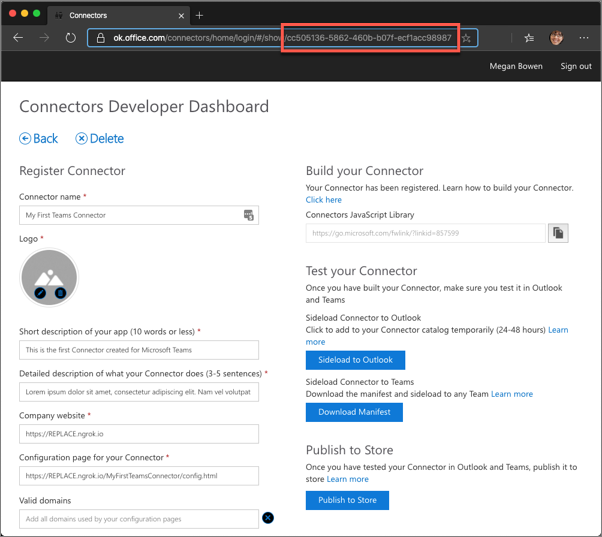

### **Task 2 - Create Microsoft Teams app**

1.  Open **Command Prompt**.

2.  Change the directory to **C:\\Teams_Projects**.

    *cd C:\\Teams_Projects*

3.  Create a new sub-directory named **learn-msteams-connectors**.

    *mkdir learn-msteams-connectors*

4.  Change the current directory to the new sub-directory
    **learn-msteams-connectors**

    *cd learn-msteams-connectors*

5.  Run the Yeoman generator for Microsoft Teams by running the following
    command:

    *yo teams*

    Yeoman starts and asks you a series of questions. Answer the questions with
    the following values:

-   **What is your solution name?**: MyFirstTeamsConnector

-   **Where do you want to place the files?**: Use the current folder

-   **Title of your Microsoft Teams App project?**: My First Teams Connector

-   **Your (company) name? (max 32 characters)**: Contoso

-   **Which manifest version would you like to use?**: v1.8

-   **Enter your Microsoft Partner Id, if you have one?**: (Leave blank to skip)

-   **What features do you want to add to your project?**: A Connector

-   **The URL where you will host this solution?**: (Accept the default option)

-   **Would you like show a loading indicator when your app/tab loads?**: No

-   **Would you like personal apps to be rendered without a tab header-bar?** No

-   **Would you like to include Test framework and initial tests?**: No

-   **Would you like to use Azure Applications Insights for telemetry?**: No

-   **What type of Connector would you like to include?**: A new Connector
    hosted in this solution

-   **What is the Id of your Connector (found in the Connector Developer
    Portal)?**: (Enter the ID of the Connector you copied in the last task)

-   **What is the name of your Connector?** My First Teams Connector

**Note-**Most of the answers to these questions can be changed after creating
the project. For example, the URL where the project will be hosted isn't
important at the time of creating or testing the project.

After answering the generator's questions, the generator will create the
scaffolding for the project and then execute npm install that downloads all the
dependencies required by the project.

### **Task 3 - Examine and update the Teams app project files**

1.  Open the file
    **C:\\Teams_Projects\\learn-msteams-connectors\\src\\manifest\\manifest.json**.

2.  Locate the following properties and delete them from the **manifest.json**
    file:

    "configurableTabs": []

    "staticTabs": []

    "bots": []

    "composeExtensions": []

3.  **Save** this file and close it.

4.  Open the file
    **C:\\Teams_Projects\\learn-msteams-connectors\\src\\app\\scripts\\myFirstTeamsConnector\\
    MyFirstTeamsConnectorConfig.tsx**.

5.  Within the componentWillMount() React lifecycle event handler, locate the
    following code:

    microsoftTeams.getContext((context: microsoftTeams.Context) =\> {

    this.setState({

    color: availableColors.find(c =\> c.code === context.entityId),

    });

    this.setValidityState(this.state.color !== undefined);

    });

6.  The find() method needs to be replaced with a filter() method. Update this
    line:

    color: availableColors.find(c =\> c.code === context.entityId),

7.  ... to the following:

    color: availableColors.filter(c =\> c.code === context.entityId)[0],

8.  **Save** this file and close it.

### **Task 4 - Test the Office 365 Connector in Microsoft Teams**

1.  On the **Command Prompt**, ensure that you are in
    **C:\\Teams_Projects\\learn-msteams-connectors** directory and run the
    following command:

    *gulp ngrok-serve*

2.  Go the **Microsoft Teams** browser tab and in the left navigation pane,
    click **Teams**.

3.  On one of your Teams, click on **…** and then select **Manage team**.

    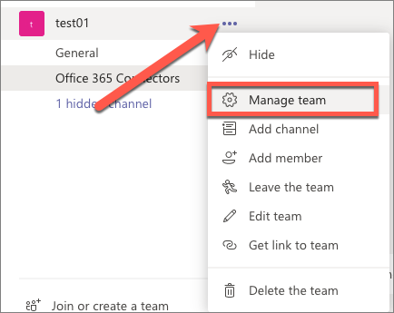

4.  Select the **Apps** tab and then the **More apps** button:

    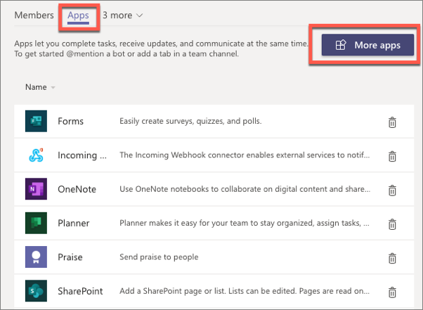

5.  From the **Browse available apps and services**, select the **Upload a
    custom app \> Upload for Contoso** at the bottom of the **Apps** panel of
    categories.

6.  Browse and select **C:\\Teams_Projects\\learn-msteams-connectors\\package\\
    MyFirstTeamsConnector.zip** file and open it.

7.  This will add the **My First Team Connector** tile in **Microsoft Teams**.

    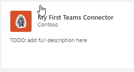

8.  Click on this tile and then click **Add to a team**.

    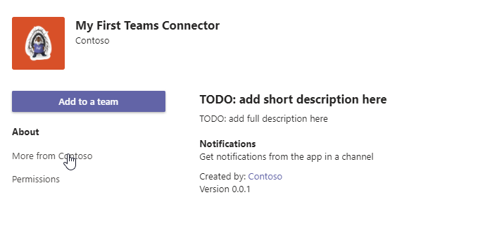

9.  Select a team to add the Connector to and click **Set up a Connector**.

10. On the **Connectors for... channel in ... team** page, select the **Others**
    category in the left pane. You should see your connector in this section.
    Click **Configure**.

11. This will display the configuration page for your project.

    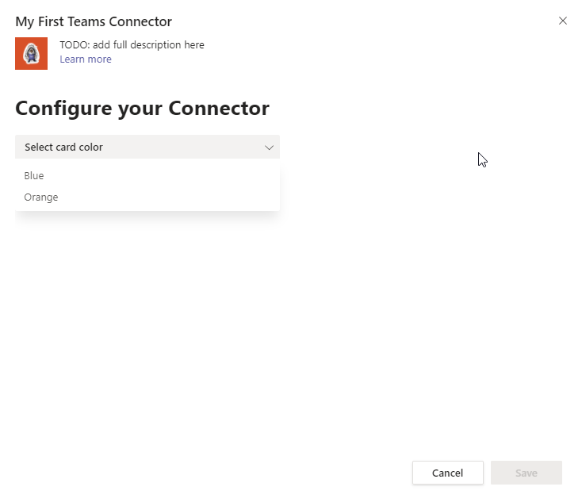

12. Select a color and then select the **Save** button.

13. Open the **Postman** application.

14. Create a new request for **GET**.

15. Set the Content-Type header to application/json on the **Headers** tab:

    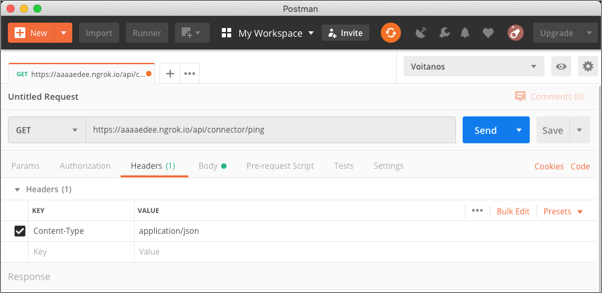

16. Add the following JSON to the **Body** tab and select the **raw** option
    (*make sure to update the URL of the image in the sections[0].activityTile
    property so the image renders when the message is set to Microsoft Teams*):

    {

    "@type": "MessageCard",

    "@context": "http://schema.org/extensions",

    "themeColor": "0076D7",

    "summary": "Larry Bryant created a new task",

    "sections": [

    {

    "activityTitle":
    "Larry
    Bryant created a new task",

    "activitySubtitle": "On Project Tango",

    "activityImage":
    "https://myfirstteamsconnector.azurewebsites.net/static/img/image5.png",

    "facts": [

    {

    "name": "Assigned to",

    "value": "Unassigned"

    },

    {

    "name": "Due date",

    "value": "Mon May 01 2017 17:07:18 GMT-0700 (Pacific Daylight Time)"

    },

    {

    "name": "Status",

    "value": "Not started"

    }

    ],

    "markdown": true

    }

    ],

    "potentialAction": [

    {

    "@type": "ActionCard",

    "name": "Add a comment",

    "inputs": [

    {

    "@type": "TextInput",

    "id": "comment",

    "isMultiline": false,

    "title": "Add a comment here for this task"

    }

    ],

    "actions": [

    {

    "@type": "HttpPOST",

    "name": "Add comment",

    "target": "http://..."

    }

    ]

    },

    {

    "@type": "ActionCard",

    "name": "Set due date",

    "inputs": [

    {

    "@type": "DateInput",

    "id": "dueDate",

    "title": "Enter a due date for this task"

    }

    ],

    "actions": [

    {

    "@type": "HttpPOST",

    "name": "Save",

    "target": "http://..."

    }

    ]

    },

    {

    "@type": "ActionCard",

    "name": "Change status",

    "inputs": [

    {

    "@type": "MultichoiceInput",

    "id": "list",

    "title": "Select a status",

    "isMultiSelect": "false",

    "choices": [

    {

    "display": "In Progress",

    "value": "1"

    },

    {

    "display": "Active",

    "value": "2"

    },

    {

    "display": "Closed",

    "value": "3"

    }

    ]

    }

    ],

    "actions": [

    {

    "@type": "HttpPOST",

    "name": "Save",

    "target": "http://..."

    }

    ]

    }

    ]

    }

    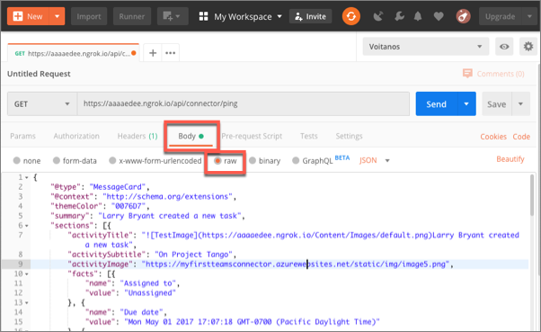

**Important -** Connectors, like incoming webhooks, only support Office 365
Connector Cards for messages sent to Microsoft Teams. Adaptive cards aren't
supported when sending messages with cards when using Connectors or incoming
webhooks.

1.  Select the **Send** button in Postman.

2.  When you go back to the channel, you'll see the card displayed as a message
    in the team:

    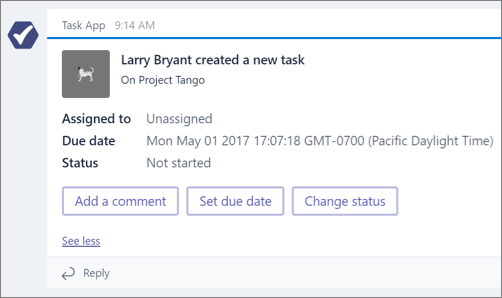
