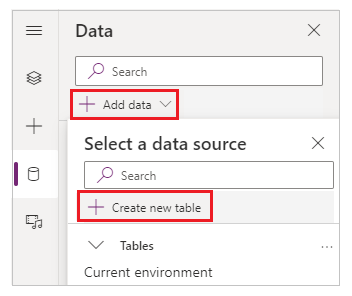
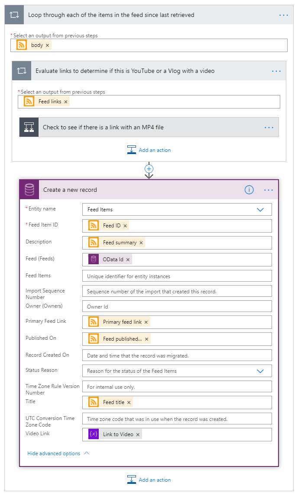

## Exercise 1 - Build an app to retrieve Power Platform videos for readiness

In this exercise, you’ll build a solution that retrieves, lists, and displays
content that can be used for readiness.

### Task 1 - Install and pin Power Apps in Teams

1.  Open a web browser window and navigate to the following URL:

    <https://teams.microsoft.com>

2.  If prompted, sign in with your lab admin credentials and click **Use web app
    instead**.

3.  In the left navigation pane, click on **More added apps** button (**…**) and
    then search for **Power Apps**.

    

4.  Select **Add**.

    

5.  Power Apps is now added to Teams. You can access the app in Teams from the
    left pane.

    

**Tip**

As an alternative to using the flyout menu, you can select **Apps** from the
lower-left corner in Teams, and then search for **Power Apps** to install the
app.

6.  To easily access Power Apps app, right click the Power Apps tab in the left
    navigation pane and then select **Pin**.

    

### Task 2 - Create the app and the tables

1.  Select the Power Apps app.

2.  Select the **Create an app** tab at the top of the screen.

3.  This action will display the **Create an app** dialog box.

4.  Select the name of the team from the drop-down list and select **Create**.

    

**Note -** If this is the first time you’ve tried to create an app in this
Microsoft Teams team, it will take a moment to set up.

5.  When prompted for the name of the app, enter **Video Library** and select
    **Save**.

6.  Select **Create new table** on the left side of the screen.

7.  When prompted for the name of the table, enter **Feeds**.

8.  Select **Create**.

9.  In the visual editor, select the drop-down menu for the **Name** column and
    then **Edit column**.

10.  Change the name to **Title**.

11.  Select **Advanced options** and then change the value for **Max length** to
    *255*.

12.  Select **Save**.

13.  Select **+** to create a new column.

14. Specify the name as **Description**.

15. For **Type**, select **Text** from the list.

16. Select **Advanced options** and then change the value for **Max length** to
    *255*.

17. Select **Create**.

18. Select **+** to create a new column.

19. Specify the name as **Image Link**.

20. For **Type**, select **URL** from the list.

21. Select **Advanced options** and then change the value for **Max length** to
    *255*.

22. Select **Create**.

23. Select **+** to create a new column.

24. Specify the name as **Image Title**.

25. For **Type**, select **Text** from the list.

26. Select **Advanced options** and then change the value for **Max length** to
    *255*.

27. Select **Create**.

28. Select **+** to create a new column.

29. Specify the name as **Last Retrieved**.

30. For **Type**, select **Text** from the list.

31. Select **Create**.

32. Select **+** to create a new column.

33. Specify the name as **Link**.

34. For **Type**, select **URL** from the list.

35. Select **Advanced options** and then change the value for **Max length** to
    *255*.

36. Select **Create**.

37. Select **+** to create a new column.

38. Specify the name as **Published On**.

39. For **Type**, select **Text** from the list.

40. Select **Create**

41. In the visual editor, add a row for the Microsoft show "\#LessCodeMorePower"
    that will be used in testing.

-   **Title** \#LessCodeMorePower (HD) - Channel 9

-   **Description** The show all about Power Apps. Learn more here!

-   **Image Link** https://sec.ch9.ms/content/feedimage.png

-   **Image Title** \#LessCodeMorePower (HD) - Channel 9

-   Leave the **Last Retrieved** column empty.

-   **Link** <https://s.ch9.ms/Shows/Less-Code-More-Power/feed/mp4high>

-   Leave the **Published On** column empty.

The visual editor should resemble the image below.

>   

42.  Select **Close** to close the visual editor.

    The screen created automatically in the app, named **Screen1**, should
    automatically bind to the table, displaying the fields in the table and the
    record you added. The screen should resemble the image below.

   

43.  Select **Add data** on the left side of the screen.

44.  Select **Create new table**.

   

45.  When prompted for the name of the table, enter **Feed Items** and click
    **Create**.

46.  In the visual editor, select the drop-down for the **Name** column, and then
    select **Edit column**.

47.  Change the name to **Feed Item ID**.

48.  Select **Advanced options** and then change the value for **Max length** to
    *255*.

49.  Select **Save**.

50.  Select **+** to create a new column.

51. Specify the name as **Feed**.

52. For **Type**, select **Lookup** from the list.

53. For the table, select **Feeds** from the list

54. Select **Create**.

55. Select **+** to create a new column.

56. Specify the name as **Title**.

57. For **Type**, select **Text** from the list.

58. Select **Advanced options** and then change the value for **Max length** to
    *255*.

59. Select **Create**.

60. Select **+** to create a new column.

61. Specify the name as **Description**.

62. For **Type**, select **Text** from the list.

63. Select **Advanced options** and then change the value for **Max length** to
    *2000*.

64. Select **Create**.

65. Select **+** to create a new column.

66. Specify the name as **Primary Feed Link**.

67. For **Type**, select **URL** from the list.

68. Select **Advanced options** and then change the value for **Max length** to
    *255*.

69. Select **Create**.

70. Select **+** to create a new column.

71. Specify the name as **Video Link**.

72. For **Type**, select **URL** from the list.

73. Select **Advanced options** and then change the value for **Max length** to
    *255*.

74. Select **Create**.

75. Select **+** to create a new column.

76. Specify the name as **Published On**.

77. For **Type**, select **Text** from the list.

78. Select **Create**.

The visual editor should resemble the image below.

79.  Select **Close** to close the visual editor.

80.  Now that you’ve created the required tables, select **Save** on the
    upper-right corner to save the app and close the Power Apps Studio.

### Task 3 - Create flows to get the video details for configured feeds

1.  Select the **Build** tab.

2.  From the list on the left, select the name of your team in which you created
    the tables earlier.

3.  Select **See all** under the *Built by this Team* tab.

4.  Select **New**.

5.  Select **Cloud flow** \> **Scheduled**.

    

6.  In the **Build a scheduled flow** dialog,

-   Enter the name as **Retrieve Videos**.

-   Select **Day** as the frequency.

-   Select **Create**.

    

7.  Select **New step**.

8.  Enter *Initialize variable* in the search box.

9.  Select the **Initialize variable** action.

10.  Enter *Link to Video* in the **Name** field.

11.  Select **String** in the drop-down for **Type**.

    Note - Don’t enter any value in the **Value** field.

   

12.  Select **New Step**.

13.  Enter *Common Data Service (current environment)* in the search box and
    select the action named **List rows**.

14.  Select **Feeds** in the **Table name** property.

15.  Select ellipsis (…) in the header of the action and select **Rename**.

16. Rename the action to **Get list of feeds to retrieve**.

    

17. Select **New Step**.

18. Enter *Date Time* in the search box and select the action named **Current
    time**.

    

19. Select **New Step**.

20. Enter *Apply to each* in the search box, and then select the action named
    **Apply to each**.

21. Select the text box under **Select output from previous steps**.

22. In the **Dynamic content** list, scroll down to the section **Get list of
    feeds to retrieve**, and then select **value**.

23. Select ellipsis (…) in the header of the action and select **Rename**.

24. Rename the action to *Loop through each of the feeds in the database*.

    

25. Select **Add an action**.

26. Enter *RSS* in the search box and select the action called **List all RSS
    feed items**.

27. Select the box for the property **The RSS feed URL**.

28. In the **Dynamic content**, scroll down to the section **Get list of feeds
    to retrieve**, and then select **Link**.

29. Select in the box for the property **since** and select **Last Retrieved**.

    

30. Select **Add an action**.

31. Enter *Apply to each* in the search box and select the action named **Apply
    to each**.

32. Select the text box under **Select output from previous steps**.

33. In the **Dynamic content** list, scroll down to the section called **List
    all RSS feed items**, and then select **body**.

34. Select ellipsis (…) in the header of the action, and then select **Rename**.

35. Rename the action to *Loop through each of the items in the feed since last
    retrieved*.

    

36. Select **Add an action** inside *Loop through each of the items in the feed
    since last retrieved*.

37. Enter *Apply to each* in the search box and select the action named **Apply
    to each**.

38. Select the text box under **Select output from previous steps**.

39. In the **Dynamic content** list, scroll down to the section **List all RSS
    feed items**, and then select **Feed links**.

40. Select ellipsis (…) in the head of the action, and then select **Rename**.

41. Rename the action to *Evaluate links to determine if this is YouTube or a
    Vlog with a video*.

    

42. Select **Add an action**.

43. Enter *Condition* in the search box, and then select the action named
    **Condition**.

44. Select the text box containing text **Choose a value**.

45. In the **Dynamic content** list that is displayed, scroll down to the
    section called **Evaluate links to determine if this is YouTube or a Vlog
    with a video**, and then select **Current item**.

46. Select the drop-down that shows **is equal to**, and then select
    **contains**.

47. Select the text box text **Choose a value** and enter the value **.mp4**.

48. Select ellipsis (…) in the header of the action, and then select **Rename**.

49. Rename the action to *Check to see if there is a link with an MP4 file*.

    

50. In the **If yes** path on the left, select **Add an action**.

-   Enter *Set variable* in the search box, and then select the action named
    **Set Variable**.

-   Select **Link to Video** in the drop-down for the *Name* property.

-   Select the textbox for the **Value** property.

-   In the **Dynamic content** list, scroll down to the section called
    **Evaluate links to determine if this is YouTube or a Vlog with a video**
    and select **Current item**.

-   Select ellipsis (…) in the header of the action, and then select **Rename**

-   Rename the action to *Specify the Video Link is the link to an MP4 File*.

    

51.  In the **If No** path on the left, select **Add an action**.

-   Enter *Set variable* in the search box, and then select the action named
    **Set Variable**.

-   Select **Video Link** in the drop-down for the **Name** property.

-   Select the textbox for the **Value** property.

-   In the **Dynamic content** list, scroll down to the section **List all RSS
    feed items**, and then select **Primary feed link**.

-   Select ellipsis (…) in the header of the action, and then select **Rename**.

-   Rename the action to *Specify the Video Link is the Primary feed link*.

    

52.  Select the header of the action to show the title of **Evaluate links to
    determine if this is YouTube or a Vlog with a video**.

   

53.  Inside *Loop through each of the items in the feed since last retrieved*
    action, select **Add an action**.

54.  Enter *Common Data Service (current environment)* in the search box, and
    then select the action called **Create a new row**.

55.  Select **Feed Items** in the **Table name** property.

56.  Select the textbox next to **Field Item ID**.

57.  In the **Dynamic content** list scroll down to the section **List all RSS feed items**, and then select **Feed ID**.

58.  Select **Show advanced options** link in the action to display all the
    fields in the table.

59.  Select the textbox next to **Description**.

60.  In the **Dynamic content** list, scroll down to the section called **List all RSS feed items** and select **Feed summary**.

61. Select the textbox next to **Feed (Feeds)**.

62. In the **Dynamic content** list, scroll down to the section **Get list of feeds to retrieve**, and then select **OData Id**.

63. Select the textbox next to **Primary Feed Link**.

64. In the **Dynamic content** list scroll down to the section **List all RSS feed items**, and then select **Primary feed link**.

65. Select the textbox next to **Published On**.

66. In the **Dynamic content** list, scroll down to the section **List all RSS
    feed items**, and then select **Feed published on**.

67. Select the textbox next to **Title**.

68. In the **Dynamic content** list, scroll down to the section **List all RSS
    feed items**, and then select **Feed title**.

69. Select the textbox next to **Video Link**.

70. In the **Dynamic content** list, scroll down to the section **Variables**,
    and then select **Link to Video**.

    

71. Select **Add action** after **Create new row**.

72. Enter **Teams** in the search box, and then select the **Post a message (V3)
    (Preview)** action.

73. In the drop-down for the **Team** property, select the team to send the
    message.

74. In the drop-down for the **Channel** property, select the channel to send
    the message.

75. Select **Show advanced options** link.

76. In the **Message** property, create a message with details about the item.
    An example message is shown in the image below.

    

77. Select the header of the action to show the title of **Loop through each of
    the items since last retrieved**.

78. Inside *Loop through each of the feeds in the database* action, select **Add
    an action**.

79. Enter *Common Data Service (current environment)* in the search box, and
    then select the action **Update a row**.

80. Select **Feeds** for the *Table Name*.

81. Select textbox next to *Item ID*.

82. In the **Dynamic content** list, scroll down to the section **Get list of
    feeds to retrieve**, and then select **Feeds**.

83. Select textbox next to *Title*.

84. In the **Dynamic content** list, scroll down to the section **Get list of
    feeds to retrieve**, and then select **Title**.

85. Select **Show advanced options** link in the action to display all the
    fields in the table.

86. Select textbox next to *Description*.

87. In the **Dynamic content** list, scroll down to the section **Get list of
    feeds to retrieve**, and then select **Description**.

88. Select textbox next to *Image Link*.

89. In the **Dynamic content** list, scroll down to the section **Get list of
    feeds to retrieve**, and then select **Image Link**.

90. Select textbox next to *Image Title*.

91. In the **Dynamic content** list, scroll down to the section **Get list of
    feeds to retrieve**, and then select **Image Title**.

92. Select textbox next to *Last Retrieved*.

93. In the **Dynamic content** list, scroll down to the section **Current time**
    and select **Current time**.

94. Select textbox next to *Link*.

95. In the **Dynamic content** list, scroll down to the section **Get list of
    feeds to retrieve**, and then select **Link**

96. Select textbox next to *Published On*.

97. In **Dynamic content** list, scroll down to the section **Get list of feeds
    to retrieve**, and then select **Published On**.

    

98. Your complete flow should look like the following image:

    

99. From the upper-right side of the screen, select **Save**.

100. Select the back arrow in the upper left.

101. Select the flow **Retrieve Videos**.

102. Select **Run** in the command bar.

103. From the panel on the right side of the screen, select **Run flow**.

104. Select **Done**.

105. Select the refresh button in **28-day run history** to show the details of
    the flow run.

   

106. If the flow doesn't show as succeeded, select the flow run and it will
    display the failed action with any associated error message.

### Task 4 - Edit the app to add the video library interface

1.  Select Power Apps from the left rail in Teams.

2.  Select the **Build** tab.

3.  From the left pane, select the team environment where the app is created.

4.  Under **Built by this team**, select the **Video Library** app.

5.  Select **Tree view**.

6.  Select **New screen**.

7.  Select **Blank** layout.

8.  Select **+** to begin adding controls to screen.

9.  Enter **Rectangle** in the search box.

10. Drag the rectangle control onto the screen.

11. Set the following properties with these values:

| **Property** | **Value** |
|--------------|-----------|
| X            | 0         |
| Y            | 0         |
| Width        | 1365      |
| Height       | 60        |
| Color        | Purple    |

12.  Enter **Label** in the search box.

13.  Drag the label onto the screen.

14.  Set the following properties with these values:

| **Property** | **Value**     |
|--------------|---------------|
| Text         | Video Library |
| Display Mode | View          |
| Font size    | 24            |
| X            | 576           |
| Y            | 0             |
| Width        | 191           |
| Height       | 61            |
| Color        | White         |

15.  Enter **Rectangle** in the search box.

16.  Drag the rectangle control onto the screen.

17.  Set the following properties with these values:

| **Property** | **Value** |
|--------------|-----------|
| X            | 0         |
| Y            | 61        |
| Width        | 1365      |
| Height       | 58        |
| Color        | Purple    |

18.  Enter **Label** in the search box.

19.  Drag the label onto the screen.

20.  Set the following properties with these values:

| **Property** | **Value**                          |
|--------------|------------------------------------|
| Text         | Select a video from the list below |
| Display Mode | View                               |
| Font size    | 14                                 |
| X            | 39                                 |
| Y            | 74                                 |
| Width        | 320                                |
| Height       | 32                                 |
| Color        | White                              |

21.  Enter **Vertical Gallery** in the search box.

22.  Drag the label onto the screen.

23.  Set the following properties with these values:

| **Property** | **Value**                  |
|--------------|----------------------------|
| Name         | Video Library              |
| Data Source  | Feed Items                 |
| Layout       | Image, title, and subtitle |
| X            | 0                          |
| Y            | 119                        |
| Width        | 450                        |
| Height       | 649                        |

24.  In the Tree view on the left side of the screen, there are three controls
    underneath the Video Gallery with names starting with Subtitle, Title, and
    Image.

   

25.  Select the control that starts with **Subtitle**.

26.  Select the **Text** property from the property list on top-left.

27.  Update the property value to the following formula:

~~~~~~~~~~~~~~~~~~~~~~~~~~~~~~~~~~~~~~~~~~~~~~~~~~~~~~~~~~~~~~~~~~~~~~~~~~~~~~~~
ThisItem.Feed.Description
~~~~~~~~~~~~~~~~~~~~~~~~~~~~~~~~~~~~~~~~~~~~~~~~~~~~~~~~~~~~~~~~~~~~~~~~~~~~~~~~

28.  Select the control that starts with **Title**.

29.  Select the **Text** property from the property list on top-left.

30.  Update the property value to the following formula:

~~~~~~~~~~~~~~~~~~~~~~~~~~~~~~~~~~~~~~~~~~~~~~~~~~~~~~~~~~~~~~~~~~~~~~~~~~~~~~~~
ThisItem.Feed.Title
~~~~~~~~~~~~~~~~~~~~~~~~~~~~~~~~~~~~~~~~~~~~~~~~~~~~~~~~~~~~~~~~~~~~~~~~~~~~~~~~

31.  Select the control that starts with **Image**.

32.  Select the **Text** property from the property list on top-left.

33.  Update the property value to the following formula:

~~~~~~~~~~~~~~~~~~~~~~~~~~~~~~~~~~~~~~~~~~~~~~~~~~~~~~~~~~~~~~~~~~~~~~~~~~~~~~~~
ThisItem.Feed.'Image Link'
~~~~~~~~~~~~~~~~~~~~~~~~~~~~~~~~~~~~~~~~~~~~~~~~~~~~~~~~~~~~~~~~~~~~~~~~~~~~~~~~

34.  Enter **Rectangle** in the search box.

35.  Drag the rectangle control onto the screen.

36.  Set the following properties with these values:

| **Property** | **Value** |
|--------------|-----------|
| X            | 451       |
| Y            | 61        |
| Width        | 915       |
| Height       | 707       |
| Color        | Purple    |

37.  Enter **Label** in the search box.

38.  Drag the label onto the screen.

39.  Set the following properties with these values:

| **Property** | **Value** |
|--------------|-----------|
| Font size    | 18        |
| X            | 466       |
| Y            | 51        |
| Width        | 883       |
| Height       | 78        |
| Color        | White     |

40.  Select the **Text** property from the property list on top-left.

41.  Set the **Text** property value to the following formula:

~~~~~~~~~~~~~~~~~~~~~~~~~~~~~~~~~~~~~~~~~~~~~~~~~~~~~~~~~~~~~~~~~~~~~~~~~~~~~~~~
'Video Library'.Selected.Title
~~~~~~~~~~~~~~~~~~~~~~~~~~~~~~~~~~~~~~~~~~~~~~~~~~~~~~~~~~~~~~~~~~~~~~~~~~~~~~~~

42.  Enter **Video** in the search box.

43.  Drag the video control onto the screen.

44.  Set the following properties with these values:

| **Property** | **Value** |
|--------------|-----------|
| X            | 450       |
| Y            | 129       |
| Width        | 916       |
| Height       | 523       |

45.  Select the **Media** property from the property list on top-left.

46.  Set the **Media** property value to the following formula:

~~~~~~~~~~~~~~~~~~~~~~~~~~~~~~~~~~~~~~~~~~~~~~~~~~~~~~~~~~~~~~~~~~~~~~~~~~~~~~~~
'Video Library'.Selected.'Video Link'
~~~~~~~~~~~~~~~~~~~~~~~~~~~~~~~~~~~~~~~~~~~~~~~~~~~~~~~~~~~~~~~~~~~~~~~~~~~~~~~~

47.  Enter **HTML text** in the search box.

48.  Drag the HTML text control onto the screen.

49.  Set the following properties with these values:

| **Property** | **Value** |
|--------------|-----------|
| Font size    | 14        |
| X            | 458       |
| Y            | 651       |
| Width        | 908       |
| Height       | 82        |
| Color        | White     |

50.  Select the **HtmlText** property from the property list on top-left.

51.  Set the **HtmlText** property value to the following formula:

~~~~~~~~~~~~~~~~~~~~~~~~~~~~~~~~~~~~~~~~~~~~~~~~~~~~~~~~~~~~~~~~~~~~~~~~~~~~~~~~
'Video Library'.Selected.Description
~~~~~~~~~~~~~~~~~~~~~~~~~~~~~~~~~~~~~~~~~~~~~~~~~~~~~~~~~~~~~~~~~~~~~~~~~~~~~~~~

52.  Enter **Label** in the search box.

53.  Drag the Label onto the screen.

54.  Set the following properties with these values:

| **Property** | **Value** |
|--------------|-----------|
| Font size    | 14        |
| X            | 1153      |
| Y            | 732       |
| Width        | 213       |
| Height       | 36        |
| Color        | White     |

55.  Select the **Text** property from the property list on top-left.

56.  Set the **Text** property value to the following formula:

~~~~~~~~~~~~~~~~~~~~~~~~~~~~~~~~~~~~~~~~~~~~~~~~~~~~~~~~~~~~~~~~~~~~~~~~~~~~~~~~
Concatenate("Published On ",Text('Video Library'.Selected.'Published On'))
~~~~~~~~~~~~~~~~~~~~~~~~~~~~~~~~~~~~~~~~~~~~~~~~~~~~~~~~~~~~~~~~~~~~~~~~~~~~~~~~

57.  Select **Screen2**.

58.  Select **Add icon** from the properties pane.

59.  Select the **Settings** icon type.

60.  Set the following properties with these values:

| **Property** | **Value** |
|--------------|-----------|
| X            | 1307      |
| Y            | 6         |
| Width        | 48        |
| Height       | 51        |
| Color        | White     |

61.  Select the **OnSelect** property from the property list on top-left.

62.  Set the **OnSelect** property value to the following formula:

~~~~~~~~~~~~~~~~~~~~~~~~~~~~~~~~~~~~~~~~~~~~~~~~~~~~~~~~~~~~~~~~~~~~~~~~~~~~~~~~
Navigate(Screen1)
~~~~~~~~~~~~~~~~~~~~~~~~~~~~~~~~~~~~~~~~~~~~~~~~~~~~~~~~~~~~~~~~~~~~~~~~~~~~~~~~

63.  Select **Screen1**.

64.  Select **Add icon** from the properties pane.

65.  Select the **Back** icon type.

66.  Set the following properties with these values:

| **Property** | **Value** |
|--------------|-----------|
| X            | 225       |
| Y            | 12        |
| Width        | 32        |
| Height       | 32        |

67.  Select the **OnSelect** property from the property list on top-left.

68.  Set the **OnSelect** property value to the following formula:

~~~~~~~~~~~~~~~~~~~~~~~~~~~~~~~~~~~~~~~~~~~~~~~~~~~~~~~~~~~~~~~~~~~~~~~~~~~~~~~~
Navigate(Screen2)
~~~~~~~~~~~~~~~~~~~~~~~~~~~~~~~~~~~~~~~~~~~~~~~~~~~~~~~~~~~~~~~~~~~~~~~~~~~~~~~~

### Task 5 - Test the app

1.  Run the Power Automate flow.

2.  Confirm that new items have been added to the **Feed Items** table.

3.  Confirm that the flow has posted new messages to the Channel you specified
    when configuring the application.

4.  Open the app in Power Apps Studio.

5.  From upper-right side of the screen, select **Preview**.

6.  Select the list of feed items in the gallery on the left.

7.  When you select an item, confirm that the *Title*, *Description*, *Publish
    Date*, and the Video details are displayed.

8.  Select the video and confirm the video plays.

9.  Add another feed to the **Feeds** table.

10. Rerun the Power Automate flow.

11. Repeat the above steps.

12. Select the **Publish to Teams** icon in the upper right.

13. Select **Next**.

14. Select **+** next to the channel, such as **Readiness** to add the app to.

    

15. Select **Save and close**.

## Exercise 2 - Use sample apps from the Microsoft Teams store

### Task 1 - Install the sample app

1.  Select **Apps** at the bottom of the left pane in Teams.

2.  Search for **Employee ideas**.
    

3.  Select the app.

4.  Select **Add to a team**.

    

5.  Search for the team channel that you want to add the app to.

    

6.  Select **Set up a tab**.

    

7.  Select **Save** to confirm and start the installation.

    

**Note -** You can keep **Post to the channel about this tab** selected to post
an announcement to the channel that the app has been added. If you clear this
check box, the addition of the app won't be announced.

8.  Installation of the app begins. Installation might take a while; you can
    continue with other activities.

    

**Note**

-   If the selected Teams team doesn't already have an environment created, a
    new environment is created at this stage.

-   Environment creation will fail if the Teams team that you selected has
    *Hiddenmembership* enabled. If this happens, try creating the app in a
    different team.

9.  After the app is installed, you'll see a tab named **Employee ideas** added
    to the team channel that you selected earlier.

    

### Task 2 - Run the sample app

1.  To run the installed app, select the **Employee ideas** tab from the team
    channel.

2.  Before you can use the app, it might ask your permission to use
        connections.

        Note - The list of connections you see below is an example. The number
        and types of connections asking for your permissions may vary depending
        on the app you install.

    

3.  Select **Allow**, so the app can use connections.

4.  Select the channel (in this example, the channel is populated
        automatically), and then select **Let's go**.

    

5.  The **Employee ideas** app is now open and ready for your use.

    
